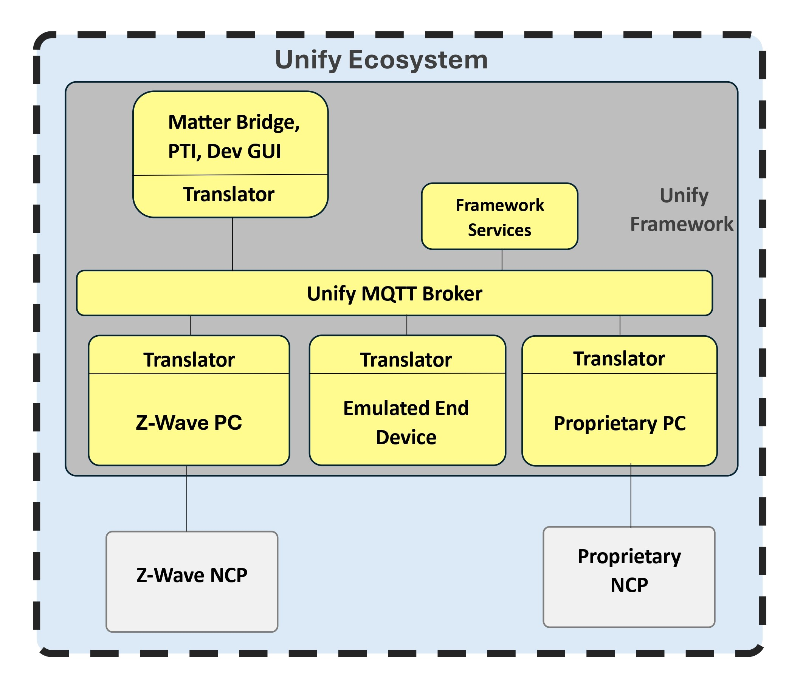

# Unify SDK

The Unify SDK is the main source for Silicon Labs customers who are working with Linux based applications. While developing IoT products that leverage a Linux operating system, such as an IoT gateway or an advanced IoT end device, additional software is needed to interface with the IoT radio and provide interoperability with the host application. To equip customers developing complex IoT applications for single or multi-protocol use cases, Silicon Labs has created a software framework that simplifies the developer experience, removing difficult parts of network control and network management as it relates to gateway and hub development in IoT applications. It can also provide Matter bridge functionality to other protocols that do not natively run matter.

Here is an overview of the components delivered with this repo.

## Documentation

You will find complete documentation for quickly evaluating the Unify SDK in the [Unify SDK documentation](https://siliconlabs.github.io/UnifySDK).
Here you will also learn how to build and run the various components that make up the Unify SDK.

**Copyright 2021 Silicon Laboratories Inc. www.silabs.com**

The licensor of this software is Silicon Laboratories Inc. Your use of this software is governed by the terms of Silicon Labs Master Software License Agreement (MSLA) available at www.silabs.com/about-us/legal/master-software-license-agreement. This software is distributed to you in Source Code format and is governed by the sections of the MSLA applicable to Source Code.
