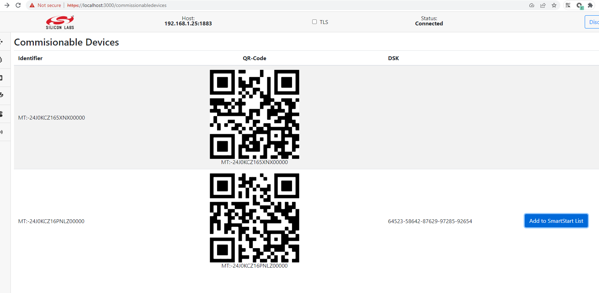
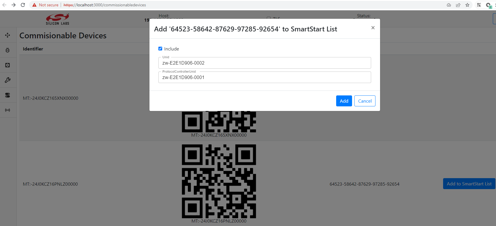
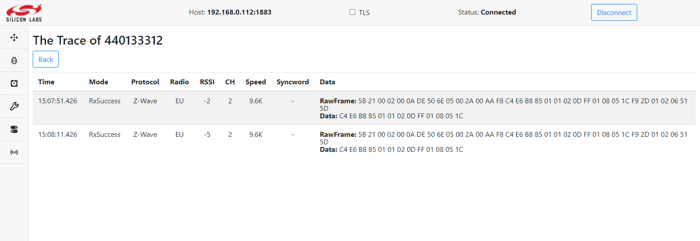

# Dev GUI User's Guide

The _Unify Framework Developer GUI_ is a Web service that runs on the
_Unify_ gateway. It provides a graphical interface to operate the various features
of the _Unify_ gateway, such as network management, smartstart, multicast, and so on.

**NOTE**: This guide illustrates the capabilities of the Dev GUI. Screenshots and information may be outdated.

## Access Developer GUI

The developer GUI (_Dev GUI_) can be accessed via any browser that can
reach the _Unify_ gateway over TCP/IP. Enter the hostname or IP address of
the target running _Unify_ and port 3080, which is the default port for _Dev GUI_.
This process is shown in the image below where the hostname of a Raspberry is
raspberrypi.local:

> In addition to port 3080, the Dev GUI also depends on port 1337, which has to
> be accessible on the target running the _Unify_.


After entering the URL, you should see this front page:


## Connecting the Developer GUI

Click connect in the top bar to start operating the _Unify_. Because of the
modular nature of the developer GUI, you can connect it to other _Unify's_.
In most cases, you want to connect to the actual _Unify_ that the
developer UI is running on, therefore leaving it on _localhost_.

After clicking connect, check that the status says **Connected** and, after
this, the page will still be blank. Then, click on the navigation bar on the
left saying **Nodes**. At that point, the page should look like this:


## Node Inclusion

After connecting you should be able to see the discovered protocol controllers (_PC_)
in the nodes list, as shown in the image above.
You can do a normal node inclusion by pressing **Add** in the dropdown,
on the right hand side of the row for the _PC_.
This will set the _PC_ in inclusion mode. After activating inclusion mode
on the end device, a secure inclusion window may pop up depending on the
security capabilities of the device:


For secure inclusion, input the first five digits of the DSK key. For unsecure
inclusion, click **Reject**. Following is an example of a nodelist, where
different security schemes are displayed:


## SmartStart List

The SmartStart list enables including devices easily. A page of the SmartStart
list enables to add and edit Device Specific Keys (DSK). When a device
starts up or resets, it will automatically get included. A SmartStart entry and
inclusion may look like this:


After filling in the **DSK** key and checking include, click save. If the _Unify
UPVL_ is running, it will be saved to the SmartStart list.

### Using SmartStart with different PHYs

To make use of the SmartStart functionality, it is required to find out the
Device Specific Key (DSK) of a device. There is no standard way to
identify the DSK accross technologies, so this section describe how to do it
for a few protocols.

#### Z-Wave DSKs

The Z-Wave DSK is printed either on the device, on the product packaging
or a leaflet part of the box.

The DSK for a Z-Wave device is composed of 8 groups of 5 digits, for example
`01421-38707-17446-23033-49713-08065-04470-59259`.

On a label, if only 5 digits are displayed, they represent the first group
of the DSK. (`01421` from the example above).

If using [Simplicity Studio](https://www.silabs.com/developers/simplicity-studio),
the DSK of a Z-Wave module can be accessed right-clicking on an adapter,
selecting `Device Configuration`. Navigate to the `Z-Wave Device Settings` tab.
The QR Code and DSK will be displayed in the window.

If a device shows a QR Code, it is possible to extract the DSK by scanning the
QR Code. Use a QR Code scanning application and retrieve the data from the code.
Z-Wave QR Code are encoded as a string of digits. For example:

`9001165290030142138707174462303349713080650447059259001001793030790220000000000400003025780803003`

Use the
[Z-Wave Alliance QR Code decoding tool](https://siliconlabs.github.io/UnifySDK/doc/qr_code_scanner.html)
to parse the digits and show what they represent.
If you do not have access, you can request it at the
[Z-Wave Alliance member portal](https://sdomembers.z-wavealliance.org/).
Using the example from above,
it will parse and display all information contained in the QR Code digits:

```console
~/qr_code_tool> python3 decoder.py 9001165290030142138707174462303349713080650447059259001001793030790220000000000400003025780803003
╒══════════════════════════╤════════╤═════════╤═══════════════════════════════════════════════════════════════╕
│ Label                    │   Size │ Value   │ Encoding                                                      │
╞══════════════════════════╪════════╪═════════╪═══════════════════════════════════════════════════════════════╡
│ Lead-In                  │      2 │ 90      │ Lead-In char: 'Z' (MUST be 'Z')                               │
├──────────────────────────┼────────┼─────────┼───────────────────────────────────────────────────────────────┤
│ Version                  │      2 │ 01      │ SmartStart QR Code Version: 1                                 │
├──────────────────────────┼────────┼─────────┼───────────────────────────────────────────────────────────────┤
│ Checksum                 │      5 │ 16529   │ Checksum: 0x4091                                              │
│                          │        │         │ Computed value: 0x4091                                        │
├──────────────────────────┼────────┼─────────┼───────────────────────────────────────────────────────────────┤
│ Requested Keys           │      3 │ 003     │ Requested S2 Keys: 0x003                                      │
│                          │        │         │ Unauthenticated: 1                                            │
│                          │        │         │ Authenticated: 1                                              │
│                          │        │         │ Access Control: 0                                             │
│                          │        │         │ Security 0 Network: 0                                         │
├──────────────────────────┼────────┼─────────┼───────────────────────────────────────────────────────────────┤
│ DSK                      │     40 │ 01421   │ DSK: 01421-38707-17446-23033-49713-08065-04470-59259          │
│                          │        │ 38707   │                                                               │
│                          │        │ 17446   │                                                               │
│                          │        │ 23033   │                                                               │
│                          │        │ 49713   │                                                               │
│                          │        │ 08065   │                                                               │
│                          │        │ 04470   │                                                               │
│                          │        │ 59259   │                                                               │
├──────────────────────────┼────────┼─────────┼───────────────────────────────────────────────────────────────┤
│ ProductType (00)         │     10 │ 01793   │ Z-Wave Device Type: 0x0701                                    │
│                          │        │ 03079   │ GENERIC_TYPE_SENSOR_NOTIFICATION (0x07)                       │
│                          │        │         │ SPECIFIC_TYPE_NOTIFICATION_SENSOR (0x01)                      │
│                          │        │         │ Z-Wave Installer Icon Type: 0x0C07                            │
│                          │        │         │ ICON_TYPE_SPECIFIC_SENSOR_NOTIFICATION_HOME_SECURITY (0x0C07) │
├──────────────────────────┼────────┼─────────┼───────────────────────────────────────────────────────────────┤
│ ProductId (02)           │     20 │ 00000   │ Z-Wave Manufacturer ID: Z-Wave (0x0000)                       │
│                          │        │ 00004   │ Z-Wave Product Type: 00004 (0x0004)                           │
│                          │        │ 00003   │ Z-Wave Product ID: 00003 (0x0003)                             │
│                          │        │ 02578   │ Z-Wave Application Version: 02578 (0x0A12)                    │
├──────────────────────────┼────────┼─────────┼───────────────────────────────────────────────────────────────┤
│ Supported protocols (08) │     03 │ 003     │ Z-Wave is supported: 1                                        │
│                          │        │         │ Z-Wave Long Range is supported: 1                             │
╘══════════════════════════╧════════╧═════════╧═══════════════════════════════════════════════════════════════╛
```

Add the DSK value in the SmartStart List from the DevGUI.
The ZPC will subsequently include the node whenever it requests inclusion.
Note that nodes already part of a network will need to be excluded or reset
before they will seek inclusion in a new network.

#### BLE DSKs

There is currently no support for BLE DSKs in the SmartStart List.


## Clusters

The following are the currently (2022-02-09) supported clusters of the _Dev GUI_:

- BarrierControl
- Basic
- Binding
- ColorControl
- CarbonDioxide
- CarbonMonoxide
- ConfigurationParameters
- DoorLock
- ElectricalConductivityMeasurement
- ElectricalMeasurement
- FlowMeasurement
- IASZone
- Identify
- IlluminanceMeasurement
- Level
- Metering
- NameAndLocation
- NetworkManagement
- OccupancySensing
- OnOff
- PhMeasurement
- PM25
- PowerConfiguration
- PressureMeasurement
- RelativityHumidity
- RFTelemetry
- Scenes
- SoilMoisture
- SystemMetrics
- TemperatureMeasurement
- Thermostat
- WindSpeedMeasurement
- WindowCovering

After inclusion of the node and navigating to the corresponding cluster page,
you have the ability to view/edit cluster attributes and send commands that supported by the cluster.

#### Cluster page examples


If the attribute is writable it can be edited by the Dev GUI. Writable attributes are highlighted in yellow:


In case the running command requires a list of params they can be entered in a pop-up window


## Measurements

All *Measurement clusters collected on one "Measurements" page. The first tab on this page is a list of all measurement clusters per node,
the rest provide a list of nodes that support the corresponding cluster:


## Groups

The Groups pane allows the user to create groups of endpoint devices. Groups may
be used if you have a devices that support the same Commands, that you want to
control as groups. A common use case for this is light bulbs or binary switches.


### Create Group

Groups are created by pressing the _Create Group_ button. The following image
shows how to create a group with four binary switches.


After clicking _Save_, the groups page will look like following:


### Sending Command to Group

Click the _Run Command_ button to open the _Send Group Command_ pop-up, which
looks like following.


This enables selecting the command you want to send to the group. Clicking _Send_
will issue the command. In the above example, it will turn all the binary
switches in the group off.


## Name and Location

The Dev GUI allows the user to set name and location for each device and help recognize
them. The following image shows the dialog when user clicks the corresponding name and
location column.


After clicking _Update_, the page will look like this.


## Application Monitoring

All Unify services have the ability to notify client about their start/stop.
So the Application Monitoring page represents the status and version of each application running on the _Unify_ gateway.


## OTA

The OTA page provides information about the device's current firmware:


If a new version of the firmware is ability, devices can be flashed:


## Commissionable Devices

Represents a list of commissinable devices provided by Matter Bridge:



If DSK is available, the device can be added to the SmartStart list:




## UPTI

Dev GUI application allows user to initiate adapters discovery,
to start/stop trace packages capturing and visualize trace packages.

* Enable/Disable PTI on the Protocol Controller
    To `Enable` or `Disable` the PTI functionality for controllers with NCP that support this, you need to toggle `On\Off PTI` switch to the desired position on the `RFTelemetry` page

    .

    Note: An enabled pti produces a large number of messages sent via mqtt, so to prevent mqtt overload it is recommended to keep PTI disabled at all times while not in use.
    Note: This functionality is available when running the [ZPC](../../zpc/readme_user.md).

* Discovery PTI
    To discover the network and identify all PTIs, press `Discovery` button on the `UPTI` page. After some time, all PTIs will be available in a table with information about `Serial Number`, `IP Address` and connection status

    .

* Enable/Disable data capture
    To `Toggle` capturing data, press `Enable` or `Disable` button. If you `Enable` capturing, you can choose in the pop-up window whether you want to parse additional data or only capture raw data.

    

    

* View Trace Package
    To view a list of trace packages press the `View Trace` button.
    You will see the table of captured trace packages with additional data:

    

    or without additional data:
    
    
