# Dev GUI User's Guide

The _Unify SDK Developer GUI_ is a Web service that runs on the
_Unify_ gateway. It provides a graphical interface to operate the various features
of the _Unify_ gateway, such as network management, smartstart, multicast, and so on.

## Access Developer GUI

The developer GUI (_Dev GUI_) can be accessed via any browser that can
reach the _Unify_ gateway over TCP/IP. Enter the hostname or IP address of
the target running _Unify_ and port 3080, which is the default port for _Dev GUI_.
This process is shown in the image below where the hostname of a Raspberry is
raspberrypi.local:

> In addition to port 3080, the Dev GUI also depends on port 1337, which has to
> be accessible on the target running the _Unify_.

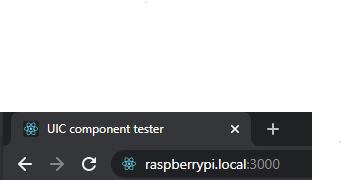

After entering the URL, you should see this front page:

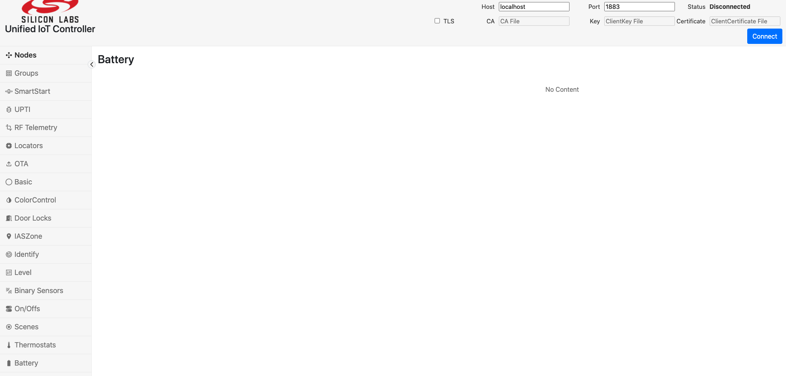

## Connecting the Developer GUI

Click connect in the top bar to start operating the _Unify_. Because of the
modular nature of the developer GUI, you can connect it to other _Unify's_.
In most cases, you want to connect to the actual _Unify_ that the
developer UI is running on, therefore leaving it on _localhost_.

After clicking connect, check that the status says **Connected** and, after
this, the page will still be blank. Then, click on the navigation bar on the
left saying **Nodes**. At that point, the page should look like this:

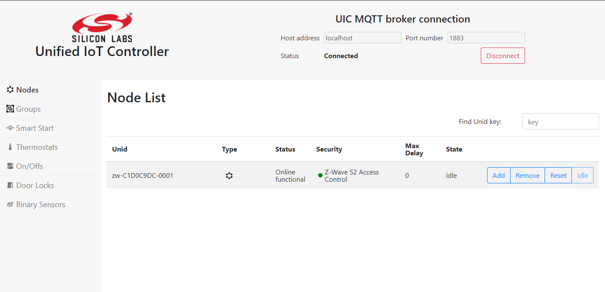

## Node Inclusion

After connecting you should be able to see current running the protocol controllers
in the nodes list, as shown in the image above.
You can do a normal node inclusion by pressing **Add** on the table for the
_PC_. This will set the _PC_ in inclusion mode. After activating inclusion mode
on the end device, a secure inclusion window may pop up depending on the
security capabilities of the device:

For secure inclusion, input the first five digits of the DSK key. For unsecure
inclusion, click **Reject**. Following is an example of a nodelist, where
different security schemes are displayed:

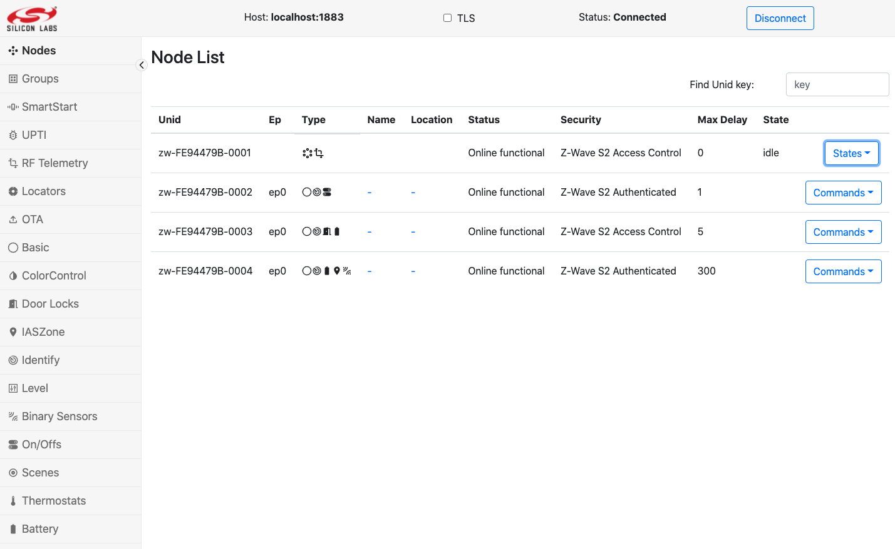

## SmartStart List

The SmartStart list enables including devices easily. A page of the smart
start list enables editing and inputting **DSK** keys of devices. When a device
starts up or resets, it will automatically get included. A SmartStart entry and
inclusion may look like this:

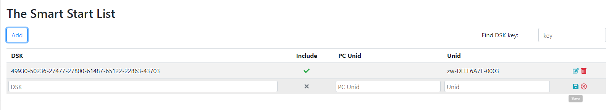

After filling in the **DSK** key and checking include, click save. If the _Unify
UPVL_ is running, it will be saved to the SmartStart list.

## Clusters

The following are the currently (2022-02-09) supported clusters of the _Dev GUI_:

- On/Off switch
- Binary sensor
- Door lock
- Thermostat
- Color Control
- Level Control
- Identify
- Name and Location
- Scenes
- Locator and Position Estimation
- Basic
- IASZone
- Power Configuration

### On/Off Switch

After inclusion of an **On/Off** switch and navigating to the switches page, the
page will look something like this:

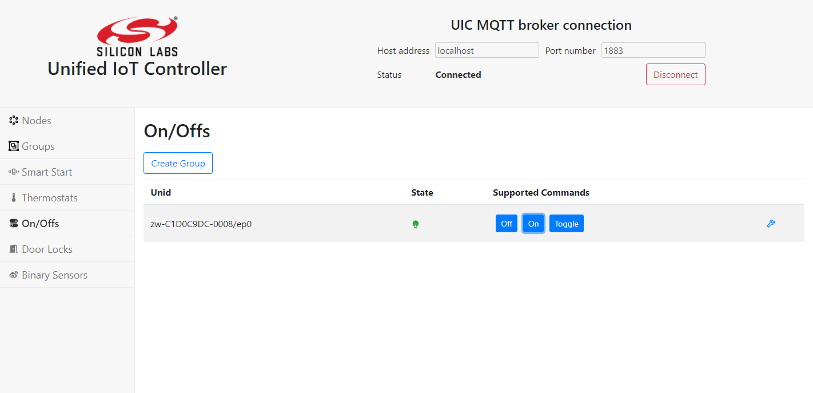

This can control an **On/Off** switch.

### Binary Sensor

After including a **Binary sensor**, a page will look like this:

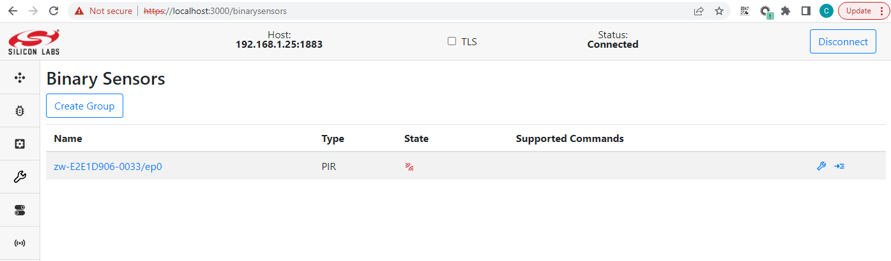

### Door Lock

The door lock requires secure inclusion to work. The page will look like this:

When unlocking or locking the door lock, a pop up will ask for a pin to the door
lock:

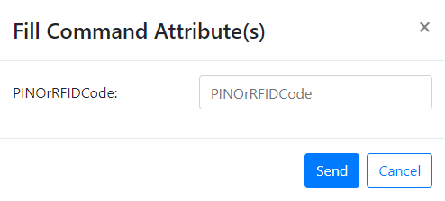

### Thermostat

The thermostat can change mode and change set point temperatures.

## Groups

The Groups pane allows the user to create groups of endpoint devices. Groups may
be used if you have a devices that support the same Commands, that you want to
control as groups. A common use case for this is light bulbs or binary switches.

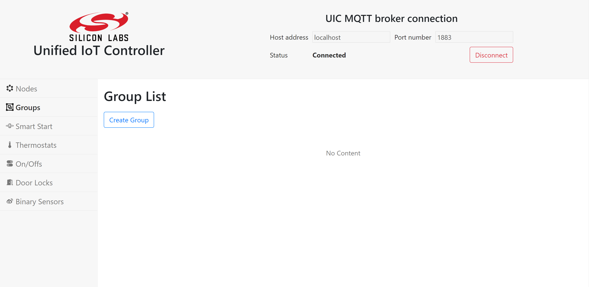

### Create Group

Groups are created by pressing the _Create Group_ button. The following image
shows how to create a group with four binary switches.

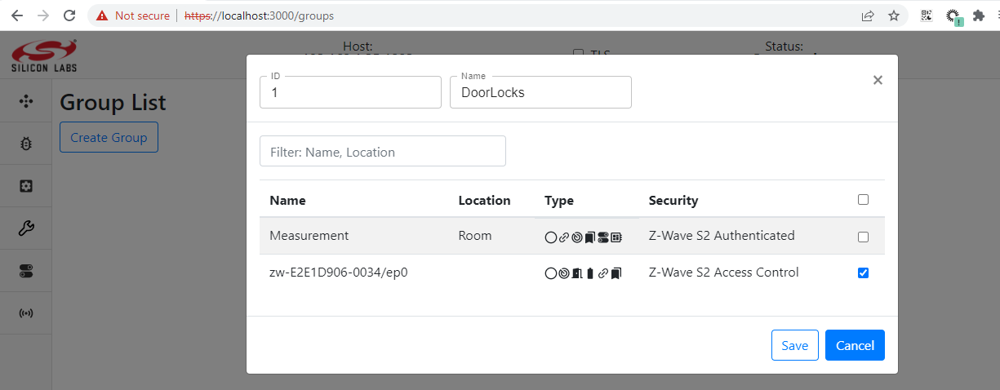

After clicking _Save_, the groups page will look like following:

### Sending Command to Group

Click the _Run Command_ button to open the _Send Group Command_ pop-up, which
looks like following.

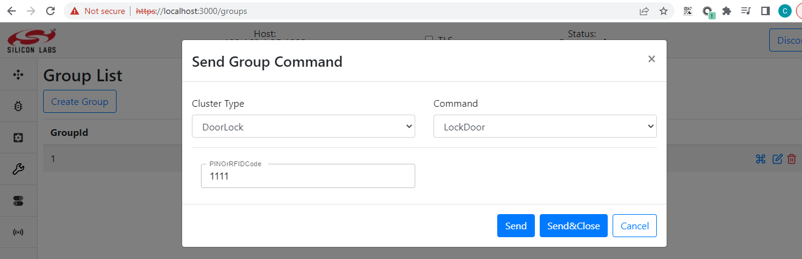

This enables selecting the command you want to send to the group. Clicking _Send_
will issue the command. In the above example, it will turn all the binary
switches in the group off.

## Name and Location

The Dev GUI allows the user to set name and location for each device and help recognize
them. The following image shows the dialog when user clicks the corresponding name and
location column.

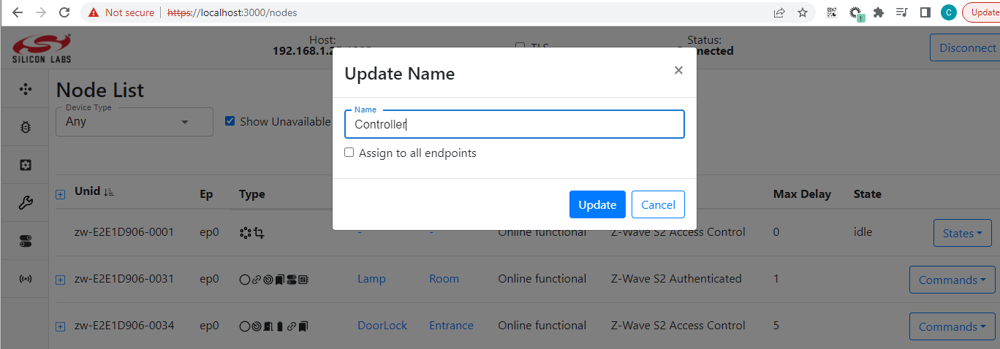

After clicking _Update_, the page will look like this.

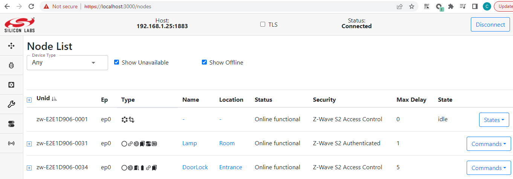