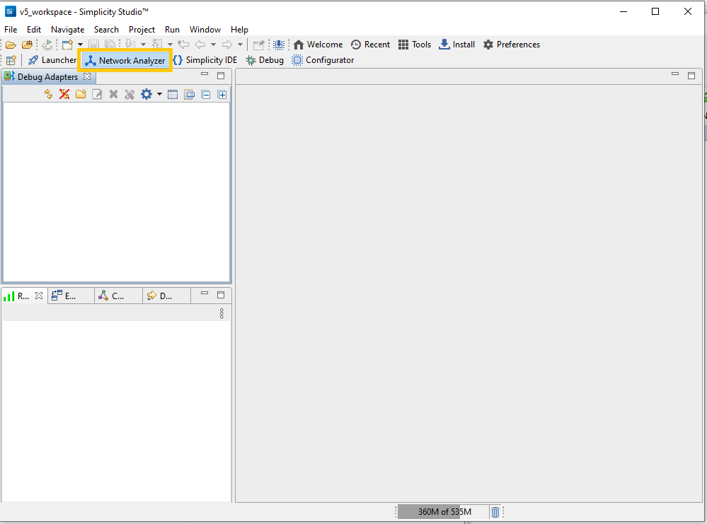
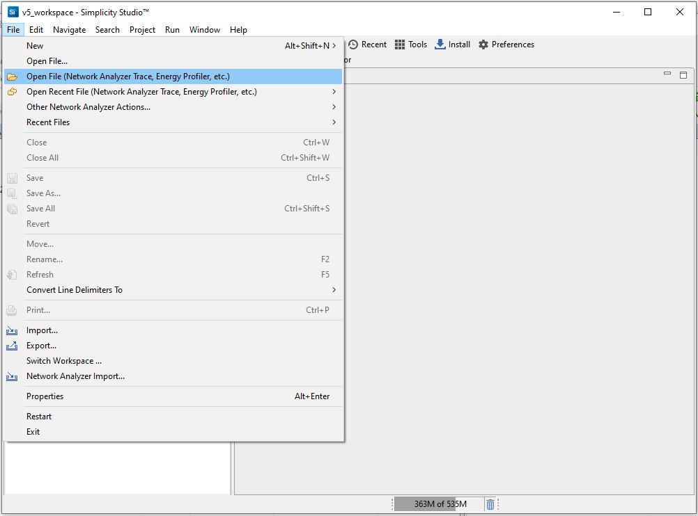
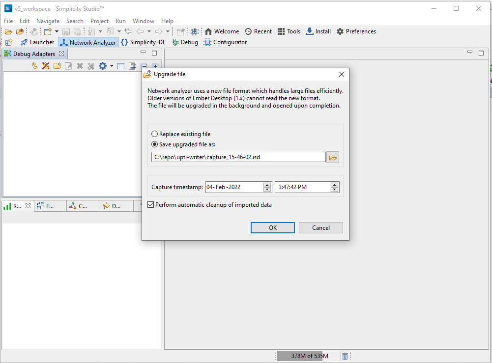
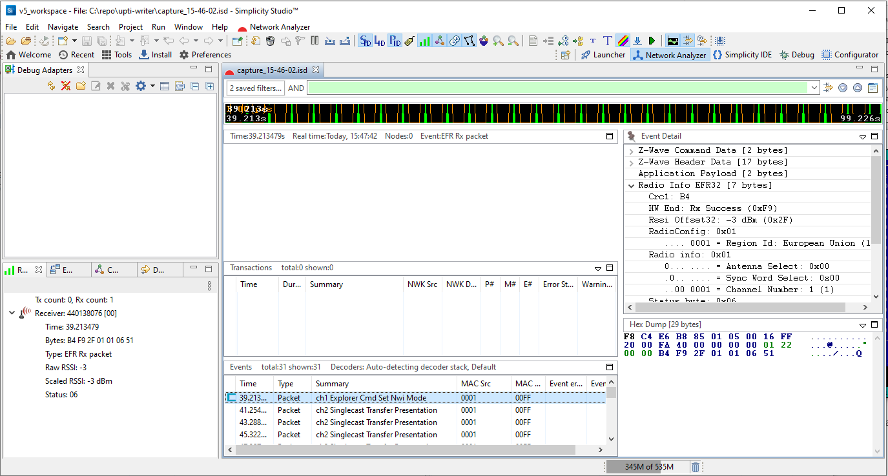

# UPTI WRITER User's Guide

The _UPTI_WRITER_ is an application to receive trace packages captured with _UPTI_CAP_ application and save them to file in [Network Analyzer](https://docs.silabs.com/simplicity-studio-5-users-guide/latest/ss-5-users-guide-tools-network-analyzer/) compatible format. 

The _UPTI_WRITER_ subscribes to topics 

* `ucl/UPTICap/List` 
* `ucl/UPTICap/+/TracePackage`

## Running the UPTI WRITER

### Using Command Line

You can run the UPTI WRITER by executing `uic-upti-writer`.

You can configure the MQTT server, log file path, etc through command line options.

For details about options, run the following command:

```bash
pi@unify:uic-upti-writer --help
```

## Output File format

```
[94143017 800 16908330 Packet 1B] [440138076] [F8 C4 E6 B8 85 01 01 0B 0D FF 01 08 05 15 F9 2B 01 02 06 51]

These fields are decoded as follows:

•94143017 - Timestamp in microseconds when event completed (start time can be inferred from subtracting Duration from this value).
•800 - Event duration in microseconds.
•16908330 - Event type ID. This varies for different kinds of trace events (Packets, traces, etc.) 
•Packet - Event type string. This is the friendly name (as ASCII text) for the event type and will match what Network Analyzer displays in the event window for this event type.
•1B - Debug protocol's sequence number from the capture source (used to detect gaps in the capture stream).
•440138076 - Source device serial number where event was captured.
•[F8 C4 ... 51] - Event data bytes (prior to any decryption; includes any RadioInfo data appended to end of packets by the hardware). 
```

### File Example
```
# (c) Ember - InSight Desktop
[39213479 800 16908330 Packet 00] [440138076] [F8 C4 E6 B8 85 01 05 00 16 FF 20 00 FA 40 00 00 00 00 01 22 00 00 B4 F9 2F 01 01 06 51]
[41254900 800 16908330 Packet 01] [440138076] [F8 C4 E6 B8 85 01 01 0F 0D FF 01 08 05 11 F9 2C 01 02 06 51]
[43288275 800 16908330 Packet 02] [440138076] [F8 C4 E6 B8 85 01 01 01 0D FF 01 08 05 1F F9 2C 01 02 06 51]
[45322341 800 16908330 Packet 03] [440138076] [F8 C4 E6 B8 85 01 01 02 0D FF 01 08 05 1C F9 2C 01 02 06 51]
[47357176 800 16908330 Packet 04] [440138076] [F8 C4 E6 B8 85 01 01 03 0D FF 01 08 05 1D F9 2B 01 02 06 51]
[49391929 800 16908330 Packet 05] [440138076] [F8 C4 E6 B8 85 01 01 04 0D FF 01 08 05 1A F9 2C 01 02 06 51]
[51424562 800 16908330 Packet 06] [440138076] [F8 C4 E6 B8 85 01 01 05 0D FF 01 08 05 1B F9 2C 01 02 06 51]
[53458801 800 16908330 Packet 07] [440138076] [F8 C4 E6 B8 85 01 01 06 0D FF 01 08 05 18 F9 2C 01 02 06 51]
[55494483 800 16908330 Packet 08] [440138076] [F8 C4 E6 B8 85 01 01 07 0D FF 01 08 05 19 F9 2C 01 02 06 51]
[57526930 800 16908330 Packet 09] [440138076] [F8 C4 E6 B8 85 01 01 08 0D FF 01 08 05 16 F9 2C 01 02 06 51]
[59561392 800 16908330 Packet 0A] [440138076] [F8 C4 E6 B8 85 01 01 09 0D FF 01 08 05 17 F9 2C 01 02 06 51]
[61596803 800 16908330 Packet 0B] [440138076] [F8 C4 E6 B8 85 01 01 0A 0D FF 01 08 05 14 F9 2C 01 02 06 51]
[63629623 800 16908330 Packet 0C] [440138076] [F8 C4 E6 B8 85 01 01 0B 0D FF 01 08 05 15 F9 2C 01 02 06 51]
[65664563 800 16908330 Packet 0D] [440138076] [F8 C4 E6 B8 85 01 01 0C 0D FF 01 08 05 12 F9 2B 01 02 06 51]
[67697876 800 16908330 Packet 0E] [440138076] [F8 C4 E6 B8 85 01 01 0D 0D FF 01 08 05 13 F9 2C 01 02 06 51]
[69732796 800 16908330 Packet 0F] [440138076] [F8 C4 E6 B8 85 01 01 0E 0D FF 01 08 05 10 F9 2C 01 02 06 51]
[71767807 800 16908330 Packet 10] [440138076] [F8 C4 E6 B8 85 01 01 0F 0D FF 01 08 05 11 F9 2C 01 02 06 51]
[73800477 800 16908330 Packet 11] [440138076] [F8 C4 E6 B8 85 01 01 01 0D FF 01 08 05 1F F9 2C 01 02 06 51]
[75834806 800 16908330 Packet 12] [440138076] [F8 C4 E6 B8 85 01 01 02 0D FF 01 08 05 1C F9 2C 01 02 06 51]
[77868815 800 16908330 Packet 13] [440138076] [F8 C4 E6 B8 85 01 01 03 0D FF 01 08 05 1D F9 2C 01 02 06 51]
[79904172 800 16908330 Packet 14] [440138076] [F8 C4 E6 B8 85 01 01 04 0D FF 01 08 05 1A F9 2C 01 02 06 51]
[81937540 800 16908330 Packet 15] [440138076] [F8 C4 E6 B8 85 01 01 05 0D FF 01 08 05 1B F9 2C 01 02 06 51]
[83970978 800 16908330 Packet 16] [440138076] [F8 C4 E6 B8 85 01 01 06 0D FF 01 08 05 18 F9 2C 01 02 06 51]
[86005202 800 16908330 Packet 17] [440138076] [F8 C4 E6 B8 85 01 01 07 0D FF 01 08 05 19 F9 2C 01 02 06 51]
[88040844 800 16908330 Packet 18] [440138076] [F8 C4 E6 B8 85 01 01 08 0D FF 01 08 05 16 F9 2B 01 02 06 51]
[90073389 800 16908330 Packet 19] [440138076] [F8 C4 E6 B8 85 01 01 09 0D FF 01 08 05 17 F9 2B 01 02 06 51]
[92107486 800 16908330 Packet 1A] [440138076] [F8 C4 E6 B8 85 01 01 0A 0D FF 01 08 05 14 F9 2C 01 02 06 51]
[94143017 800 16908330 Packet 1B] [440138076] [F8 C4 E6 B8 85 01 01 0B 0D FF 01 08 05 15 F9 2B 01 02 06 51]
[96175817 800 16908330 Packet 1C] [440138076] [F8 C4 E6 B8 85 01 01 0C 0D FF 01 08 05 12 F9 2B 01 02 06 51]
[98210157 800 16908330 Packet 1D] [440138076] [F8 C4 E6 B8 85 01 01 0D 0D FF 01 08 05 13 F9 2B 01 02 06 51]
[99225575 800 16908330 Packet 1E] [440138076] [F8 C4 E6 B8 85 01 05 00 16 FF 20 00 FA 40 00 00 00 00 01 22 01 00 B5 F9 2F 01 01 06 51]
```

## How to open file with Network Analyzer

[Official Network Analyzer User Guide](https://docs.silabs.com/simplicity-studio-5-users-guide/latest/ss-5-users-guide-tools-network-analyzer/)

E.g our log file name is `capture_15-46-02.log`

Start Simplicity Studio and switch to Network Analyzer perspective:



On the File menu, select Open File (Network Analyzer trace ..):



Save log file in upgraded format: 



Navigate over traces in editor:

