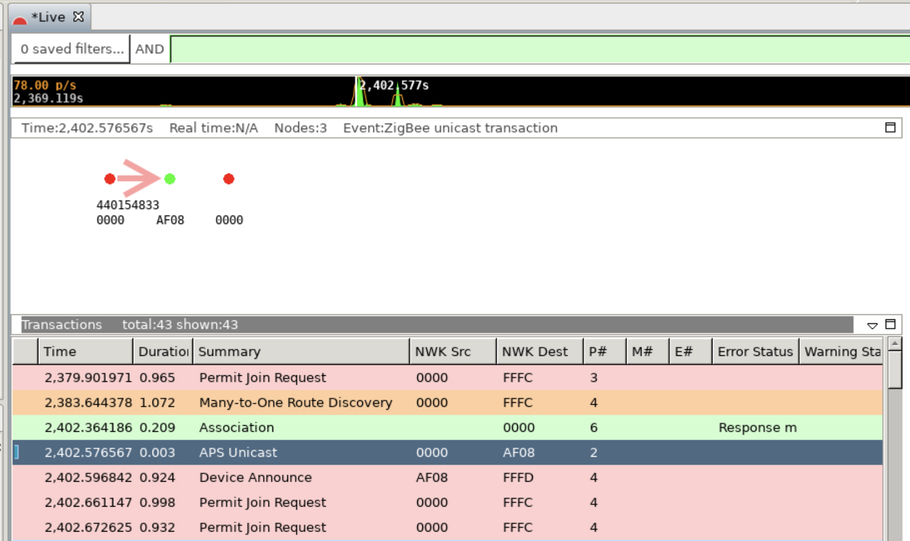

# ZigPC Developer Guide

This readme is intended for Unify Framework developers, who are trying to cross compile,
install, and run ZigPC on a Raspberry Pi.

## Build Instructions

This guide describes how to cross compile the Zigbee Protocol Controller / ZigPC
for Raspberry Pi using Docker on your work station. If you haven't already built
the Unify docker image, follow the guide in the docker folder
[readme.md](../../docker/readme_developer.md) file.

### Set up Gecko SDK

The Zigbee Protocol Controller uses certain functionality in the
[GeckoSDK](https://docs.silabs.com/gecko-platform/latest/). The Gecko SDK can be
downloaded through [Simplicity
Studio](https://www.silabs.com/developers/simplicity-studio). The ZigPC uses the
[EmberZNet library](https://www.silabs.com/developers/zigbee-emberznet) provided
through the Gecko Platform. See the [AN0822: Simplicity Studio User's Guide]
(<https://www.silabs.com/documents/public/application-notes/AN0822-simplicity-studio-user-guide.pdf>)
for more information. In summary, select the EmberZNet library at installation
time or, when creating a new project, select "Manage SDKs" followed by
"Customize Installation".

After EmberZNet/GeckoSDK is installed, locate its path (e.g.,
~/SimplicityStudio/SDKs/gecko_sdk/). Currently, v4.0 is supported. Set the
environment variable $GSDK_LOCATION to this path.

## Modifying Underlying SLC-based Zigbee Host Library

The Zigbee Protocol Controller imports a Silicon Labs Configurator based UC
project as a static library. This project should be configured in combination
with any ZCL support changes performed.

See the [Zigbee Host Library Readme](components/zigpc_gateway/libs/zigbee_host/readme.libzigbee_host.zigpc.md)
for more details.

### Cross Compiling for Raspberry Pi Using Docker

> Cross compilation builds currently supports only the Raspberry Pi OS Bullseye.

From the root of the Unify source directory, run the following:

* Build the Docker container image:

``` bash
cd docker
./build_docker.sh arm64 uic_arm64
cd ..
```

* Run the container with the GSDK locations mounted:

``` bash
docker run -it --rm \
  --env GSDK_LOCATION \
  -v`pwd`:`pwd` \
  -w `pwd` \
  -v ${GSDK_LOCATION}:${GSDK_LOCATION} \
  uic_arm64
```

Alternatively, use the provided runDocker.sh script in the docker directory.
Fill out the GSDK_LOCATION and UIC_REPO paths in the script to properly set up
the docker image.

### Compiling

To compile, run these commands from the top level Unify directory, inside the
Docker container:

``` bash
mkdir build
cd build
cmake -GNinja -DCMAKE_TOOLCHAIN_FILE=../cmake/arm64_debian.cmake ..
ninja               # Build binaries
ninja deb           # Build Debian Installers (optional)
```

### Advanced Feature - Run Raspberry Pi Unit Tests in Docker on the Host

You can run the Raspberry Pi unit tests (and ZigPC binary) within
Docker on the Host machine by using QEMU to emulate the ARM
architecture, and binfmt in the kernel, to tell Linux OS to run the ARM binaries
within QEMU.

To run the unit tests within Docker on the Host machine, run the following
command in the Host (not in the Docker container):

``` bash
docker run --user 0 --privileged --rm -it uic_arm64 update-binfmts --enable
```

> NB: This command needs to be run once after each restart of the Host machine.

After enabling this you can run the unittests by issuing following command in
the `uic_arm64` docker image in the build directory:

```bash
ninja test
```

## Install Instructions

For installing please refer to the general installation method in
[Getting started](../../doc/getting_started.md).

## Reading Console Logs

ZigPC is built on top of the Zigbee Host Wrapper Library. Currently this library
is implemented as a Silicon Labs SLC project using the SiLabs Ember Application
framework. Logs from the framework will be shown as a part of ZigPC console logs.

After ZigPC is launched, the logs from ZigPC will be associated with a timestamp, log
level, and a tag in the following format:

`LOG_TIMESTAMP <LOG_LEVEL> [LOG_TAG] LOG_MESSAGE`

`<LOG_LEVEL>` corresponds to the following:

* `<d>`: Debug log
* `<i>`: Info log
* `<w>`: Warning log
* `<e>`: Error log
* `<c>`: Critical log

NOTE: Any log that doesn't follow the above format is assumed to be part of
printed output from the Ember Application framework.

The following snippet is a snippet of example logs to expect:

```bash
zigpc --zigpc.serial /dev/ttyACM0 --mqtt.host 0.0.0.0 --mqtt.port 1883 --zigpc.datastore_file zigpc.db
# 2020-11-05 10:55:36:314815 <d> [sl_log] Setting log level to debug
# 2020-11-05 10:55:36:315475 <d> [uic_component_fixtures] Completed: UIC Signal Handler
# ...
# ...
# 2020-11-05 10:55:36:326455 <d> [uic_component_fixtures] Completed: UIC STDIN
# 2020-11-05 10:55:36:326674 <d> [uic_component_fixtures] Completed: ZIGPC Config
# [linux-serial debug] emberSerialInit()
# ...
# ...
# 2020-11-05 10:55:37:961488 <d> [zigpc_smartstart_process] SmartStart Manager Reset with new Gateway
# 2020-11-05 10:55:37:961592 <d> [mqtt_client] Subscribing to: ucl/SmartStart/List
# 2020-11-05 10:55:37:961802 <d> [mqtt_client] Subscription to ucl/by-unid/+/+/OnOff/+/ successful
# 2020-11-05 10:55:37:961979 <d> [mqtt_client] Subscription to ucl/SmartStart/List successful
# ZigPC>
```

The `ZigPC>` prompt can be used to carry out common Protocol Controller functions.
Typing "help" brings up the currently supported functions:

```bash
ZigPC> help
==================================================
Unify Command line interface Help:
==================================================
exit  :Exit the application
help  :Prints help
info  :Execute 'info' command accessible from the EmberAf CLI
log_level d|i||w|e|c:Set log levelDEBUG | INFO | WARNING | ERROR | CRITICAL
==================================================
Tip: log_level c to reduce the verbosity of log
==================================================
```

### Changing Log Levels

Changing the log levels can be achieved using the log_level command in the
"ZigPC>" console on ZigPC. The following formats are supported for this command:

* `log_level <level>`
* `log_level <tag>,<level>`

`<tag>` corresponds to any of the tags you see in the logs (i.e., mqtt_client)

`<level>` corresponds to any one of the following (can be applied overall or to
a particular log_tag):

* "off": turn off logs
* "d": Show logs up to debug levels (critical, errors, warnings, info, debug)
* "i": Show logs up to info levels (critical, errors, warnings, info)
* "w": Show logs up to warning levels (critical, errors, warnings)
* "e": Show logs up to error levels (critical, errors)
* "c": Show logs up to critical levels (critical

<br><br>

## Using Zigbee Network Analyzer to Monitor PAN

The "Network Analyzer" perspective in Silicon Labs
[Simplicity Studio](https://www.silabs.com/developers/simplicity-studio) IDE v5
can be used to analyze the traffic on the Zigbee PAN.

Network activity can be observed based on the UCL commands relayed by ZigPC.

### Installing Simplicity Studio v5

If you have not done so already, download Simplicity Studio v5 from
<https://www.silabs.com/products/development-tools/software/simplicity-studio> on
a host computer.

### Detecting Devices in Simplicity Studio

Devices in [Simplicity Studio](https://www.silabs.com/developers/simplicity-studio)
can be detected using any of the following methods:

#### Connection via Ethernet Interface

If the host computer and one of the Zigbee devices are connected via Ethernet (using
a Wireless Starter Kit for example:
<https://www.silabs.com/development-tools/wireless/efr32xg22-wireless-starter-kit>),
[Simplicity Studio](https://www.silabs.com/developers/simplicity-studio)
can capture network traffic using this interface. Either an
end device or the gateway radio can be connected via Ethernet to perform network
capture (since the serial USB connection, which ZigPC uses, can run
independently of the Ethernet connection services).

Instructions:

1. Ensure that the radio is assigned an IP address (static or dynamic).

2. In Studio, navigate from the top menu: Window → Preferences.

3. In the preferences window, go to the left menu and select: Simplicity Studio
   → Device Manager → TCP/IP Adapters.

4. In the TCP/IP Adapters view, add your device's IP Address in the Discovery
   Subnet Configuration section.

5. Click on "Apply" and then "OK".

6. Devices will now appear in the "Debug Adapters" view.

7. If the device doesn't appear, click on the "Refresh" icon in the "Debug
   Adapters" view.

#### Connection via Serial USB Interface

Because the Gateway radio is connected to Raspberry Pi running ZigPC, a test end
device should be connected to the host computer.

Instructions:

1. Plug in the end device to the host computer.
2. Devices will now appear in the "Debug Adapters" view.
3. If the device doesn't appear, click on the "Refresh" icon in the "Debug
   Adapters" view.

### Capturing Network Traffic in Simplicity Studio

Using the top menu, select Window → Perspective → Network Analyzer.

Then, in the "Debug Adapters" window, right-click on the connected device and
click "Connect", then click "Start capture".

This will trigger the Network Analyzer to record PAN events, as shown below:


The middle table, labeled "Transactions", can be used to get a high-level
overview of messages sent on the network.

### Decrypting Network Traffic in Simplicity Studio

ZigPC uses Network key (NWK key) based on the install code. In typical Zigbee
applications, the Ember CLI can be used to get this key. The CLI can be
re-enabled at compilation time, however, the network information is also
printed out at startup.

Look for the following pattern:

```bash
[DEBUG] NWK Key:: ZZ ZZ ZZ ZZ ZZ ZZ ZZ ZZ ZZ ZZ ZZ ZZ ZZ ZZ ZZ ZZ
```

Extract the NWK key value ( `ZZ ZZ ZZ ...` sequence in the log above) and add
it as a Network Analyzer Security Key using the following instructions:

1. Open [Simplicity Studio](https://www.silabs.com/developers/simplicity-studio) v5.
2. Click from the top menu: Window -> Preferences.
3. From the left sidebar, select: Network Analyzer -> Decoding -> Security Keys.
4. Add a New Entry and insert the NWK key as the Key value.
5. Click Apply then OK.

This NWK key can now decrypt network traffic after the node has joined
the network.

For more information, see ["Section 6: Using the Network Analyzer" in QSG106:
Zigbee EmberZNet PRO Quick-Start Guide](https://www.silabs.com/documents/public/quick-start-guides/qsg106-efr32-zigbee-pro.pdf).

For example, the following decrypted transactions are seen when the SmartStart
addition is performed to add an end device to the PAN using the Install
Code based DSK:



### Adding custom clusters

It is possible to add custom ZCL info to ZigPC to add natively unsupported
clusters or to override the functionality of default clusters. This step must
be run at compilation time in order to properly include the necessary MQTT
topics and other related ZCL information.

Please note, there has been limited testing on custom clusters and more changes
may be needed to support custom applications.

* Step 1: Adding the custom cluster to the Unify framework

Add a custom XML file (or modify an existing XML file) in the shared components
of the Unify framework. All XML files defining ZCL clusters are stored in the
'uic-dotdot' component under the 'dotdot-xml' folder. If a new XML file is
added or if the name of an XML file changes, that change must be reflected in
the library.xml file

* Step 2: Adding the custom cluster in the ZigPC

ZigPC generates ZCL-cluster code and structures using ZAP. Ensure that the ZAP
templates will generate for the new cluster by adding the name to:
'uic/applications/zigpc/components/zcl\_util/zap/addon-helper.js
Specifically, the 'SUPPORTED\_CLUSTERS' and 'SUPPORTED\_CLUSTER\_ATTRIBUTES'
lists must reference the new cluster.

*Step 3: Re-generate all ZAP templates

Unify uses ZAP to generate ZCL cluster information (as discussed in step #2).
Make sure that zap can find the library by modifying its configuration file.

Alternatively, compile with the cmake option 'ZAP\_GENERATE' set to 'ON' to
automatically re-generate zap output files as part of the compilation process.

Re-generate all zap output in the top level uic for the following components:
uic\_dotdot, uic\_dotdot\_mqtt, unify\_dotdot\_attribute\_store

Re-generate all zap output in the zigpc level for the following components:
command\_mapper, zcl\_util, zcl\_command\_parser, zcl\_profiles, attribute\_management

Please take a look at [https://github.com/SiliconLabs/zap] for more detailed
information.

* Step 4:

Compile ZigPC as normal. ZigPC should now support your custom cluster.
