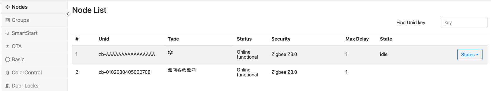

# ZigPC User's Guide

This document is a user guide for the Zigbee Protocol controller (ZigPC).
The primary role of ZigPC is to allow Zigbee devices to be monitored and
controlled using the Unify Controller Language (UCL).

<br><br>

## Overview

The Unify SDK provides a consolidated API to observe and control devices that
communicate using different sensor network protocols (Zigbee, Z-Wave, and so on)
with the help of Unify Protocol Controllers.

An MQTT broker is at the core of Unify SDK. It is used by Protocol Controllers to
send and receive commands and information from other Unify components using the
Unify Controller Language (UCL).

The Zigbee Protocol Controller (ZigPC) is an opinionated Zigbee gateway that
act as a Unify gateway, as specified in the Unify Specification.

ZigPC uses the Zigbee Host-NCP model to relay messages from Unify to the end
device where EZSP is used as the serial protocol to communicate with the NCP.

<br><br>

## Hardware Prerequisites

Running Unify with ZigPC requires the following equipment:

### Gateway Host Device: Raspberry Pi

ZigPC is officially supported on a Raspberry Pi 4 running Debian Buster (A.K.A.
Raspberry Pi OS).

For installation and setup, follow steps outlined in:
https://www.raspberrypi.org/documentation/

Find more information about Raspberry Pi OS here:
https://www.raspberrypi.org/downloads/raspberry-pi-os/

### Gateway NCP Device

Supported radios: EFR32MG1X or EFR32MG2X
Supported EZSP protocol: UART (SPI not officially supported)

### PAN Zigbee Device

Currently supported Zigbee device provisioning methods:
- Zigbee 3.0 with Install Code
- Zigbee 3.0 with Well-Known-Key

See the Appendix section at the bottom of the guide for steps to configure
example NCP and Z3Light device FW images.

<br><br>

## Installing ZigPC

All of the Unify components below (MQTT Broker, UPVL client and GMS client)
should be installed before running the ZigPC. Running Unify with ZigPC requires
using an MQTT Broker. Unify currently supports using Mosquitto MQTT
(https://mosquitto.org/).

See the "Getting Started" section in
[Unify SDK Overview](README.md) to unzip and install the
Unify components.

### Description of Installed Components

After the packages are installed, the following services and libraries are
available on the Raspberry Pi:

#### Mosquitto MQTT System Service
The Mosquitto MQTT broker is installed as a system service running in the
background. It should be started before attempting to launch any Unify component.
Otherwise, Unify components may not launch properly and may not communicate to each
other properly.

#### Mosquitto MQTT Clients: mosquitto_pub, mosquitto_sub
The Mosquitto publish & subscribe tools can be used to interact with the Unify
MQTT broker by providing a topic and a message payload (if publishing).

#### libuic.so
This library contains the runtime dependencies used by some Unify components
(including ZigPC). See
[Unify SDK Library Developer Guide](doc/readme_developer.md)
for more details.

#### uic-upvl
The Unify SDK Provisioning List (UPVL)
maintains the UCL SmartStart topics (and its List, Update, and Remove
subtopics. See [UPVL User Guide](applications/upvl/readme_user.md) for more
details.

#### uic-gms
Unify IoT service that book-keeps groups data among different Protocol
Controllers. It manages the ucl/by-group/# topic space. See
[GMS User Guide](applications/gms/readme_user.md) for more details.

#### uic-image-provider
Unify IoT service that stores and distributes OTA Firmware images for Protocol
Controllers over UCL. It manages the ucl/OTA/# topic space. See
[Image Provider User's Guide](applications/image_provider/readme_user.md) for
more details.

#### zigpc
The Zigbee Protocol Controller application connects to the Mosquitto MQTT
broker, sets up a PAN as a Zigbee Coordinator, and relays messages using the
Zigbee NCP connected on a serial port.

<br><br>

## Starting ZigPC on the Command Line

1. Run the MQTT Broker on the Raspberry Pi.
```bash
systemctl start mosquitto
systemctl status mosquitto

# If you encounter problems with running the service, logs can be received by running
journalctl -u mosquitto
```

2. Run the UPVL application on the Raspberry Pi by following instructions in
   the [UPVL User Guide](applications/upvl/readme_user.md).
```bash
# Make sure uic-upvl is running
sudo systemctl status uic-upvl

# NOTE: If it has stopped or not running, run the following commands:
#     sudo systemctl enable uic-upvl
#     sudo systemctl start uic-upvl
```

3. Run the Group Management Service application on the Raspberry Pi by following instructions in
   the [GMS User Guide](applications/gms/readme_user.md).
```bash
# Make sure uic-gms is running
sudo systemctl status uic-gms

# NOTE: If it has stopped or not running, run the following commands:
#     sudo systemctl enable uic-gms
#     sudo systemctl start uic-gms
```
4. Run the Image provider application on the Raspberry Pi by following instructions in
   the [Image Provider User Guide](applications/image_provider/readme_user.md).
```bash
# Make sure uic-image-provider is running
sudo systemctl status uic-image-provider

# NOTE: If it has stopped or not running, run the following commands:
#     sudo systemctl enable uic-image-provider
#     sudo systemctl start uic-image-provider
```

5. Run ZigPC on the Raspberry Pi with the serial port to the flashed Zigbee NCP.
**Running ZigPC as a system service**
Once installed, ZigPC will be configured to run as a system service by default.
```bash
# Make sure uic-zigpc is running
sudo systemctl status uic-zigpc

# NOTE: If it has stopped or not running, run the following commands:
#     sudo systemctl enable uic-zigpc
#     sudo systemctl start uic-zigpc

# NOTE: To stop running zigpc as a system service, run the following commands:
#     sudo systemctl stop uic-zigpc
#     sudo systemctl disable uic-zigpc
```
The configuration used by the service can be found at `etc/uic/uic.cfg`

**Running ZigPC on the command line**
If ZigPC is not running a system service
```bash
zigpc --zigpc.serial /dev/ttyACM0 --mqtt.host 0.0.0.0 --mqtt.port 1883 --zigpc.datastore_file zigpc.db

```
> _NOTE: Run `zigpc --help` to see a full list of supported parameters_

> _NOTE: ZigPC serial argument point to the UART-EZSP port exposed by the Zigbee NCP. This path will be different based on the configuration of tty devices connected to your Raspberry Pi_

> _NOTE: Ensure ZigPC is only running as a system service or via the CLI and not both_

<br><br>

## Understanding ZigPC Functions
The Zigbee Protocol Controller performs network discovery and device servicing for sleepy and non-sleepy Zigbee devices. The following section outline some of the different functions ZigPC performs.

### Device Addressing
Unify uses a unique identifier when addressing nodes included by different protocol
controllers called a Unified Node Identifier (UNID). ZigPC uses the Extended Unique Identifier of the device (EUI64) as part of the UNID to relay messages between Unify and Zigbee devices: `zb-<EUI64_IN_BIG_ENDIAN>`

For example, if the EUI64 of a device is `00-11-22-33-44-55-66-77`, the UNID will be: `zb-0011223344556677`


### Zigbee Node Commissioning
ZigPC currently only supports adding Zigbee devices using the Unify SmartStart
List functionality. The currently supported format recognized by ZigPC is
the Z3 Install Codes based Device-Specific key (DSK). See Unify Specification Section
3.7.1 for more details.


#### Z3 Install Code-Based Provisioning
The Unify SmartStart List enables easily adding pre-provisioned devices to
the network using a protocol-specific Device-Specific Key (DSK). The SmartStart
List is managed by another Unify component called uic-upvl.

Currently, ZigPC uses DSKs that contain information from the out-of-band Zigbee
3.0 Installation Code method to permit a Zigbee device to join the network.

<b>DSK Format:</b>

ZigPC Accepts SmartStart entries that have the following DSK format in groups of
two hexadecimal values:
```
<END_DEVICE_EUI64>-<END_DEVICE_INSTALL_CODE>-<END_DEVICE_INSTALL_CODE_CRC>
```

For example, if the Zigbee device EUI64 (big endian) is 0x00 0xAA 0x11 0xBB 0x22
0xCC 0x33 0xDD and the install code (big endian) is 0x0A 0x0B 0x0C 0x0D 0xE 0xF
0x1 0x2 with a CRC of 0x7B8A, the DSK should be:
```
00-AA-11-BB-22-CC-33-DD-0A-0B-0C-0D-0E-0F-01-02-7B-8A
```

After a Z3 Install code-based SmartStart DSK has been recognized in the Unify
published SmartStart List, ZigPC will extract and add the Install Code and
EUI64 pair to ZigPC. When network-steering is performed on the joining node,
ZigPC will validate using the Install Code based Link key extracted and allow
the device to join the network.

See (AN1089: Using Installation Codes with
Zigbee Devices)[https://www.silabs.com/documents/public/application-notes/an1089-using-installation-codes-with-zigbee-devices.pdf]
for more details on how to setup Z3 Install Codes on joining devices.

UCL topics used:
- Subscribing to the current list of SmartStart entries: `ucl/SmartStart/List`

#### Well-Known-Key Based Provisioning

The ZigPC network can be configured to accept device joins using the well-known
key. ZigPC will open up the network and allow well-known key based joins when
the NetworkManagement state `add node` is requested:

UCL topics used:
- Subscribing to Network Management state change requests:
`ucl/by-unid/<DEVICE_UNID>/ProtocolController/NetworkManagement/Write`
- Publishing Network Management state changes:
`ucl/by-unid/<DEVICE_UNID>/ProtocolController/NetworkManagement`


### Device State Updates
ZigPC publishes the network status of devices through inclusion, interview,
and regular function stages.

UCL topics used:
- Publishing device state updates:
`ucl/by-unid/<DEVICE_UNID>/State`
- Publishing endpoints active under device:
`ucl/by-unid/<DEVICE_UNID>/State/Attributes/EndpointIdList/Reported`


### Device Discovery
Once added to the network, ZigPC performs device interviewing to retrieve the
ZCL clusters supported per each endpoint on the device. After the device
interview process finishes, bindings and attribute reports are configured to
publish attribute updates to Unify. In addition, ZigPC publishes the commands
supported by these ZCL clusters as UCL clusters.

UCL topics used:
- Publishing supported commands for UCL clusters discovered:
`ucl/by-unid/<DEVICE_UNID>/ep<ENDPOINT_ID>/<CLUSTER_NAME>/SupportedCommands`


### Device Command Relaying
After the supported commands are published by ZigPC for a device endpoint, UCL
commands can be sent to the Zigbee device. The UCL command received by ZigPC
is mapped to a corresponding ZCL command and sent to the Zigbee device endpoint.

UCL topics used:
- Subscribing to UCL cluster commands sent by Unify gateway:
`ucl/by-unid/<DEVICE_UNID>/ep<ENDPOINT_ID>/<CLUSTER_NAME>/Commands/<COMMAND_NAME>`


### Device GeneratedCommand Updates
ZigPC is able to publish commands generated by devices (either as command
responses or as unsolicted stimuli) to the Unify broer. The ZCL command is
parsed and mapped to UCL command before publishing under the device, endpoint,
cluster combination.

UCL topics used:
- Publishing to UCL cluster generated commands received to Unify gateway:
`ucl/by-unid/<DEVICE_UNID>/ep<ENDPOINT_ID>/<CLUSTER_NAME>/GeneratedCommands/<COMMAND_NAME>`


### Device Attribute Updates
Zigbee devices with attribute reporting configured will send ZigPC attribute reports for each attribute supported in each ZCL cluster under each endpoint. These attribute updates are published under the UCL `Reported` topic when changes occur of after a timeout.

UCL topics used:
- Publishing reported UCL cluster attribute updates:
`ucl/by-unid/<DEVICE_UNID>/ep<ENDPOINT_ID>/<CLUSTER_NAME>/Attributes/<ATTRIBUTE_NAME>/Reported`


### Group Message Handling
Unify uses the ZCL Group ID format to send group commands to multiple devices
spanning different protocols at the same time. ZigPC uses the ZCL Groups
cluster functionality on each Zigbee endpoint to maintain the group membership.
After an endpoint is added to the group using the UCL Groups/AddGroup
command, ZigPC publishes the list of groups the endpoint is part of.

ZigPC uses the functionality provided by the Unify Group manager component
called uic-gms. Once the group list is published by ZigPC, the uic-gms
manages the group commands that can be sent through the Unify gateway.

ZigPC listens to the by-group topic space and services any groupIDs that is
recognized by translating the UCL cluster command and sending this message as
a multicast message to the Zigbee network.

UCL topics used:
- `ucl/by-group/<GROUP_ID>/<CLUSTER_NAME>/Commands/<COMMAND_NAME>`
    *  Behavior: ZigPC listens to DotDot cluster commands received and sends the
       group command as a multicast message on the network based on Unify Spec Section
       6.3.3.


### Zigbee OTA Firmware Upgrade Support
ZigPC supports OTA updates for nodes that have an OTA ZCL cluster.
The OTA mechanism is based off the existing GSDK, OTA-Server plugin.
For more information, see [Silicon Labs' OTA Server-Client Application
Note](https://www.silabs.com/documents/public/application-notes/an728-ota-client-server-setup.pdf).

NOTE: It is expected that a device will have a bootloader to properly support OTA updates. See
[Silicon Labs' Bootloader User Guide](https://www.silabs.com/documents/public/user-guides ug103-06-fundamentals-bootloading.pdf)
for more details.


### Zigbee Sleepy End Device Support
ZigPC handles sleepy end device (SED) communications with the use of the ZCL
PollControl server functionality available on the SED. After the SED is
interviewed by ZigPC, ZCL messages sent to SED will be stored until the SED
PollControl server sends ZigPC a PollControl/CheckIn message. ZigPC will send
a PollControl/CheckInrResponse as a reply to transition SED into fast-polling
mode. This will allow ZigPC to unload/send any queued messages to the SED.

### Protocol Controller Diagnostics
ZigPC publishing information related to the host process and NCP information to
provide usage statistics to customers. The following metrics are being published
currently:
- System uptime
- System CPU load average
- Process CPU usage
- Process memory usage
- Zigbee stack counters

UCL topics used:
- Publishing supported diagnostic metrics:
`ucl/by-unid/<DEVICE_UNID>/ProtocolController/SystemHealth/SupportedMetrics`
- Subscribing to metric requests:
`ucl/by-unid/<DEVICE_UNID>/ProtocolController/SystemHealth/Request`

<br><br>

## Getting Started with Including Zigbee 3.0 Device to ZigPC

For the following example, the UNID addresses used are as follows:

**ZigPC Gateway UNID: zb-AAAAAAAAAAAAAAAA**

**Zigbee Device UNID: zb-0102030405060708**

There are 3 command-lines terminals used in the following steps:
1. Non-ARM Host prompt: Host> (used in Simplicity Commander instructions)
2. Raspberry Pi prompt: RaspberryPi>
3. Zigbee Device EmberCLI prompt: Z3Device>

OPTIONAL: To see all messages sent to the broker, follow the steps to download
and install the [MQTT Explorer tool](https://mqtt-explorer.com/). After it is
run on the host machine, connect to the MQTT broker on the Raspberry Pi.

To perform the below steps using the Unify Dev GUI tool, see
[Dev GUI User Guide](applications/dev_ui/dev_gui/readme_user.md).

### Adding Zigbee Device to the ZigPC Network via Install-Code Method
NOTE: The following steps use the command line interface (CLI) exposed by Simplicity
Commander stand-alone tool.

1. Create a random HEX sequence of 6,8,12, or 16 bytes (12, 16, 24, 32
   characters respectively) and put it in a file containing the following text:
   `Install Code: <RANDOM_HEX_SEQUENCE>`
   ```bash
   ## command ##
   Host> cat /tmp/install-code.txt:

   Install Code: F64C3E6D196569CE4F2000A40069B534

   ```

2. Connect the Zigbee device to your host machine via USB.

3. Use the Simplicity Commander CLI to flash the Install code to the Zigbee Device:
   ```bash
   ## command ##
   Host> commander flash --tokengroup znet --tokenfile /tmp/install-code.txt --device efr32mg12p

   ```

4. Validate the install code is present and extract the CRC corresponding to the
   install code by running the following command:
   ```bash
   ## command ##
   Host> commander tokendump –-tokengroup znet –-device efr32mg12p

   ## sample output ##
   # ...
   # # MFG_EMBER_EUI_64              : 0807060504030201       <-- NOTE: This is in Little Endian
   # ...
   # #'MFG_INSTALLATION_CODE (Smart Energy Install Code)' token group
   # # Install Code Flags : 0x0006
   # Install Code       : F64C3E6D196569CE4F2000A40069B534    <-- NOTE: This is in Big Endian
   # # CRC                : 0x7646                            <-- NOTE: This is in Little Endian

   ```


> _NOTE: Ensure ZigPC is running by this step._

5. Format the SmartStart DSK using the Z3Device's EUI64, install code, and
   install code CRC.
    - Example EUI64 in big endian = `01-02-03-04-05-06-07-08`
    - Install code in big endian =
      `F6-4C-3E-6D-19-65-69-CE-4F-20-00-A4-00-69-B5-34`
    - Install code CRC  big endian = `46-76`
    - DSK combining above information =
      `01-02-03-04-05-06-07-08-F6-4C-3E-6D-19-65-69-CE-4F-20-00-A4-00-69-B5-34-46-76`

   NOTE: Ensure the EUI64 used above corresponds to the device that is
   joining, not the example EUI64 used as an example`.

6. Access the Zigbee device EmberCLI using Studio or a serial terminal to perform cleanup of the device state.
   ```bash
   ## command ##
   Z3Device> plugin reporting clear
   Z3Device> plugin groups clear
   Z3Device> network leave
   Z3Device> keys clear

   ```
   NOTE: Ensure that Z3Device is not part of the network by entering the
   `info` command and seeing `panID [0x0000]` and `nodeID [0xFFFE]` in the
   output:
   ```bash
   ## command ##
   Z3Device> info

   ## sample output ##
   # MFG String:
   # AppBuilder MFG Code: 0x1002
   # node [(>)0102030405060708] chan [0] pwr [0]
   # panID [0x0000] nodeID [0xFFFE] xpan [0x(>)0000000000000000]
   # parentID [0x0000] parentRssi [0]
   # ...
   # ...

   ```

7. Validate that a new MQTT topic has been published showing the Protocol
   Controller Network Management state as `idle`:
   ```bash
   ## command ##
   RaspberryPi> mosquitto_sub -h 0.0.0.0 -p 1883 -t 'ucl/by-unid/+/ProtocolController/NetworkManagement'

   ## sample output ##
   # ucl/by-unid/zb-AAAAAAAAAAAAAAAA/ProtocolController/NetworkManagement {"State": "idle", "SupportedStateList": ["add node", "remove node"], "RequestedStateParameters": []}

   ```
   in the output above, the ZigPC Gateway UNID can be seen from the topic
   as `zb-AAAAAAAAAAAAAAAA`

   **Dev GUI Method**: Go to the Nodes tab to see the Protocol Controller UNID and state.

   

8. Use the Mosquitto publish tool to add a SmartStart entry using the DSK
   created above.

   OPTIONAL: you can also specify the EUI64 of the ZigPC Gateway NCP (see
   User Manual below) in the "ProtocolControllerUnid" field:
   ```bash
   ## command ##
   RaspberryPi> mosquitto_pub -h 0.0.0.0 -p 1883 -t 'ucl/SmartStart/List/Update' -m '{"DSK":"01-02-03-04-05-06-07-08-F6-4C-3E-6D-19-65-69-CE-4F-20-00-A4-00-69-B5-34-46-76","Include":true,"ProtocolControllerUnid":"","Unid":""}'

   ```
   **Dev GUI Method**: Go to the SmartStart tab and click on the "Add" key

   

   **Dev GUI Method**: Fill in the DSK in the entry.

   

9. Once ZigPC detects the new SmartStart entry, it will open the network to permit the Z3Device to
    join using the install code configured.

10. In the Z3Device, start the Network Steering plugin process by entering `plugin
   network-steering start 0` on the Z3Device Ember CLI:
   ```bash
   ## command ##
   Z3Device> plugin network-steering start 0
   ```

11. Z3Device should join the ZigPC network and assign a UNID using the
   following format: `zb-<Z3DEVICE_EUI64_BE>`.
   ```bash

   ## Sample format ##
   # Z3Device EUI64(BE): 0102030405060708
   # Z3Device UNID: zb-0102030405060708

   ```

12. Validate that the UNID has been assigned by checking the Unify SmartStart list
    using the Mosquitto subscribe tool:
   ```bash
   ## command ##
   RaspberryPi> mosquitto_sub -h 0.0.0.0 -p 1883 -W 1 -v -t 'ucl/SmartStart/List'

   ## sample output ##
   # ucl/SmartStart/List { "value": [{"DSK":"01-02-03-04-05-06-07-08-F6-4C-3E-6D-19-65-69-CE-4F-20-00-A4-00-69-B5-34-46-76","Include":true,"ProtocolControllerUnid":"","Unid":"zb-0102030405060708"}] }

   ```
   As seen, the Device UNID is "zb-0102030405060708".

   **Dev GUI Method**: Go to the SmartStart tab and see the updated UNID field.

   

13. Validate that the ZigPC NetworkManagement state has transitioned back to
   idle (previous MQTT messages would have shown the NetworkManagement state
   has transitioned from "idle" -> "add node" -> "node interview" -> "idle"):
   ```bash
   ## command ##
   RaspberryPi> mosquitto_sub -h 0.0.0.0 -p 1883 -t 'ucl/by-unid/+/ProtocolController/NetworkManagement'

   ## sample output ##
   # ucl/by-unid/zb-AAAAAAAAAAAAAAAA/ProtocolController/NetworkManagement {"State": "idle", "SupportedStateList": ["add node", "remove node", "node interview"], "RequestedStateParameters": []}

   ```

14. Validate that a new MQTT topic has been published showing Z3Device is online and functional:
   ```bash
   ## command ##
   RaspberryPi> mosquitto_sub -h 0.0.0.0 -p 1883 -W 1 -v -t 'ucl/by-unid/zb-0102030405060708/State'

   ## sample output ##
   # ucl/by-unid/zb-0102030405060708/State { "Security": "Zigbee Z3.0", "MaximumCommandDelay": "1", "NetworkStatus": "Online functional" }

   ```

   **Dev GUI Method**: Go to the Nodes tab and see the updated Z3Device entry.

   


### Adding Zigbee Device to the ZigPC Network using Well-Known Key
NOTE: The following steps use the command line interface (CLI) exposed by Simplicity
Commander stand-alone tool.

1. Configure and run ZigPC to allow accepting well-known key based joins:
- Using CLI with argument `--zigpc.tc_use_well_known_key true`
- Using system service configuration in `etc/uic/uic.cfg`:
```yaml
zigpc:
  ...
  tc_use_well_known_key: true
```

2. Validate the following MQTT topic has been published showing the Protocol
   Controller Network Management state as `idle`:
   ```bash
   ## command ##
   RaspberryPi> mosquitto_sub -h 0.0.0.0 -p 1883 -t 'ucl/by-unid/+/ProtocolController/NetworkManagement'

   ## sample output ##
   # ucl/by-unid/zb-AAAAAAAAAAAAAAAA/ProtocolController/NetworkManagement {"State": "idle", "SupportedStateList": ["add node", "remove node"], "RequestedStateParameters": []}

   ```
   
   in the output above, the ZigPC Gateway UNID can be seen from the topic
   as `zb-AAAAAAAAAAAAAAAA`

   **Dev GUI Method**: Go to the Nodes tab to see the Protocol Controller UNID and state.

   

3. Use the Mosquitto publish tool to request a Network Management state change to `add node`:
   ```bash
   ## command ##
   RaspberryPi> mosquitto_pub -h 0.0.0.0 -p 1883 -t 'ucl/by-unid/zb-AAAAAAAAAAAAAAAA/ProtocolController/NetworkManagement/Write' -m '{"State": "add node"}'

   ```
   **Dev GUI Method**: Go to the Nodes tab and click on the "States" dropdown and select the "add node" item.

   

   ZigPC will now open the network to permit the Z3Device to join using the well-known key.

4. In the Z3Device, start the Network Steering plugin process by entering `plugin
   network-steering start 0` on the Z3Device Ember CLI:
   ```bash
   ## command ##
   Z3Device> plugin network-steering start 0
   ```

5. Z3Device should join the ZigPC network and assign a UNID using the
   following format: `zb-<Z3DEVICE_EUI64_BE>`.
   ```bash

   ## Sample format ##
   # Z3Device EUI64(BE): 0102030405060708
   # Z3Device UNID: zb-0102030405060708

   ```

6. Validate that the ZigPC NetworkManagement state has transitioned back to
   idle (previous MQTT messages would have shown the NetworkManagement state
   has transitioned from "idle" -> "add node" -> "node interview" -> "idle"):
   ```bash
   ## command ##
   RaspberryPi> mosquitto_sub -h 0.0.0.0 -p 1883 -t 'ucl/by-unid/+/ProtocolController/NetworkManagement'

   ## sample output ##
   # ucl/by-unid/zb-AAAAAAAAAAAAAAAA/ProtocolController/NetworkManagement {"State": "idle", "SupportedStateList": ["add node", "remove node", "node interview"], "RequestedStateParameters": []}

   ```

7. Validate that a new MQTT topic has been published showing Z3Device is online and functional:
   ```bash
   ## command ##
   RaspberryPi> mosquitto_sub -h 0.0.0.0 -p 1883 -W 1 -v -t 'ucl/by-unid/zb-0102030405060708/State'

   ## sample output ##
   # ucl/by-unid/zb-0102030405060708/State { "Security": "Zigbee Z3.0", "MaximumCommandDelay": "1", "NetworkStatus": "Online functional" }

   ```

   **Dev GUI Method**: Go to the Nodes tab and see the updated Z3Device entry.

   

### Discovering UCL Cluster Command Support for Z3Device
NOTE: The Zigbee device must be added using the SmartStart addition process
discussed above.
NOTE: ZigPC will publish the UCL cluster command support under for all endpoints
discovered in the interview process.

1. Subscribe to the UCL cluster command topic space under a Z3Device endpoint:
   NOTE: Endpoint 1 (ep1) chosen for this example. Other endpoint support will
   be published based on device discovery
   ```bash
   ## command ##
   RaspberryPi> mosquitto_sub -h 0.0.0.0 -p 1883 -W 1 -v -t 'ucl/by-unid/zb-0102030405060708/ep1/+/SupportedCommands'

   ## sample output ##
   # ucl/by-unid/zb-0102030405060708/ep1/OnOff/SupportedCommands
   # {"value": ["Off","On","Toggle","OffWithEffect","OnWithRecallGlobalScene","OnWithTimedOff","WriteAttributes","ForceReadAttributes"]}
   #
   # ucl/by-unid/zb-0102030405060708/ep1/Level/SupportedCommands
   # {"value": ["MoveToLevel","Move","Step","Stop","MoveToLevelWithOnOff","MoveWithOnOff","StepWithOnOff","StopWithOnOff","MoveToClosestFrequency","WriteAttributes","ForceReadAttributes"]}
   #
   # ucl/by-unid/zb-0102030405060708/ep1/Identify/SupportedCommands
   # {"value": ["Identify","IdentifyQuery","TriggerEffect","WriteAttributes","ForceReadAttributes"]}
   #
   # ucl/by-unid/zb-0102030405060708/ep1/Groups/SupportedCommands
   # {"value": ["AddGroup","ViewGroup","GetGroupMembership","RemoveGroup","RemoveAllGroups","AddGroupIfIdentifying","WriteAttributes","ForceReadAttributes"]}

   ```

   **Dev GUI Method**: Go to the Nodes tab and see `Type` column to see the supported clusters.

   


### Discovering UCL Cluster Attribute Updates for Z3Device
NOTE: The Zigbee device must be added using the SmartStart addition process
discussed above.
NOTE: ZigPC will publish the UCL cluster support under for all endpoints
discovered in the interview process.

1. Subscribe to the UCL cluster attribute topic space under one of the Z3Device
   endpoints:
   NOTE: Endpoint 1 (ep1) chosen for this example. Other endpoint support will
   be published based on device discovery.
   ```bash
   ## command ##
   RaspberryPi> mosquitto_sub -h 0.0.0.0 -p 1883 -W 1 -v -t 'ucl/by-unid/zb-0102030405060708/ep1/+/Attributes/#'

   ## sample output ##
   # ucl/by-unid/zb-0102030405060708/ep1/OnOff/Attributes/GlobalSceneControl/Reported { "value": true }
   # ucl/by-unid/zb-0102030405060708/ep1/OnOff/Attributes/OnOff/Reported { "value": false }
   # ucl/by-unid/zb-0102030405060708/ep1/OnOff/Attributes/OnTime/Reported { "value": 0 }
   # ucl/by-unid/zb-0102030405060708/ep1/OnOff/Attributes/OffWaitTime/Reported { "value": 0 }
   # ucl/by-unid/zb-0102030405060708/ep1/OnOff/Attributes/StartUpOnOff/Reported { "value": "SetOnOffTo0" }
   # ucl/by-unid/zb-0102030405060708/ep1/OnOff/Attributes/ClusterRevision/Reported {"value": 2}
   #
   # ucl/by-unid/zb-0102030405060708/ep1/Level/Attributes/CurrentLevel/Reported { "value": 0 }
   # ucl/by-unid/zb-0102030405060708/ep1/Level/Attributes/RemainingTime/Reported { "value": 0 }
   # ucl/by-unid/zb-0102030405060708/ep1/Level/Attributes/StartUpCurrentLevel/Reported { "value": 0 }
   # ucl/by-unid/zb-0102030405060708/ep1/Level/Attributes/ClusterRevision/Reported {"value": 2}
   # ...
   # ...
   ```

   **Dev GUI Method**: Go to a specific cluster tab (i.e. OnOff) see the main attribute `State` column.

   


### Sending a UCL Cluster Command to Z3Device to see Attribute Update
The UCL command format translates 1:1 to ZCL messages that is recognized by ZCL
compliant Zigbee devices. To know the exact format of the UCL command, see
the Unify specification and the DotDot specification.

1. See the supported commands for a UCL cluster. For this exercise, the endpoint 1, OnOff cluster will be selected.
   ```bash
   ## command ##
   RaspberryPi> mosquitto_sub -h 0.0.0.0 -p 1883 -W 1 -v -t 'ucl/by-unid/zb-0102030405060708/ep1/OnOff/SupportedCommands'

   ## sample output ##
   # ucl/by-unid/zb-0102030405060708/ep1/OnOff/SupportedCommands {"value": ["Off","On","Toggle","OffWithEffect","OnWithRecallGlobalScene","OnWithTimedOff","WriteAttributes","ForceReadAttributes"]}
   ```

   The commands can be send to the Z3Device/ep1/OnOff cluster: `Off, On, Toggle, OffWithEffect, OnWithRecallGlobalScene, OnWithTimedOff, WriteAttributes, ForceReadAttributes`

 2. Publish a UCL command to send to the Z3Device endpoint's OnOff cluster.
   ```bash

   ## sample output based on choosing to send the OnOff/Toggle command ##
   ## command ##
   RaspberryPi> mosquitto_pub -h 0.0.0.0 -p 1883 -t 'ucl/by-unid/zb-0102030405060708/ep1/OnOff/Commands/Toggle' -m '{}'
   ```

   **Dev GUI Method**: Go to the OnOff tab and click on the `Toggle` Command on the ep1 row.

3. On the Z3Device device, notice that a ZCL message has been received:
   ```bash
   Z3Device>

   ## sample output ##
   # T00000000:RX len 3, ep 01, clus 0x0006 (On/off) FC 01 seq 1A cmd 02 payload[]

   ```

4. Subscribe to the UCL OnOff Attribute in the OnOff cluster to see the updated
   reported state:
   ```bash
   ## command ##
   RaspberryPi> mosquitto_sub -h 0.0.0.0 -p 1883 -W 1 -v -t 'ucl/by-unid/zb-0102030405060708/ep1/OnOff/Attributes/OnOff/Reported'

   ## sample output ##
   # ucl/by-unid/zb-0102030405060708/ep1/OnOff/Attributes/OnOff/Reported { "value": true }
   ```

   **Dev GUI Method**: Go to the OnOff tab and see the OnOff `State` icon is active.

   

5. Retry the same UCL command to send to the Z3Device endpoint's OnOff cluster.
   ```bash

   ## sample output based on choosing to send the OnOff/Toggle command ##
   ## command ##
   RaspberryPi> mosquitto_pub -h 0.0.0.0 -p 1883 -t 'ucl/by-unid/zb-0102030405060708/ep1/OnOff/Commands/Toggle' -m '{}'
   ```

6. On the Z3Device device, notice that a ZCL message has been received:
   ```bash
   Z3Device>

   ## sample output ##
   # T00000000:RX len 3, ep 01, clus 0x0006 (On/off) FC 01 seq 1B cmd 02 payload[]
   ```

7. Subscribe to the UCL OnOff Attribute in the OnOff cluster to see the updated
   reported state:
   ```bash
   ## command ##
   RaspberryPi> mosquitto_sub -h 0.0.0.0 -p 1883 -W 1 -v -t 'ucl/by-unid/zb-0102030405060708/ep1/OnOff/Attributes/OnOff/Reported'

   ## sample output ##
   # ucl/by-unid/zb-0102030405060708/ep1/OnOff/Attributes/OnOff/Reported { "value": false }
   ```


### Removing a Device Already in the ZigPC Network
NOTE: The Zigbee device must be added using the SmartStart addition process
discussed above.

1. Send a Network Management state change to start removing a node:
   ```bash
   ## command ##
   RaspberryPi> mosquitto_pub -h 0.0.0.0 -p 1883 -t 'ucl/by-unid/zb-AAAAAAAAAAAAAAAA/ProtocolController/NetworkManagement/Write' -m '{"State": "remove node"}'
   ```

2. ZigPC will try to perform a state change. If successful, the following
   message will be published:
   ```bash
   ## command ##
   RaspberryPi> mosquitto_sub -h 0.0.0.0 -p 1883 -t 'ucl/by-unid/zb-AAAAAAAAAAAAAAAA/ProtocolController/NetworkManagement'

   ## sample output ##
   # ucl/by-unid/zb-AAAAAAAAAAAAAAAA/ProtocolController/NetworkManagement {"State": "remove node", "SupportedStateList": ["add node", "remove node", "node interview"], "RequestedStateParameters": ["Unid"]}
   ```
   As seen above, ZigPC requests that the UNID parameter should be passed in.

3. Send the UNID of the Z3Device to remove:
   ```bash
   ## command ##
   RaspberryPi> mosquitto_pub -h 0.0.0.0 -p 1883 -t 'ucl/by-unid/zb-AAAAAAAAAAAAAAAA/ProtocolController/NetworkManagement/Write' -m '{"State": "remove node", "StateParameters": {"Unid": "zb-0102030405060708"}}'
   ```

4. Validate that the Z3Device has left the network by entering
   `info` on the Ember CLI and noticing a nodeID of 0xFFFE:
   ```bash
   ## command ##
   Z3Device> info

   ## sample output ##
   # MFG String:
   # AppBuilder MFG Code: 0x1002
   # node [(>)0102030405060708] chan [0] pwr [0]
   # panID [0x0000] nodeID [0xFFFE] xpan [0x(>)0000000000000000]
   # parentID [0x0000] parentRssi [0]
   # ...
   ```

5. Validate that the NetworkManagement topic has shown the state transition
   from "remove node" to "idle":
   ```bash
   ## command ##
   RaspberryPi> mosquitto_sub -h 0.0.0.0 -p 1883 -t 'ucl/by-unid/+/ProtocolController/NetworkManagement'

   ## sample output ##
   # ucl/by-unid/zb-AAAAAAAAAAAAAAAA/ProtocolController/NetworkManagement {"State": "idle", "SupportedStateList": ["add node", "remove node", "node interview"], "RequestedStateParameters": []}
   ```

### Updating Zigbee Device Firmware already on the ZigPC Network
To initialize an OTA update, you need the following:
* A working end-device with a ZCL OTA client cluster enabled.
* A valid firmware file to upload to the device - refer to the application note above.
* Sufficient storage space on both host and end device for the firmware image.
* (Optional) An ota-files directory created in the location where the ZigPC will be run.

#### Instructions on how to start an OTA update:

1. Run the Zigbee Protocol Controller, as specified above in this document

2. Verify that the 'ota-files' directory exists. If this folder was not created by the user,
   the Zigbee Protocol Controller should create it at startup.

3. Add a Zigbee node, as described above in [Adding Z3Light Device to the ZigPC Network]

4. Start the Unify Image Provider application. See
   [Unify Image Provider User Guide](../image_provider/readme_user.md)

5. Add the firmware image to the image-provider's specified folder. Update the
   images.json file with the firmware information.

   _NOTE: For this version of the Zigbee Protocol Controller, the UIID should
   be set to the UNID of the node that should be updated. Future releases will
   allow for a more involved UIID, which can reflect version and other
   information._

   _NOTE: The image-provider's images.json file needs to be updated **after**
   ZigPC is running to ensure that ZigPC receives the "image announce" message.
   Updating the images.json file automatically triggers this process._

#### Once the Unify Image Provider recognizes changes to images.json, the following actions will occur:

1. ZigPC will recognize any supported OTA image metadata and the image should
   be automatically copied to the 'ota-files' directory.

2. The Silicon Labs' OTA-Client plugin on the Zigbee node should periodically
   poll ZigPC for new images (based on the "OTA Client Query Delay").

   _NOTE: If there is access to the CLI on the node, the command
   '`plugin ota-client request-image`' can manually send this request to ZigPC._

3. The OTA image transfer from ZigPC to the Zigbee node should start. Do not
   interrupt the OTA process to ensure proper operation. Debug messages on the
   ZigPC can be enabled at startup with the option '-d', which can help verify
   that the messages are being sent.

8. After the OTA image upload and installation is complete, the new firmware
   version running on the Zigbee node can be verified. The OTA process is now
   complete.

### Retrieving Diagnostic information from ZigPC

ZigPC has exposed the `ProtocolController/SystemHealth` topic space to enable
the publishing of information related to the ZigPC system, process, and Zigbee stack.

The following metrics are available:
- Uptime: The amount of seconds the system has been online.
- CpuLoadAverage: The system CPU load average.
- MemUsePercent: The percent memory use of the ZigPC process.
- Counters: The Zigbee stack counters information.


#### Steps to enable this behaviour:
1. Retrieve the metrics supported by the protocol controller diagnostics topic space.
   ```bash
   ## command ##
   RaspberryPi> mosquitto_sub -h 0.0.0.0 -p 1883 -t 'ucl/by-unid/zb-AAAAAAAAAAAAAAAA/ProtocolController/SystemHealth/SupportedMetrics'

   ## sample output ##
   # ucl/by-unid/zb-AAAAAAAAAAAAAAAA/ProtocolController/SystemHealth/SupportedMetrics {"value": ["Uptime", "CpuLoadAverage", "MemUsePercent", "Counters"]}
   ```

2. Enable a metric using the `Request` subtopic:
   ```bash
   ## command ##
   RaspberryPi> mosquitto_pub -h 0.0.0.0 -p 1883 -t 'ucl/by-unid/zb-AAAAAAAAAAAAAAAA/ProtocolController/SystemHealth/Request' -m '{"value": ["MemUsePercent"]}'
   ```

3. Validate metric requested being updated regularly:
   ```bash
   ## command ##
   RaspberryPi> mosquitto_sub -h 0.0.0.0 -p 1883 -t 'ucl/by-unid/zb-AAAAAAAAAAAAAAAA/ProtocolController/SystemHealth/MemUsePercent'

   ## sample output ##
   # ucl/by-unid/zb-AAAAAAAAAAAAAAAA/ProtocolController/SystemHealth/MemUsePercent {"value": 0.12}
   ```

<br><br>

## Technical Specifications

### Device UNID Format

ZigPC uses the following format for the UNID: zb-<EUI64-IN-BIG-ENDIAN>

where "zb-" is the current fixed prefix (subject to be configurable in later
releases)

For example, the following Zigbee device having a EUI64 of 01 23 45 67 89 AB CD EF
has the following device UNID `zb-0123456789ABCDEF`.

### Recognized SmartStart DSK Format
ZigPC supports the following SmartStart Device-Specific Key (DSK)
format:

`<NODE_EUI64>`-`<Z3_INSTALL_CODE>`-`<Z3_INSTALL_CODE_CRC>`

* Both the EUI64 and Install code values should be in big endian
* The EUI64 identifier is placed first since it has a fixed length
* Use hyphens ("-") to separate each group of 2 hexadecimal characters
* This accommodates the variable Z3 Install code lengths noted above
* The maximum length of the DSK should be 77 characters in ASCII representation
  (52 characters without dashes)

Examples of Supported ZigPC DSK:
* for **8-byte** Z3 Install code variant:
  `00-11-22-33-44-55-66-77-AA-BB-CC-DD-EE-FF-00-11-88-99`

* for **16-byte** Z3 Install code variant:
  `00-11-22-33-44-55-66-77-AA-BB-CC-DD-EE-FF-00-11-22-33-44-55-66-77-88-99-12-34`


### Zigbee Device Support

ZigPC should have a Zigbee NCP attached via the serial UART connection.

EFR32MG1X or EFR32MG2X are the supported NCP Radios.

NCP Image supported by ZigPC from GSDK v4.0:
* ncp-uart-hw
* ncp-uart-sw

ZigPC currently uses the following functionality using Gecko SDK v4.0:
* Communication with Zigbee NCP using EZSP over Serial (UART)
* Network formation as a Zigbee Trust Center
* Device addition using Z3 Install Code Method
* Usage of the Device Table plugin to track nodes on the PAN
* Reporting plugin

Device types types:
* Non Sleepy Devices (Router + End devices)
* Sleepy End Devices

ZCL cluster types supported by ZigPC for attribute updates and command relays:
* (0x0003) Identify
* (0x0004) Groups
* (0x0006) OnOff
* (0x0008) Level
* (0x0101) DoorLock
* (0x0201) Thermostat
* (0x0300) ColorControl
* (0x0406) OccupancySensing

## Appendix

### Setting Up the Zigbee NCP Connected to ZigPC

There are two ways to get the NCP image:

#### Using Pre-built NCP FW Images
A single radio should be designated as a Zigbee Gateway NCP that ZigPC connects
to.

The Gecko SDK provides ready-made NCP images available under the demo-applications package.

#### Building NCP FW Images Using Studio

Follow section 2 from the following application note to build a NCP application
using the Simplicity Studio IDE:
[AN1010: Building a Customized NCP Application](https://www.silabs.com/documents/public/application-notes/an1010-customized-ncp.pdf)


### Setting Up the Sample Zigbee Z3Light FW Image

A Zigbee 3.0 Light device FW is used as an example device that can join the ZigPC network.

Follow the instructions in *Section 4: Starting an Example Application* in [QSG106: Zigbee EmberZNet PRO Quick-Start Guide](https://www.silabs.com/documents/public/quick-start-guides/qsg106-efr32-zigbee-pro.pdf) to create a **Z3Light** Application.


NOTE: before the Appbuilder project generation, ensure the following changes are made:
1. In the *Plugins* tab, ensure the "Binding Table Size" in the "Binding Table
Library" plugin is bigger is considerable enough to accommodate ZCL groups
(uses multicast bindings) and attribute reporting (to allow ZigPC to receive
automated attribute updates). For the Z3Light project, this should be at least 16.

   ```
   Plugins tab -> Binding Table Library ->    Binding Table Size > 16
   ```

2. [OPTIONAL] In the *Plugins* tab, ensure the "Reporting Table Size" in the
"Reporting" plugin is bigger than the number of attributes supported in each
device endpoint cluster. For the Z3Light project, this should be at least 9.

   ```
   Plugins tab -> Reporting ->    Reporting Table Size > 9
   NOTE: In the Appbuilder project, see EMBER_AF_GENERATED_REPORTING_CONFIG_DEFAULTS_TABLE_SIZE for the recommended minimum size
   ```

> _NOTE: If the reporting table size is not sufficient to support all attributes, Unify IoT Services will need to use the ForceReadAttributes command to get updated attribute states_

Follow the steps below to create and flash the Zigbee Z3Light Image:

### Flashing Zigbee Devices

For flashing device firmware onto the Zigbee radios, see *Section 4.4: Compiling and Flashing the Application* in [QSG106: Zigbee EmberZNet PRO Quick-Start Guide](https://www.silabs.com/documents/public/quick-start-guides/qsg106-efr32-zigbee-pro.pdf).
