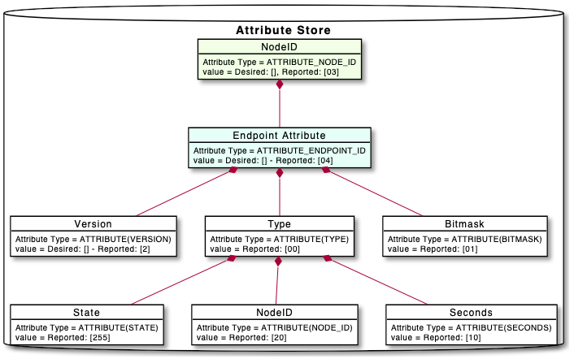

# Guideline for implementing Command Classes

## Defining the Z-Wave Command Class attribute state data model

The first step is to define the data model of the Z-Wave Command Class
attributes state, which will be presented under the endpoint attribute tree.
This could be achieved via reading the command class structure which is
described in the Z-Wave specification and define the type of the attributes.
The following example illustrates the Alarm Sensor command class attributes
that could hold all states related to alarm sensor command class.



After defining the data model, the next step is to define the type of each
node in the attribute store. Under the include package of the attribute store,
create the header of the command class types. In the header define the
types of the node with an additional type name that will be used in the
command class implementation.

```c
  typedef uint8_t alarm_sensor_type_t;
  typedef uint8_t alarm_sensor_state_t;
  typedef zwave_node_id_t alarm_sensor_id_t;
  typedef uint16_t alarm_sensor_seconds_t;

```

Define the attributes of command class, under the
attribute_store_defined_attribute_types.h. Define them by assigning
to the name of the attribute the value that it has. The types and definitions
of many attributes can be found under the ZW_classcmd.h. By defining the
attributes of the command class the attribute mapper can interpret
the data and make it easier to visualize the attribute store in the console.

```c
  ///////////////////////////////////
  // Alarm Sensor Command Class
  DEFINE_ATTRIBUTE(ATTRIBUTE_COMMAND_CLASS_ALARM_SENSOR_VERSION,
                  ZWAVE_CC_VERSION_ATTRIBUTE(COMMAND_CLASS_SENSOR_ALARM))

  // Bitmask Attribute contains the bytes that describe the alarm
  // types that the device support. uint8_t
  DEFINE_ATTRIBUTE(ATTRIBUTE_COMMAND_CLASS_ALARM_SENSOR_BITMASK,
                  ((COMMAND_CLASS_SENSOR_ALARM << 8) | 0x02))

  // Alarm type contains the type of the alarm. alarm_sensor_type_t type
  DEFINE_ATTRIBUTE(ATTRIBUTE_COMMAND_CLASS_ALARM_SENSOR_TYPE,
                  ((COMMAND_CLASS_SENSOR_ALARM << 8) | 0x03))

  // Sensor state contains the state of the alarm if alarm is active or not
  // alarm_sensor_state_t type
  DEFINE_ATTRIBUTE(ATTRIBUTE_COMMAND_CLASS_ALARM_SENSOR_STATE,
                  ((COMMAND_CLASS_SENSOR_ALARM << 8) | 0x04))

  // Node ID, which detected the alarm condition. alarm_sensor_id_t type
  DEFINE_ATTRIBUTE(ATTRIBUTE_COMMAND_CLASS_ALARM_SENSOR_NODE_ID,
                  ((COMMAND_CLASS_SENSOR_ALARM << 8) | 0x05))

  //Seconds indicates time the remote alarm must be active since last received report.
  // alarm_sensor_seconds_t type
  DEFINE_ATTRIBUTE(ATTRIBUTE_COMMAND_CLASS_ALARM_SENSOR_SECONDS,
                  ((COMMAND_CLASS_SENSOR_ALARM << 8) | 0x06))
```

Under the attribute store package and under the src in
zpc_attribute_store_registration.c. In this file, define
the attribute types for the attribute store API for the new command class.

```c
  /////////////////////////////////////////////////////////////////////
  //        Alarm Sensor Command Class attributes
  /////////////////////////////////////////////////////////////////////
  status |= attribute_store_register_type(
    ATTRIBUTE_COMMAND_CLASS_ALARM_SENSOR_VERSION,
    "Alarm Sensor Command Class version",
    ATTRIBUTE_ENDPOINT_ID,
    U8_STORAGE_TYPE);

  status |= attribute_store_register_type(
    ATTRIBUTE_COMMAND_CLASS_ALARM_SENSOR_BITMASK,
    "Alarm Sensor Bitmask",
    ATTRIBUTE_ENDPOINT_ID,
    BYTE_ARRAY_STORAGE_TYPE);

   status |= attribute_store_register_type(
    ATTRIBUTE_COMMAND_CLASS_ALARM_SENSOR_TYPE,
    "Alarm Sensor Type",
    ATTRIBUTE_ENDPOINT_ID,
    U8_STORAGE_TYPE);

    status |= attribute_store_register_type(
    ATTRIBUTE_COMMAND_CLASS_ALARM_SENSOR_STATE,
    "State",
    ATTRIBUTE_COMMAND_CLASS_ALARM_SENSOR_TYPE,
    U8_STORAGE_TYPE);

    status |= attribute_store_register_type(
    ATTRIBUTE_COMMAND_CLASS_ALARM_SENSOR_NODE_ID,
    "NodeID",
    ATTRIBUTE_COMMAND_CLASS_ALARM_SENSOR_TYPE,
    U16_STORAGE_TYPE);

    status |= attribute_store_register_type(
    ATTRIBUTE_COMMAND_CLASS_ALARM_SENSOR_SECONDS,
    "Seconds",
    ATTRIBUTE_COMMAND_CLASS_ALARM_SENSOR_TYPE,
    U16_STORAGE_TYPE);

```

Under the package zwave_command_class/src, create the header of the command
class implementation, it's easy to use a copy of another command class header
that is up to date and made the appropriate modifications to suit the new
implementation, doxygen documentation is based on the structure of this header
to create the section about the new command class, based on that the comments
of the header must be well defined. Moreover, in the zwave_command_class_fixt.c
should include the header and call the initialization function that is in the
implementation file (e.g. zwave_command_class_< name >.c). Before the
implementation, in CMakeLists.txt in the zwave_command_classes package add the
path for the command class file that includes the implementation code
(e.g. src/zwave_command_class_< name >.c).

## Implementation

The easiest way to start our implementation is to copy and use as a template an
up-to-date implementation e.g. zwave_command_class_alarm_sensor.c,
zwave_command_class_binary_switch.c. In the implementation code of the command
class, can be found the following structure.

### Command Class Functions

#### Public interface functions

**The initialisation function**: The function starts the procedure by
registering the rules for the attributes. Each attribute can have only one
rule, but it is not necessary to register a rule for all the attributes.
A rule is necessary only for attributes that will be used from a set or/and get
function. Register the rule through the zwave_command_class_register_rule
(Attribute type, set_function, get function) if the attribute will be used only
for a set or get command, provide only this function and NULL for the other one.

**Attribute store callbacks registration**: Attribute store callbacks functions
are responsible for do the appropriate changes to the attribute store when a
change is taking place to an attribute (e.g. delete, update). Through the
functions that register the callbacks, we can register the function that will
make the appropriate changes to the attribute store when any change happens to
a specific attribute. The function that we will register will be implemented in
the same file.

Register Z-wave Command Class handler: This piece of code is responsible to
register the handler of the command class. In the command_handler assign the
 function that will handle the commands that are addressed to our command class.

#### Implementation of the assigned functions

**Resolution Functions**: Resolutions functions are the get/set functions that
we assigned the rules. In each of these get/set functions fill the frame with
the appropriate information that it needs to be based on the command class
specification to return the response that needs. If no existing command class
structure serves the scope, create a new command structure in the header file.
Before the synthesis of the frame it could be necessary to do some things to
find the information that should be included in the frame.

**Attribute Store Callback Functions**: These functions are the functions that
handle the changes of an attribute. When an attribute is updated or deleted etc.
some actions should take place in the attribute store. An example can be when
the version of an endpoint is updating, it could need to create some of the
nodes that at a later point will be used to handle other commands.

**Incoming commands handler**: This function is the one that will handle the
report commands. In this function, we check the size of command frame, the
header which is the Command Class identifier, if the size of the frame and the
Command Class identifier are as expected we proceed and based on the Command
identifier call the frame parsing function that is responsible to handle the
command.

```c
  zwave_command_handler_t handler = {};
  handler.support_handler         = NULL;
  handler.control_handler = &zwave_command_class_example_control_handler;
  handler.minimal_scheme             = ZWAVE_CONTROLLER_ENCAPSULATION_NONE;
  handler.manual_security_validation = false;
  handler.command_class              = COMMAND_CLASS_EXAMPLE;
  handler.version                    = EXAMPLE_VERSION;
  handler.command_class_name         = "Example";
  handler.comments                   = "";
```

 **Frame-parsing Functions**: These are the functions that handle the incoming
 frames by using the structure of the frame and extracting information from the
 bytes to serve the scope of the specified commands that are documented in the
 Z-Wave Application Command Class Specification.

### Post-processing

After the implementation of the command class, you could be able to verify the
correct operation by including a device that supports the new command class and
verfiy the new command class attributes are created and updated via checking
the attribute store (i.e., using 'attribute_store_log <node_id>' CLI commands).

To ensure the implemented functionalities are mapped to the doddot ZCl data
model, one should create the UAM file under dotodot_mappers/rules for Dotdot
Cluster to Z-Wave Command Class Mapping. More information regarding mapping
can be found above in Dotdot Cluster Mapping section.

If the command class attributes state required to be updated via issue 'get'
type of commands, one could add the attribute and the polling  interval in the
zwave_poll_config.yaml which can be found under the zpc_rust package. More
information regarding polling can be found in the
Network Polling section in [ZPC User's Guide](readme_user.md).

**Test class**: Under the zwave_command_class/test we need to have a test class
 to test the functionality of the command class. An approach that can be used
 to implement the test class is to try and think based on the command class
 specification and the code of the command class the good and bad scenarios
 that could happen. A suggestion is to try and create a method for each bad
 scenario, based on the implementation of the command class could be necessary
 in some occasions to create some nodes to test if any change happens to
 others. After the implementation of the test class should add the unit test
 to the CMakeLists.txt.

> NOTE: An implementation of the command class can be more complicated and
> can consist of more than that mentioned above. This is only a guide that
> helps to start with.
