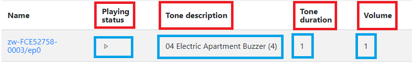
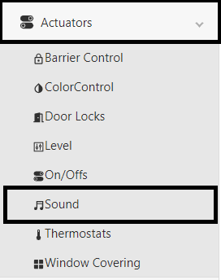

How to interact with clusters
=============================

Unify internal model works with DotDot ZCL clusters. More info on this
in :doc:`chapter 2 <../../doc/unify_specifications/Chapter02-ZCL-in-uic>` that
describes how clusters are implemented in Unify and how to use them.

ZPC attributes are not exposed to MQTT bus by default. To be able to interact 
with ZPC with the MQTT broker we must map ZPC values to cluster attributes.

.. contents::
   :depth: 3
   :local:
   :backlinks: none

Z-Wave Cluster Mapping Guidelines
---------------------------------

When implementing a Z-Wave command class or updating a existing one, you have 
to make sure that the end user can interact with it through the MQTT broker.

The first step is to identify the existing clusters and try to map as much as 
you can to these. This is important as it will ensure compatibility with others 
protocols. For example, a Sound Switch device can be mapped to both OnOff cluster
(to handle play/stop) and Level cluster (handle volume and tone). This way the 
Matter Bridge will be able to control this device without knowing the specifics 
of Z-Wave since they both use the same clusters.

Sometimes you may need to create a new cluster to handle specifics features. Not all
ZCL cluster have the same features as Z-Wave command classes. For example, the 
most of the features of Fan Mode can be mapped to the Fan Control cluster but 
Z-Wave supports more Fan Modes than ZCL, so we need to create a new cluster to
handle those specifics features.

Custom Cluster Implementation
-----------------------------

This section will go through an example of how we can implement a custom Sound cluster
that can go with the SoundSwitch Z-Wave command class.

Create the cluster XML file
~~~~~~~~~~~~~~~~~~~~~~~~~~~

The first thing to do is to create the .xml file that defines your
cluster. The syntax and the needed definitions are defined in the
``README.md`` in the ``components/uic_dotdot/dotdot-xml`` folder.

The new custom cluster must have the ``Unify_`` prefix name. We name
ours ``Unify_Sound.xml``. The first thing we need to do is attribute an
ID to our custom cluster. The clusters ID and can be split into 2
ranges:

- [0x0000…0xFBFF]: Official ZCL Clusters
- [0xFC00…0xFFFF]: Proprietary clusters

.. note::
   You should never change already attributed ID to keep the
   Unify Library compatible with subsequent version.

In Unify we use the range [0xFF00…0xFFFF] to create new clusters. Make
sure that your ID is not already taken by another cluster. You can
search the following pattern in the xml files : ``id="your_id"`` to
check if a cluster already defines your ID. Here we are using the id
``FFA0`` :

.. code:: xml

   <zcl:cluster
     xmlns:zcl="http://zigbee.org/zcl/clusters"
     xmlns:xsi="http://www.w3.org/2001/XMLSchema-instance"
     xmlns:type="http://zigbee.org/zcl/types"
     xmlns:xi="http://www.w3.org/2001/XInclude"
     xsi:schemaLocation="http://zigbee.org/zcl/clusters cluster.xsd http://zigbee.org/zcl/types type.xsd"
     id="FFA0" revision="1" name="Sound">
   <classification role="application" picsCode="LVL"/>
   </zcl:cluster>

.. note::

  picsCode (Protocol Implementation Conformance Statement) field
  can be ignored safely here.

Then we need to define which attribute we need and the associated
command. For our example we would like :

-  Attributes

   -  ``IsPlaying`` : Status of if a sound is playing or not
   -  ``SoundLevel`` : Current sound level
   -  ``ToneID`` : The current tone ID
   -  ``ToneDescription`` : Tone description
   -  ``ToneDuration`` : Tone duration

-  Commands

   -  ``PlayDefault`` : Play the current configured sound
   -  ``PlaySound`` : Play a specific sound
   -  ``ChangeVolume`` : Change the used volume
   -  ``ChangeTone`` Change the used tone

The attributes can be constrained if needed (min, max, …). You can find
information about this in the associated ``README.md`` in the
``components/uic_dotdot/dotdot-xml`` folder :

.. code:: xml

    <server>
      <attributes>
         <attribute id="0000" name="IsPlaying" type="bool" max="1" required="true" reportRequired="true" default="0"/>
         <attribute id="0001" name="SoundLevel" type="uint8" reportRequired="true" default="0">
           <restriction>
             <type:minInclusiveRef ref="MinLevel" />
             <type:maxInclusiveRef ref="MaxLevel" />
           </restriction>
         </attribute>
         <attribute id="0002" name="MinLevel" type="uint8" default="0">
           <restriction>
             <type:maxInclusiveRef ref="MaxLevel" />
           </restriction>
         </attribute>
         <attribute id="0003" name="MaxLevel" type="uint8" max="100" default="100">
           <restriction>
             <type:minInclusiveRef ref="MinLevel" />
           </restriction>
         </attribute>
         <attribute id="0004" name="ToneID" type="uint8" default="1">
           <restriction>
             <type:maxInclusiveRef ref="MaxTone" />
           </restriction>
         </attribute>
         <attribute id="0005" name="MaxTone" type="uint8"/>
         <attribute id="0006" name="ToneDescription" type="string"/>
         <attribute id="0007" name="ToneDuration" type="uint16""/>
       </attributes>
       <commands>
       </commands>
   </server>

The commands can also have parameters if needed :

.. code:: xml

     <server>
       <attributes>
       </attributes>
       <commands>
         <command id="00" name="PlayDefault" required="true" />
         <command id="01" name="PlaySound" required="true">
           <fields>
             <field name="Volume" type="uint8" />
             <field name="ToneID" type="uint8" />
           </fields>
         </command>
         <command id="02" name="ChangeVolume" required="true">
           <fields>
             <field name="Volume" type="uint8" />
           </fields>
         </command>
         <command id="03" name="ChangeTone" required="true">
           <fields>
             <field name="ToneID" type="uint8" />
           </fields>
         </command>
       </commands>
     </server>

The full implementation of our custom cluster can be found below :

.. code:: xml

   <?xml version="1.0"?>
   <!-- 
   Zigbee Alliance owns the copyright to the text and content displayed or 
   included in this document (including in PDF, XML files and other formats) in 
   all forms of media, which copyright is protected by the copyright laws of the 
   United States and by international treaties.  Full text of licensing terms 
   applicable to this document can be found in the LICENSE.md file.
   -->
   <zcl:cluster
     xmlns:zcl="http://zigbee.org/zcl/clusters"
     xmlns:xsi="http://www.w3.org/2001/XMLSchema-instance"
     xmlns:type="http://zigbee.org/zcl/types"
     xmlns:xi="http://www.w3.org/2001/XInclude"
     xsi:schemaLocation="http://zigbee.org/zcl/clusters cluster.xsd http://zigbee.org/zcl/types type.xsd"
     id="FFA0" revision="1" name="Sound">
     <classification role="application" picsCode="LVL"/>
     <server>
       <attributes>
         <attribute id="0000" name="IsPlaying" type="bool" max="1" required="true" reportRequired="true" default="0"/>
         <attribute id="0001" name="Volume" type="uint8" reportRequired="true" default="0" required="true">
           <restriction>
             <type:minInclusiveRef ref="MinLevel" />
             <type:maxInclusiveRef ref="MaxLevel" />
           </restriction>
         </attribute>
         <attribute id="0002" name="MinLevel" type="uint8" default="0">
           <restriction>
             <type:maxInclusiveRef ref="MaxLevel" />
           </restriction>
         </attribute>
         <attribute id="0003" name="MaxLevel" type="uint8" max="100" default="100">
           <restriction>
             <type:minInclusiveRef ref="MinLevel" />
           </restriction>
         </attribute>
         <attribute id="0004" name="ToneID" type="uint8" default="1"/>
           <restriction>
             <type:maxInclusiveRef ref="MaxTone" />
           </restriction>
         <attribute id="0005" name="MaxTone" type="uint8" default="30"/>
         <attribute id="0006" name="ToneDescription" type="string" default=""/>
         <attribute id="0007" name="ToneDuration" type="uint16" default="0"/>
       </attributes>
       <commands>
         <command id="00" name="PlayDefault"/>
         <command id="01" name="PlaySound">
           <fields>
             <field name="Volume" type="uint8" />
             <field name="ToneID" type="uint8" />
           </fields>
         </command>
         <command id="02" name="Stop"/>
         <command id="03" name="ChangeVolume">
           <fields>
             <field name="Volume" type="uint8" />
           </fields>
         </command>
         <command id="04" name="ChangeTone" required="true">
           <fields>
             <field name="ToneID" type="uint8" />
           </fields>
         </command>
       </commands>
     </server>
   </zcl:cluster>

Once the cluster is defined, you'll need to include it in the
``library.xml`` file. At the end you can add the line :

.. code:: xml

       <!--... -->
       <xi:include href="Unify_ApplicationMonitoring.xml" parse="xml"/>
       <!--Here : -->
       <xi:include href="Unify_Sound.xml" parse="xml"/>
   </zcl:library>

Command logic and callbacks
~~~~~~~~~~~~~~~~~~~~~~~~~~~

ZAP generation
^^^^^^^^^^^^^^

The clusters logics are generated by the
`ZAP <https://github.com/project-chip/zap>`__ tool. The ZAP generation
is disabled by default since it only needs to be run once to have all
the files we need.

We need to enable it to generated our files associated with our custom
cluster. To do so, set the ``ZAP_GENERATE`` CMake variable to ``ON``.
You can do that either with the pseudo-gui ``ccmake .`` in your build
folder or with the ``cmake`` command argument ``-DZAP_GENERATE=ON``.

Once the CMake argument is set you can call ``ninja`` on your build
folder and the necessary file will be generated. You can check ZAP logs
in the build process or see with git status if files have changed in the
``zap-generated`` folders:

.. code:: text

   Changes not staged for commit:
     (use "git add <file>..." to update what will be committed)
     (use "git restore <file>..." to discard changes in working directory)
           modified:   ../applications/dev_ui/dev_gui/zap-generated/src/cluster-types/cluster-type-attributes.ts
           modified:   ../components/uic_dotdot/dotdot-xml/library.xml
           modified:   ../components/uic_dotdot/zap-generated/include/dotdot_attribute_id_definitions.h
           modified:   ../components/uic_dotdot/zap-generated/include/dotdot_cluster_command_id_definitions.h
           modified:   ../components/uic_dotdot/zap-generated/include/dotdot_cluster_id_definitions.h
           modified:   ../components/uic_dotdot/zap-generated/readme_ucl_mqtt_reference.md
           modified:   ../components/uic_dotdot/zap-generated/src/dotdot_attribute_id_definitions.c
           modified:   ../components/uic_dotdot/zap-generated/src/dotdot_cluster_id_definitions.c
           modified:   ../components/uic_dotdot_mqtt/zap-generated/include/dotdot_mqtt.h
           modified:   ../components/uic_dotdot_mqtt/zap-generated/include/dotdot_mqtt_attributes.h
           modified:   ../components/uic_dotdot_mqtt/zap-generated/include/dotdot_mqtt_generated_commands.h
           modified:   ../components/uic_dotdot_mqtt/zap-generated/include/dotdot_mqtt_group_commands.h
           modified:   ../components/uic_dotdot_mqtt/zap-generated/include/dotdot_mqtt_send_commands.h
           modified:   ../components/uic_dotdot_mqtt/zap-generated/include/dotdot_mqtt_supported_generated_commands.h
           modified:   ../components/uic_dotdot_mqtt/zap-generated/src/dotdot_mqtt.cpp
           modified:   ../components/uic_dotdot_mqtt/zap-generated/src/dotdot_mqtt.hpp
     // And more...

.. note:: 
  Good practice is to commit the generated code in it's own commit. This way 
  we can update it or delete it based on our needs.

  It makes easier to merge multiples branches that generate code.

Command logic implementation
^^^^^^^^^^^^^^^^^^^^^^^^^^^^

We now need to implement the commands logic now that they are defined.
This is done in ``components/unify_dotdot_attribute_store/src``. The
naming convention here is
``unify_dotdot_attribute_store_command_callbacks_{cluster_name}`` where
``cluster_name`` is the name of the cluster.

We create the header and the source file in this folder :
``unify_dotdot_attribute_store_command_callbacks_unify_sound.h`` and
``unify_dotdot_attribute_store_command_callbacks_unify_sound.c``.

The header is straightforward, some doxygen tags and we define the
initialize function that will be called later:

.. code:: c

   /**
    * @defgroup on_off_cluster_mapper Unify Sound Cluster Mapper
    * @ingroup dotdot_mapper
    * @brief Maps Unify Sound Cluster incoming Commands to attribute modifications.
    *
    * @{
    */

   #ifndef UNIFY_SOUND_CLUSTER_MAPPER_H
   #define UNIFY_SOUND_CLUSTER_MAPPER_H

   #ifdef __cplusplus
   extern "C" {
   #endif

   /**
    * @brief Initialize the Unify Sound cluster mapper
    *
    */
   sl_status_t unify_sound_cluster_mapper_init(void);

   #ifdef __cplusplus
   }
   #endif

   #endif  //UNIFY_SOUND_CLUSTER_MAPPER_H
   /** @} end unify_cluster_mapper */

The base source file include some definition that will be used later :

.. code:: c

   #include "unify_dotdot_attribute_store_command_callbacks.h"
   #include "unify_dotdot_attribute_store_command_callbacks_unify_sound.h"

   #include "unify_dotdot_attribute_store_configuration.h"
   #include "unify_dotdot_attribute_store_helpers.h"
   #include "unify_dotdot_defined_attribute_types.h"
   #include "attribute_timeouts.h"
   #include "dotdot_mqtt_send_commands.h"

   // Other Unify components.
   #include "dotdot_mqtt.h"
   #include "sl_log.h"

   #define LOG_TAG "unify_dotdot_attribute_store_unify_sound_commands_callbacks"

   ////////////////////////////////////////////////////////////////////////////////
   // Internal component function that register callbacks to DotDot MQTT
   ////////////////////////////////////////////////////////////////////////////////
   sl_status_t unify_sound_cluster_mapper_init()
   {
     // Unify Sound Commands.
     sl_log_debug(LOG_TAG, "Unify Sound Cluster mapper initialization\n");

     return SL_STATUS_OK;
   }

This function must be registered in the main callback function
``unify_dotdot_attribute_store_command_callbacks_init`` defined in
``components/unify_dotdot_attribute_store/src/unify_dotdot_attribute_store_command_callbacks.c``
:

.. code:: c

   // ...
   #include "unify_dotdot_attribute_store_command_callbacks_unify_sound.h"

   sl_status_t unify_dotdot_attribute_store_command_callbacks_init()
   {
     // ...
     
     unify_sound_cluster_mapper_init();

     return SL_STATUS_OK;
   }

Now that it is registered, we can start to implement the commands logic.

In the ``unify_sound_cluster_mapper_init`` we call
``uic_mqtt_dotdot_sound_xxx_callback_set()`` function. These functions
call callbacks when the given command is called. For example
``uic_mqtt_dotdot_sound_play_default_callback_set(&unify_sound_play_default)``
says to unify to call ``unify_sound_play_default`` when the
``PlayDefault`` command is invoked.

.. note::
   Most of the function called here are generated by ZAP from the
   XML definition. See :ref:`the useful commands section <useful_commands>`
   to invoke the command to force regeneration of the code if you
   changed something in the XML cluster.

The callback needs at least 3 arguments + the arguments of the function.
The types are defined in
``components/uic_dotdot_mqtt/zap-generated/include/dotdot_mqtt.h`` :

.. code:: c

   typedef sl_status_t (*uic_mqtt_dotdot_sound_play_default_callback_t)(
       dotdot_unid_t unid,
       dotdot_endpoint_id_t endpoint,
       uic_mqtt_dotdot_callback_call_type_t call_type
   );

So our callback function can look like this:

.. code:: c

   sl_status_t unify_sound_play_default(dotdot_unid_t unid, 
     dotdot_endpoint_id_t endpoint, 
     uic_mqtt_dotdot_callback_call_type_t call_type) 
   {
     return SL_STATUS_OK;
   }

-  *unid* : Unify UID for which the command was invoked.
-  *endpoint* : Unify endpoint identifier for which the command was
   invoked.
-  *call_type* : Type of call. This argument can be used to verify if
   the command is compatible with the current model definition.

To translate the unid and endpoint argument into a node ID of the
attribute store you can use
``unify_dotdot_attributes_get_endpoint_node()`` :

.. code:: c

     attribute_store_node_t endpoint_node
       = unify_dotdot_attributes_get_endpoint_node()(unid, endpoint);

To have our command published in the ``SupportedCommand`` MQTT topic, we
have to verify the call type and return ``SL_STATUS_OK`` if all is ok,
``SL_STATUS_FAIL`` otherwise. The more common verification is to check
if our attributes are present in the attribute store. This can be done
with ``dotdot_is_supported_sound_xxx(unid, endpoint)`` generated
function.

For our ``PlayDefault`` function we expect the attribute store to have 3
attributes defined :

-  ``Volume`` : The volume of the tone
-  ``ToneID`` : The ID of the tone
-  ``IsPlaying`` : The status of current tone

The user may want to disable the automatic deduction of supported
commands so it's good practice to check the return value of
``is_automatic_deduction_of_supported_commands_enabled()``. Our callback
looks like this:

.. code:: c

   sl_status_t unify_sound_play_default(dotdot_unid_t unid, 
     dotdot_endpoint_id_t endpoint, 
     uic_mqtt_dotdot_callback_call_type_t call_type) 
   {
     // First check the call type. If this is a support check support call, 
     // we check the attributes
     if (call_type == UIC_MQTT_DOTDOT_CALLBACK_TYPE_SUPPORT_CHECK) {
       // Check user option automatic_deduction_of_supported_commands
       if (is_automatic_deduction_of_supported_commands_enabled()) {
         // We check the result of existence of volume, toneid and isplaying attributes
         return (dotdot_is_supported_sound_volume(unid, endpoint) && 
             dotdot_is_supported_sound_toneid(unid, endpoint) && 
             dotdot_is_supported_sound_is_playing(unid, endpoint))
                  ? SL_STATUS_OK
                  : SL_STATUS_FAIL;
       } else {
         return SL_STATUS_FAIL;
       }
     }

     // If we are in command invocation, we only need to set our attribute to the value we need.
     // Here we only modify IsPlaying and we are assuming that toneID and volume are correctly defined.
     return dotdot_set_sound_is_playing(unid, endpoint, DESIRED_ATTRIBUTE, true);
   }

We can check if our newly supported command is correctly defined by
using ``mosquitto_sub``. We assume that your MQTT booker is up and
running and you at least have one endpoint called ep0 that support your
new custom cluster. 

UAM files binding
^^^^^^^^^^^^^^^^^

Now that you have your cluster defined and attributes updated, you'll have to create 
an .uam file to bind your Z-Wave attributes to your ZCL attributes.

.. note::
  More info on uam files can be found at :doc:`Implement new Z-Wave classes <how_to_implement_zwave_command_classes>`

.. code:: uam

   // Sound Switch Command Class
   def zwSOUND_SWITCH_TONE_PLAY 0x7908
   def zwSOUND_SWITCH_CONFIGURED_VOLUME 0x7902
   def zwSOUND_SWITCH_TONE_IDENTIFIER 0x7903
   def zwSOUND_SWITCH_MAX_TONE 0x7904
   def zwSOUND_SWITCH_TONE_INFO_ROOT 0x7905
   def zwSOUND_SWITCH_TONE_INFO_DURATION 0x7906
   def zwSOUND_SWITCH_TONE_INFO_DESCRIPTION 0x7907

   // ZCL OnOff Cluster
   def zbIS_PLAYING 0xFFA00000
   def zbSOUND_LEVEL 0xFFA00001
   def zbSOUND_LEVEL_MIN 0xFFA00002
   def zbSOUND_LEVEL_MAX 0xFFA00003
   def zbSOUND_TONE_ID 0xFFA00004
   def zbSOUND_MAX_TONE 0xFFA00005
   def zbSOUND_TONE_DESCRIPTION 0xFFA00006
   def zbSOUND_TONE_DURATION 0xFFA00007

   // Constants
   def min_level 1
   def max_level 100

   // 30 is higher priority than other cluster switches
   scope 30 chain_reaction(0) {
     // Linking attributes zwave -> zigbee (note : 0 is stop playing)
     r'zbIS_PLAYING = if (r'zwSOUND_SWITCH_TONE_PLAY != 0) 1 0
     d'zbIS_PLAYING = if (d'zwSOUND_SWITCH_TONE_PLAY != 0) 1 0
     
     r'zbSOUND_LEVEL = r'zwSOUND_SWITCH_CONFIGURED_VOLUME
     
     r'zbSOUND_LEVEL_MIN = if (e'zwSOUND_SWITCH_CONFIGURED_VOLUME) min_level undefined
     r'zbSOUND_LEVEL_MAX = if (e'zwSOUND_SWITCH_CONFIGURED_VOLUME) max_level undefined

     // Map Z-Wave readonly attributes to ZCL
     r'zbSOUND_TONE_ID = r'zwSOUND_SWITCH_TONE_IDENTIFIER
     // Can't bind string attributes here we must do it in the command class directly
     // r'zbSOUND_TONE_DESCRIPTION = r'zwSOUND_SWITCH_TONE_INFO_ROOT.zwSOUND_SWITCH_TONE_INFO_DESCRIPTION
     r'zbSOUND_TONE_DURATION = r'zwSOUND_SWITCH_TONE_INFO_ROOT.zwSOUND_SWITCH_TONE_INFO_DURATION 
     r'zbSOUND_MAX_TONE = r'zwSOUND_SWITCH_MAX_TONE

     // Linking attributes zigbee -> zwave for commands
     d'zwSOUND_SWITCH_TONE_PLAY = if (d'zbIS_PLAYING != 0) 1 0
     r'zwSOUND_SWITCH_TONE_PLAY = if (r'zbIS_PLAYING != 0) 1 0

     d'zwSOUND_SWITCH_CONFIGURED_VOLUME = d'zbSOUND_LEVEL
     r'zwSOUND_SWITCH_CONFIGURED_VOLUME = r'zbSOUND_LEVEL

     d'zwSOUND_SWITCH_TONE_IDENTIFIER =  d'zbSOUND_TONE_ID
     r'zwSOUND_SWITCH_TONE_IDENTIFIER =  r'zbSOUND_TONE_ID
   }

Sometimes UAM files are not enough for achieving the desired behavior. In 
this case UAM doesn't support string values only numbers. To workaround 
that you can use a callback on your attribute and update the value directly
in your controller/command class.

First, listen to all the changes for given attribute : 

.. code:: c

   attribute_store_register_callback_by_type_and_state(
     &zwave_command_class_sound_switch_on_tone_name_update,
       ATTRIBUTE_COMMAND_CLASS_SOUND_SWITCH_TONE_INFO_NAME,
       REPORTED_ATTRIBUTE);

Then map the new value to the ZCL value : 

.. code:: c

   #define MAX_CHAR_SIZE 64
   static void zwave_command_class_sound_switch_on_tone_name_update( 
     attribute_store_node_t updated_node, attribute_store_change_t change) 
   {

     if (change == ATTRIBUTE_DELETED) {
       return;
     }

     char tone_name[MAX_CHAR_SIZE];
     attribute_store_get_reported_string(updated_node, tone_name, MAX_CHAR_SIZE);
     if (strlen(tone_name) == 0) {
       return;
     }

     attribute_store_node_t endpoint_node
       = attribute_store_get_first_parent_with_type(updated_node,
                                                    ATTRIBUTE_ENDPOINT_ID);
     
     attribute_store_node_t zcl_tone_name_node
       = attribute_store_get_first_child_by_type(endpoint_node,
        DOTDOT_ATTRIBUTE_ID_SOUND_TONE_DESCRIPTION);

     if (zcl_tone_name_node == ATTRIBUTE_STORE_INVALID_NODE) {
       attribute_store_add_node(endpoint_node, DOTDOT_ATTRIBUTE_ID_SOUND_TONE_DESCRIPTION);
     }

     attribute_store_set_reported_string(zcl_tone_name_node, tone_name);
   }

You should now see something like this :

.. code:: bash

   > mosquitto_sub -h 0.0.0.0 -p 1883 -t ucl/by-unid/+/ep0/Sound/SupportedCommands

   {"value": ["PlayDefault", "ForceReadAttributes"]}

Integration with dev-ui
~~~~~~~~~~~~~~~~~~~~~~~

We may want to add those information to the dev UI to show-off its
capabilities. The first thing to do is to add the supported cluster in
the dev ui. In ``applications/dev_ui/dev_gui/zap/addon-helper.js`` add
your custom cluster at the end of the ``const supportedClusters`` array
:

.. code:: js

   const supportedClusters = [
       "AoXLocator",
       "AoXPositionEstimation",
       // ...
       "PowerConfiguration",
       "Sound"
   ];

Run ``ninja`` again to generate the desired files.

.. note::
   If you need to force a regeneration of the file because your
   cluster definition has changed :ref:`check the useful commands
   section <useful_commands>`.

Then we have to add a page that represents our custom cluster. This is
done in the
``applications/dev_ui/dev_gui/src/pages/base-clusters/cluster-view-overrides.tsx``
:

.. note:: 
   The icon library used here is located at
   https://react-icons.github.io/react-icons/. Don`t forgot to check
   license if you use something that is not in License.txt.

.. code:: js

  // ...
  } as ClusterViewOverride,
  Sound: {
      ViewTable: [
          {
              Name: `Playing status`,
              Value: (item: any) => item.Attributes?.IsPlaying?.Reported !== undefined ?
                  (item.Attributes.IsPlaying.Reported === true
                      ? <Tooltip title="Playing"><RiIcons.RiPlayFill color="#28a745" /></Tooltip>
                      : <Tooltip title="Stoped"><RiIcons.RiPlayLine color="grey" /></Tooltip>)
                  : "-"
          },
          {
              Name: `Tone description`,
              Value: (item: any) => (item.Attributes?.ToneDescription?.Reported || item.Attributes?.ToneID?.Reported) !== undefined ?
                  (item.Attributes?.ToneDescription?.Reported  || "No tone description") + " (" + (item.Attributes?.ToneID?.Reported || "-") + ")"
              : "-"
          },
          {
              Name: `Tone duration`,
              Value: (item: any) => item.Attributes?.ToneDuration?.Reported || "-"
          },
          {
              Name: `Volume`,
              Value: (item: any) => item.Attributes?.Volume?.Reported || "-"
          }
      ],
      NodesTooltip: (endpoint: string, attr: any) => {
          let state = (attr.ToneDescription?.Reported  || "No tone description")
          return (
              <Tooltip title={`Endpoint ${endpoint}: Sound : ${state}`}>
                  
                      <Link to={`/sound`}>
                          <IoIcons.IoMdMusicalNotes/>
                      </Link>
                  
              </Tooltip>
          )
      },
      NavbarItem: {
          name: ClusterTypes.Sound,
          title: 'Unify Custom Sound',
          path: '/sound',
          icon: <IoIcons.IoMdMusicalNotes/>,
          cName: 'nav-text',
          subMenu: SideMenu.Actuators
      } as NavbarItem,
      IsExpandable: true
  } as ClusterViewOverride,
  OnOff: {
  // ...

-  **ViewTable** : The attributes that are displayed on the page.

   -  **Name** (*red*) : Column name
   -  **Value** (*blue*) (``item: any``) : The values that are displayed
      in the cell. The attributes can be accessed with
      ``item.Attributes``

.. figure:: ./doc/assets/img/cluster/dev_ui_tooltip.png
   :alt: tooltip

-  **NodesTooltip** (``endpoint: string, attr: any``) : Cluster icon
   that are displayed next to endpoint in the *Nodes* page. You can
   control the icon behavior (tootip, action when clicked, …) and style.

   -  ``endpoint: string`` : Endpoint name
   -  ``attr: any`` : Attributes object

-  **NavbarItem** : Control the navigation of your cluster page. Defines
   the route to access it, and can add a shortcut in the sub menu if
   needed.

   -  **name** : ``ClusterTypes.NameOfYourCluster``. It's very important
      to define this property correctly or the route to your cluster
      will not work. **If not defined correctly you could break routes
      for other cluster as well.**
   -  **title** : Displayed title of your cluster. Appears on top on
      your cluster page and in the sub menu.

      -  |Title property|

   -  **path** : define the route to your cluster page. If it not
      working please check that all the **name** properties are correctly
      defined. The routes are defined in
      ``applications/dev_ui/dev_gui/src/App.tsx`` (~ line 282).

      -  |Cluster route|

   -  **icon** : Icon used in the sub menu

      -  |Submenu icon|

   -  **subMenu** : The sub menu where your cluster will be under.

      -  |Submenu|

Miscellaneous
-------------

Run UI in Development Mode with Live Reload
~~~~~~~~~~~~~~~~~~~~~~~~~~~~~~~~~~~~~~~~~~~

You can serve the dev-gui locally and use the live reload feature to
make some adjustment on the UI.

1. :doc:`Generate the dev-ui with CMake <../../doc/readme_building>` to generate
   cluster files and ``index.html``
2. Copy the following file into the root folder :

-  ``${BUILD_FOLDER}/applications/dev_ui/dev_gui/public/index.html``
   ->\ ``${SOURCE_FOLDER}/applications/dev_ui/dev_gui/public/index.html``
-  ``${BUILD_FOLDER}/applications/dev_ui/dev_gui/src/cluster-types``
   ->\ ``${SOURCE_FOLDER}/applications/dev_ui/dev_gui/src/cluster-types``

3. `Install nvm <https://github.com/nvm-sh/nvm>`__ if your system
   doesn't have Node 18

-  ``nvm install 18``
-  ``nvm use 18``

4. In ``${SOURCE_FOLDER}/applications/dev_ui/dev_gui/``

-  npm install
-  Start the API : ``npm run start-api``
-  Start the front end : ``npm run start``

.. _useful_commands:

Useful Commands
~~~~~~~~~~~~~~~

.. list-table:: 
  :header-rows: 1

  * - Description 
    - Command
  * - Generate all zap files (``ZAP_GENERATE`` must be set to ``ON`` in CMake) 
    - ``ninja zap``  
  * - Force regeneration of XML cluster definitions 
    - ``ninja -t clean unify_dotdot_attribute_store && ninja unify_dotdot_attribute_store``
  * - Force regeneration of js/ts files (``applications/dev_ui/dev_gui/zap-generated/src/cluster-types/``) for Dev Gui Client + API 
    - ``ninja -t clean applications_dev_ui_dev_gui_zap-generated && ninja applications_dev_ui_dev_gui_zap-generated``
  * - Force regeneration of dev gui node package 
    - ``ninja -t clean dev_gui && ninja dev_gui``

.. |Title property| image:: ./doc/assets/img/cluster/dev_ui_navbar_name.png
.. |Cluster route| image:: ./doc/assets/img/cluster/dev_ui_route.png
.. |Submenu icon| image:: ./doc/assets/img/cluster/dev_ui_icon_submenu.png

