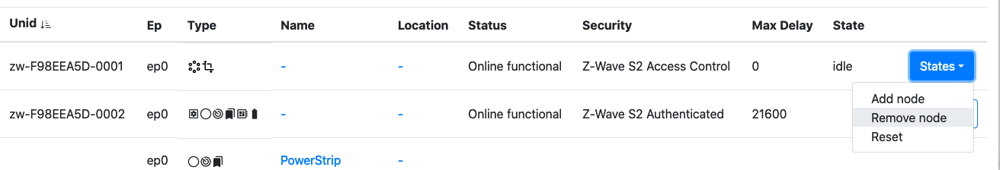
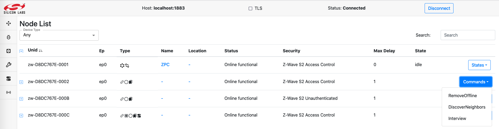
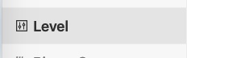
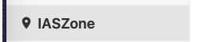
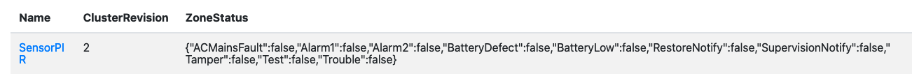
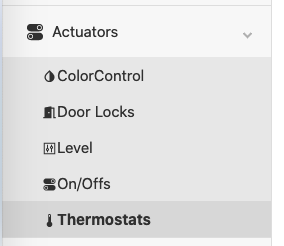
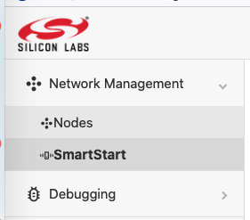
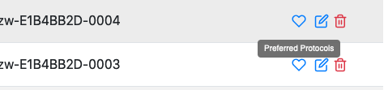

# ZPC Certification Information

## Z-Wave Protocol Interoperability

This product can be operated in any Z-Wave network with other Z-Wave-certified
devices from other manufacturers. All mains operated nodes within the network
will act as repeaters regardless of vendor to increase reliability of the
network.

## Device Type and Role Type

The ZPC has a Generic Controller Device type and uses the following device classes:

  * GENERIC_TYPE_GENERIC_CONTROLLER
  * SPECIFIC_TYPE_NOT_USED

The ZPC uses the Central Static Controller (CSC) role type, which
supports and takes the SIS role by default.

The ZPC does not support the following network functionalities:

  * Learn Mode
  * Failed Replace

## Manufacturer-Specific Information

The ZPC uses the following manufacturer-specific information:

  * Manufacturer ID : 0x0000
  * Product Type    : 0x0005
  * Product ID      : 0x0001
  * Firmware ID     : 0x0001

## Z-Wave Plus Info Information

The ZPC uses the following Z-Wave Plus Info information:

  * Role Type           : 0x0000 (CSC)
  * Node Type           : 0x0000
  * Installer Icon Type : 0x0100
  * User Icon Type      : 0x0100

## Network Management Information

### Network Management

The [Dev GUI User's Guide](./md_applications_dev_ui_dev_gui_readme_user.html)
describes how to perform the following operations:

*  Direct range and Network-Wide Inclusion (Add) of other nodes in the network.
*  Direct range and Network-Wide Exclusion (remove) of other nodes (in any network).

Learn Mode and Controller Replication are not available.

#### Adding a Node

To add a new node in the current network, select the ZPC entry in the node list
and locate the "States" button. Select the "Add node" option.

The ZPC will go from Idle to Add node. Activate learn mode on the node that
you want to include in the network. When the network inclusion happens, a new
node will appear in the list of nodes.

To cancel an inclusion attempt, select the "Idle" option under the "States" button.

#### Removing a Node

To remove a node from its network (it can be either the ZPC's network or a
foreign network), select the ZPC entry in the node list
and locate the "States" button. Select the "Remove node" option.

The ZPC will go from Idle to Remove node. Activate learn mode on the node that
you want to exclude from its network. When the network exclusion happens, the ZPC
state will return to Idle. The ZPC state will return to idle automatically
after excluding a node.

To cancel an exclusion attempt, select the "Idle" option under the "States" button.

#### Management Operations for Individual Nodes

When a network management is to be targetted for a particular node, the list of
available commands is available in the node list page, under the **Commands** button.

* Interview will perform a new node Interview
* RemoveOffline will perform a Z-Wave Remove Failed Node.
* DiscoverNeighbors will request Z-Wave node to perform a neighbor discovery. It will have no effect for nodes includes with Z-Wave Long Range.

While a node is under interview, its status will be *Online interviewing*. When
The interview is over, its status moves back to *Online functional*.

When performing a RemoveOffline on a node, no visible update is made on the node
status, however, the ZPC node entry will move its network management state to
"Remove node".

When requesting a DiscoverNeighbors, no visible feedback will be available
on the UI.

## Command Class Information

The following table shows supported and controlled Z-Wave Command Classes by the ZPC.

| Command Class                  | Version | Support | Control | Security Level              | Comment |
| ------------------------------ | ------- | ------- | ------- | --------------------------- | ------- |
| Association                    |       2 |       x |       x | Network Scheme              |         |
| Association Group Info (AGI)   |       3 |       x |       x | Network Scheme              |         |
| Basic                          |       2 |         |       x | N/A                         |         |
| Battery                        |       3 |         |       x | N/A                         | Control Part is auto-generated. |
| Binary Sensor                  |       1 |         |       x | N/A                         | Control Part is auto-generated. |
| Binary Switch                  |       2 |         |       x | N/A                         |         |
| Central Scene                  |       3 |         |       x | N/A                         | Partial control: key attributes are not displayed in the UI. |
| Configuration                  |       4 |         |       x | N/A                         |         |
| Device Reset Locally           |       1 |       x |       x | Network Scheme              |         |
| Door Lock                      |       2 |         |       x | N/A                         | Control Part is auto-generated. |
| Firmware Update                |       7 |       x |       x | Network Scheme              |         |
| Inclusion Controller           |       1 |       x |       x | Unencrypted                 |         |
| Indicator                      |       3 |       x |       x | Network Scheme              |         |
| Manufacturer Specific          |       2 |       x |       x | Network Scheme              |         |
| Multi Channel                  |       4 |         |       x | N/A                         |         |
| Multi Channel Association      |       3 |       x |       x | Network Scheme              |         |
| Multi Command                  |       1 |       x |         | Unencrypted                 |         |
| Multilevel Sensor              |      11 |         |       x | N/A                         | Partial control:  1. Not all scales are supported 2. Not all types are shown in the UI. |
| Multilevel Switch              |       4 |         |       x | N/A                         | Partial control:  1. we do not use start/stop level change. 2. we do not support the 0xFF duration |
| Notification                   |       8 |         |       x | N/A                         | Partial Control:  1. No Push/Pull discovery is done. 2. No Pull sensor support.  3. Unknown types are not supported.  4. No Regular probing is done.  |
| Powerlevel                     |       1 |       x |         | Network Scheme              |         |
| Security 0                     |       1 |       x |       x | Unencrypted                 |         |
| Security 2                     |       1 |       x |       x | Unencrypted                 |         |
| Supervision                    |       2 |       x |       x | Unencrypted                 |         |
| Thermostat Mode                |       3 |         |       x | N/A                         | Partial Control: Not all modes can be set |
| Thermostat Setpoint            |       3 |         |       x | N/A                         | Partial Control:  1. No discovery of ambiguous types in v1-v2  2. Only a few setpoints can be configured.  3. Precision/size fields in the set are determined  automatically by the controller.  |
| Time                           |       1 |       x |         | Unencrypted                 |         |
| Transport Service              |       2 |       x |       x | Unencrypted                 |         |
| Version                        |       3 |       x |       x | Network Scheme              |         |
| Wake Up                        |       3 |         |       x | N/A                         |         |
| Z-Wave Plus Info               |       2 |       x |       x | Unencrypted                 |         |

### Association / Multi Channel Association Command Classes Information

The ZPC supports the following Association Groups
| Grouping Identifier            | Maximum Number of Associations | Group Name | Usage/Trigger                                       |
| ------------------------------ | ------------------------------ | ---------- | --------------------------------------------------- |
| 1                              | 10                             | Lifeline   | ZPC reset will issue a Device Reset Locally Command |

The ZPC also controls the Association and Multi Channel Association. It only
establishes lifeline associations or establishes association if some
controlled command classes require it. (i.e. Notification, Central Scene, etc.)

#### Node status

It is not possible to see association groups state from the Dev GUI.

#### Sending commands

It is not possible to issue Association / Multi Channel Association commands
from the Dev GUI.

### Basic Command Class Information

The ZPC controls the Basic Command Class. It is possible to set and
see the current state of an unknown actuator node using Basic.

Basic will be used, only if the supporting node does not support any actuator
command classes that the ZPC controls (fully or partially). In this case, the
ZPC will attempt to discover if the Basic Command Class is supported by issuing
a Basic Get Command. If the node replies, the Basic functionality will be
presented as an OnOff functionality.

It is not possible to see if the ZPC is using Binary Switch or Basic Command
Class.

#### Node status

To see the state of the Basic Command Class, select the OnOff page
from the left menu on the Dev GUI.

The state of the node is displayed for each entry, it only consist in
a single On/Off state, represented with a small light bulb.

#### Sending commands

To trigger a Basic Set, select one of the 3 available commands.
(On, Off, Toggle).

These command will have an effect only if there is a difference between the
reported state and the command indication. i.e. the On command for a node already
on will not trigger any command to be sent.

### Battery Command Class Information

The ZPC controls the Battery Command Class. It is possible to
see the current Battery state for supporting nodes.

#### Node status

To see the state of the Battery Command Class, select the Battery page
from the left menu on the Dev GUI.

The last reported battery percentage will be visible on the attribute list.
The Battery Low indication will be set to "true" if the battery level is less
than 10% or if the node has reported a battery = 0xFF notification.

#### Sending commands

It is not possible to send Battery Commands to supporting nodes.

### Binary Switch Command Class Information

The ZPC controls the Binary Switch Command Class. It is possible to set and
see the current level of a binary switch supporting node.

#### Node status

To see the state of the Binary Switch Command Class, select the OnOff page
from the left menu on the Dev GUI.

The state of the node is displayed for each entry, it only consist in
a single On/Off state, represented with a small light bulb.

#### Sending commands

To trigger a Binary Switch Set, select one of the 3 available commands.
(On, Off, Toggle).

These command will have an effect only if there is a difference between the
reported state and the command indication. i.e. the On command for a node already
on will not trigger any command to be sent.

### Central Scene Command Class Information

The ZPC controls the Central Scene Command Class. It is possible to see which
scene is active or has been activated last in supporting nodes.

#### Node status

To see the state of the Central Scene Command Class, select the Scenes page
from the left menu on the Dev GUI.

The state of the node is displayed for each entry, it only consist in
the following attributes:

* **Number of Scenes**: The total number of scenes/key attributes combinations that could
be used by the supporting node.
* **Current Scene**: The active or last active scene. This is a unique number
derived from the Scene Number and Key attribute combination, it is in the range
[0 ; **Number of Scenes** - 1]. The Scene is calculated as follow:
*Current Scene = ((SceneID - 1) * Max Key Attribute) + (Key Attribute);*
If no Central Scene Notification has been received yet, this value stays undefined.
* **Current Scene valid**: Indicates if the Current Scene is active,
meaning that the scene was activated within the last 5 seconds or is being
activated (e.g. button is being held down). When this is set to false,
it means that the *Current Scene* attribute represents the last active scene.

#### Sending commands

It is not possible to issue Central Scene commands to supporting nodes.

### Configuration Command Class Information

The ZPC controls the Configuration Command Class. It is possible to discover
configuration parameters and set the parameter values. In addition, it is also
possible to reset all configuration parameter values to their default values.

#### Node status

To see the state of the Configuration Command Class, one could select
the Configuration Parameters page on the left menu of the Dev GUI.

The state of the node is displayed for each entry representing supported
configuration parameter IDs. An example is shown in the following figure:

If the device support Configuration Command Class version 1 or 2, the user
must initiate the discovery of the configuration parameters by using the
DiscoverParameters command and indicate the configuration parameter IDs
that are expected to be supported by the supporting node.

#### Sending commands

To set the configuration parameter value, one could select SetParameter command
and insert the configuration parameter ID and desired value. However, it is not
possible to set the parameter to its default value using "Default" bit flag.

The DefaultResetAllParameters is available from version 4 and will request
the supporting node to reset all its configuration parameters to their default value.

### Device Reset Locally Command Class Information

The ZPC can be reset to default. The operation is available with other Network
Management operations in the Dev GUI main page.

When initiating a reset operation, the ZPC will change it state to "Reset"

The ZPC will attempt to notify the lifeline destination for a short while and
reset its network afterwards. The ZPC node entry and all the nodes in its
network will disappear from the UI when the reset operation is completed.

The ZPC will then create a new network and re-spawn as a new node.

When a node is notifying that it has been reset, the ZPC will perform a Remove
Failed Node operation.

#### Door Lock Command Class Information

The ZPC controls the Door Lock Command Class. It is possible to see and change
the state of nodes supporting the Door Lock Command Class.

It is not possible to configure the Door Lock (Door Lock Configuration Commands).

#### Node status

To see the state of a Door Lock, open the Lock menu on the left hand side.

The state of the node will be displayed for each entry.

* A green door icon means that the door is secured.
* A red door icon means that the door is unsecured.

#### Sending commands

To trigger a Door Lock Operation Set, select either the LockDoor or UnLockDoor command.
A pop-up will appear, asking about a PINOrRFIDCode. This parameter is for ZigBee
nodes, and can be ignored for Z-Wave nodes. Press send without filling anything.

### Indicator Command Class Information

The ZPC both supports and controls the Indicator Command Class.

#### Support

The ZPC supports identifying itself using an on-board green LED on the top-side of the
Raspberry-Pi reference platform. On a Raspberry-Pi 4, the LED is located next to the
red power-LED, both of which are located next to the USB-C power-connector. Please note
that some Raspberry-Pi cases are opaque and some of those do not expose those
LEDs to the outside (e.g. with a light-pipe), so the top-cover may need to be removed in
order to see the LEDs.

#### Node status

To see the state of a Indicator, open the Identify menu on the left hand side.

The state of each identify indicator will be displayed for each entry.
It will only display the duration, in seconds, that the node is identifying.
For example, a node identifying for 66 seconds will be shown as follows:

#### Sending commands

To trigger an Identify command, select the Identify command.
A pop-up will appear, asking about the duration. Set the value to 3 in order
to trigger the Identify command.

#### Multilevel Sensor Command Class Information

The ZPC controls (partially) the Multilevel Sensor Command Class.
The sensor values will be queried and mapped whenever possible to ZCL clusters.

Not all sensor values are available on the Dev GUI.
##### Node status

Sensors values are probed every 6 hours if no update was received
from the end nodes.

Different type of sensors will be shown in different places in the Dev GUI.
For example, temperature sensors will be shown in the Thermostat attribute page.
##### Sending commands

It is not possible to send Multilevel Sensor Commands.

### Multilevel Switch Command Class Information

The ZPC controls the Multilevel Switch Command Class. It is possible to set and
see the current level of a multilevel switch supporting node.

However, the model on which the Unify system and
[Dev GUI](./md_applications_dev_ui_dev_gui_readme_user.html) operate is based on
The Dotdot model.

This means that Multilevel Switch supporting node will be represented with both
an OnOff and a Level functionality. The Level setting can be changed
independently, but will be interpreted in conjunction with the OnOff State.

In short:

* If OnOff is off, the Multilevel Switch value at the end node will
be 0, no matter what the current level shows.

* If OnOff is on, the Multilevel Switch value at the end node will be according
to the level setting.

#### Node status

To see the state of the Multilevel Switch Command Class, select the Level page
from the left menu on the Dev GUI.

The state of the node will be displayed for each entry. The following attributes
are available:

* CurrentLevel represents the Multilevel Switch Level
* OnOffTransitionTime represents the Multilevel Switch duration

#### Sending commands

To trigger a Multilevel Switch Set, select the MoveToLevelWithOnOff command.
A pop-up will appear, asking about the parameters.

* CurrentLevel: Multilevel Switch Level, from 0 to 99.
* OnOffTransitionTime: Transition time, in tenth of seconds, from 0 to 65534.
The transition time will be floored to the nearest Z-Wave supported value.

It is not possible to specify the 0xFF duration for Multilevel Switch Set
Commands.

For example, this command will instruct to go to 50% in 25 seconds.

It is not possible to issue Multilevel Switch Start/Stop level change.

### Notification Command Class Information

The ZPC controls the Notification Command Class partially.
It is possible to get some information from nodes sending notifications
states/events to the ZPC.

Due to the very diverse nature of the Notifications states and events that
can be reported via the Command Class, information from the command class is
displayed in a few different places in the
[Dev GUI](./md_applications_dev_ui_dev_gui_readme_user.html).

#### Node status

The following event/states are visible in the Dev GUI.

##### OccupancySensing

The following notifications states/events will be shown in the OccupancySensing
cluster (displayed as Binary Sensors):

The occupancy sensing attribute is shown in the **State** column of the
table:

The occupancy sensing will be shown as Occupied when receiving:

* Home Security - Motion Detection
* Home Security - Motion Detection with location
* Home Security - Intrusion
* Home Security - Intrusion (location provided)
* Acces Control - Door window open

The occupancy sensing will be shown as UnOccupied when receiving:

* Home Security - State Idle (Motion Detection)
* Home Security - State Idle (Motion Detection with location)
* Home Security - State Idle (Intrusion)
* Home Security - State Idle (Intrusion location provided)
* Acces Control - Door window closed

##### IASZone

The following notifications states/events will be shown in the IASZone
cluster.

The state of an IASZone is shown in the **Zone Status** column of the
table, with a JSON representation:

The following notification will be mapped to the following bits:

* CO alarm - Carbon Monoxide detected -> Alarm1
* Smoke alarm - Smoke detected -> Alarm1
* Home Security - Motion detected -> Alarm2
* Home Security - Intrusion -> Alarm1
* Home Security - Tampering -> Tamper
* Water Alarm - Leak detected -> Alarm1

#### Sending commands

It is not possible to send commands for the Notification Command Class.

### Security 0 - Security 2 Command Classes Information

The ZPC supports and controls the Security 2 and Security 0 Command Classes.
As the ZPC does not support Learn Mode, the set of granted keys is always as
shown in the following table:

| Security Class                 | Protocol                                    |
| ------------------------------ | ------------------------------------------- |
| S2 Access Control              | Z-Wave and Z-Wave Long Range                |
| S2 Authenticated               | Z-Wave and Z-Wave Long Range                |
| S2 Unauthenticated             | Z-Wave                                      |
| S0                             | Z-Wave                                      |

#### Node status

It is possible to see the highest granted key of each node in the network,
using the DevGUI, on the node page.

The Security information will not indicate if a node operates with the Z-Wave
or Z-Wave Long Range protocol.

#### Sending commands

It is not possible to issue S0/S2 commands using the DevGUI.

### Thermostat Setpoint and Thermostat Mode Command Classes Information

The ZPC controls the Thermostat Setpoint and Thermostat Mode Command Classes.
It is possible to set the mode and setpoints of supporting nodes.

#### Node status

The state of Multilevel Sensor (temperature sensor), Thermostat Setpoint and
Thermostat Mode Command Classes is aggregated in the Thermostat page
located on the left menu in the Dev GUI.

The combined state of these command classes will be presented in the UI:

* Temperature represents the Multilevel Sensor reported temperature (Sensor type 0x01).
* Heating Setpoint represents the Heat Setpoint from the Thermostat Setpoint Command Class.
* Cooling Setpoint represents the Cool Setpoint from the Thermostat Setpoint Command Class.
* System Mode represents the current mode of from the Thermostat Mode Command
Class.

#### Sending commands

There are 2 available commands for Thermotats by default:
* WriteAttributes (wrench icon)
* SetpointRaiseOrLower

##### WriteAttributes Command

To change the Thermostat Mode and/or setpoints, you have to click on the
wrench icon and modify the attributes values in the dialog.

In the Thermostat Attributes dialog,
all temperatures are in centi-celcius (1/100 of a Celcius degree)

* Heating Setpoint will trigger a Thermostat Setpoint Set with the temperature
for the indicated mode.
* Cooling Setpoint will trigger a Thermostat Setpoint Set with the temperature
for the indicated mode.
* System Mode will trigger a Thermostat Mode Set with the indicated mode. The
  Following values can be configured (and will be sent to the device if supported):
  * Off
  * Auto
  * Cool
  * Heat

##### SetpointRaiseOrLower Command

The SetpointRaiseOrLower command will apply an offset to the current
setpoint(s).

The "Amount" is the offset in deci-celcius (1/10 of a Celcius degree) to offset
the current cool, heat or both setpoints. For example, if a user selects
Both and -17 in the amount, it will lower both the cool and heat setpoints
by 1.7 degrees.

## SmartStart Information

The ZPC supports including other nodes using SmartStart. Detailed
steps to manipulate the SmartStart list are also given in the
[Dev GUI User's Guide](./md_applications_dev_ui_dev_gui_readme_user.html).

### SmartStart List Format

The SmartStart list is present in the Dev GUI using the SmartStart button in
the left menu.

The SmartStart list will be displayed as shown below.

The **DSK** indicates the DSK of the node.
The **Include** tickmark indicates if the node should be included or not.
In the example above, the third entry will not be included upon inclusion requests.

The **Unid** field indicates the unique identifier assigned to the node.
A non-empty value means that it is included in our network.

If the ZPC detected that the node is included in another network and needs to be
either excluded manually or reset to default before joining our network,
a small warning icon will be shown in the "Include" column.

### Modifying SmartStart List Entries

Click on the little pen icon to modify an entry. You will be able to change
the Include tickbox and the Unid.

It is not recommended to remove the Unid, unless you know that the node has left
the network silently.

Click on the Save Icon to save the modifications.

### Removing SmartStart List Entries

Click on the little trash can icon to remove an entry.

Note that it the entry has a Unid assigned, it will stay in the network until
reset to default or excluded.

### Z-Wave Long Range Support

The ZPC can operate as a Z-Wave Long Range controller, operating both on
Z-Wave and Z-Wave Long Range PHY/MAC.

Nodes can be included using Z-Wave Long Range, if the ZPC runs with the
US_LR RF region.

Go to the SmartStart list and add an entry, then click the heart icon to select
the preferred protocol for inclusion.

Pick Z-Wave Long Range in the pop-up. The SmartSart inclusion will now be
performed using Z-Wave Long Range.

The order of the protocols matters only if you select both Z-Wave and Z-Wave
Long Range.

### SmartStart Supported Protocol Detection

The ZPC can perform SmartStart inclusions both for Z-Wave and Z-Wave
Long Range nodes.

The list of supported protocols for a DSK entry is not advertised in
the Unify SmartStart list, which means that the ZPC, in some cases, needs to discover
which protocols are supported/in range for the SmartStart entry.

If the PreferredProtocols in the SmartStart list entry is contains a single value,
the ZPC will only attempt to include the node with the protocol indicated in the
PreferredProtocols, without any discovery.

If PreferredProtocols contains no value, the ZPC will use its default configured
priority list for inclusion protocols.

If PreferredProtocols contains more than one value, the ZPC will use this list to
attempt to include the node.

If the ZPC has several inclusion protocols candidates either from the
PreferredProtocols or based on its configuration, it will first listen for
SmartStart Prime commands to detect which protocols are available
from the node.

In the following use case, the node supports all protocols among two candidates:

\startuml

' Style for the diagram
skinparam classFontColor black
skinparam classFontSize 10
skinparam classFontName Helvetica
skinparam sequenceMessageAlign center
skinparam shadowing false
skinparam ArrowColor #000000
skinparam ParticipantBackgroundColor #FFFFFF
skinparam ParticipantBorderColor #480509
skinparam SequenceLifeLineBorderColor #001111
skinparam SequenceLifeLineBorderThickness 2
skinparam NoteBackgroundColor #FFFFFF
skinparam NoteBorderColor #000000
skinparam ActorBackgroundColor #FFFFFF
skinparam ActorBorderColor #480509

hide footbox
title Inclusion Protocol candidate discovery

' List of participants
participant "SmartStart list" as upvl
participant "ZPC" as zpc
participant "End node" as node

upvl -> zpc: New Entry in the SmartStart list.\n 2 possible inclusion protocols.

rnote over zpc, node: <b>Initiate protocol discovery</b>

rnote left of zpc: known protocols: none

node -> zpc: Z-Wave Long Range\n<b>SmartStart Prime

rnote left of zpc: known protocols:\n1. Z-Wave Long Range

node -> zpc: Z-Wave\n<b>SmartStart Prime

rnote left of zpc: known protocols:\n1. Z-Wave Long Range\n2. Z-Wave

rnote over zpc, node: <b>All candidates received\n<b>Stopping Protocol discovery.

rnote over zpc, node: Initiate SmartStart Inclusion \nat the next SmartStart Inclusion Request.

\enduml

Example, if the node supports only 1 protocol among 2 candidates:

\startuml

' Style for the diagram
skinparam classFontColor black
skinparam classFontSize 10
skinparam classFontName Helvetica
skinparam sequenceMessageAlign center
skinparam shadowing false
skinparam ArrowColor #000000
skinparam ParticipantBackgroundColor #FFFFFF
skinparam ParticipantBorderColor #480509
skinparam SequenceLifeLineBorderColor #001111
skinparam SequenceLifeLineBorderThickness 2
skinparam NoteBackgroundColor #FFFFFF
skinparam NoteBorderColor #000000
skinparam ActorBackgroundColor #FFFFFF
skinparam ActorBorderColor #480509

hide footbox
title Inclusion Protocol candidate discovery

' List of participants
participant "SmartStart list" as upvl
participant "ZPC" as zpc
participant "End node" as node

upvl -> zpc: New Entry in the SmartStart list.\n 2 possible inclusion protocols.

rnote over zpc, node: <b>Initiate protocol discovery</b>

rnote left of zpc: known protocols: none

node -> zpc: Z-Wave Long Range\n<b>SmartStart Prime

rnote left of zpc: known protocols:\n1. Z-Wave Long Range

node -> zpc: Z-Wave Long Range\n<b>SmartStart Prime

rnote left of zpc: known protocols:\n1. Z-Wave Long Range

rnote over zpc, node: <b>Cycle detected for supported protocols\n<b>Stopping Protocol discovery.

rnote over zpc, node: Initiate SmartStart Inclusion \nat the next SmartStart Inclusion Request.

\enduml

The result of this procedure (protocol discovery) will not be saved and will be
performed at every SmartStart inclusion attempt. It allows to re-assess, every
time if a protocol became available. The list of protocols may change due to
firmware update or simply due to radio conditions. Z-Wave nodes may
come within NWI range after including more nodes in the network, and subsequently join themselves.
Therefore, this protocol discovery procedure may happen at every inclusion attempt.

In a Z-Wave network, NWI will be enabled when listening to SmartStart Primes messages
and repeated frames will be received by the ZPC. To prevent
repeated frames from triggering an early conclusion on which protocols are supported, the
ZPC will apply a back-off after receiving a prime message. The back-off should be
larger than two seconds.

\startuml

' Style for the diagram
skinparam classFontColor black
skinparam classFontSize 10
skinparam classFontName Helvetica
skinparam sequenceMessageAlign center
skinparam shadowing false
skinparam ArrowColor #000000
skinparam ParticipantBackgroundColor #FFFFFF
skinparam ParticipantBorderColor #480509
skinparam SequenceLifeLineBorderColor #001111
skinparam SequenceLifeLineBorderThickness 2
skinparam NoteBackgroundColor #FFFFFF
skinparam NoteBorderColor #000000
skinparam ActorBackgroundColor #FFFFFF
skinparam ActorBorderColor #480509

!pragma teoz true

hide footbox
title Inclusion Protocol with NWI repeaters

' List of participants
participant "SmartStart list" as upvl
participant "ZPC" as zpc
participant "NWI Repeater" as repeater
participant "End node" as node

upvl -> zpc: New Entry in the SmartStart list.\n 2 possible inclusion protocols.

rnote over zpc, node: <b>Initiate protocol discovery</b>

rnote left of zpc: known protocols: none

node -> zpc: Z-Wave\n<b>SmartStart Prime
&node -> repeater

rnote left of zpc: known protocols:\n1. Z-Wave
rnote left of zpc: Start back-off for Z-Wave
activate zpc

repeater -> zpc: Z-Wave\n<b>SmartStart Prime
rnote left of zpc: Ignoring repeater\nmessage in back-off

zpc -> zpc: end of back-off for Z-Wave
deactivate zpc

node -> zpc: Z-Wave\n<b>SmartStart Prime

rnote left of zpc: known protocols:\n1. Z-Wave
rnote over zpc, node: <b>Cycle detected for supported protocols\n<b>Stopping Protocol discovery.

rnote over zpc, node: Initiate SmartStart Inclusion \nat the next SmartStart Inclusion Request.

\enduml

