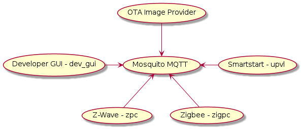

# Unify Framework

## Introduction

The Unify Framework provides software source code and binary packages for Raspberry Pi 4 to
help build an IoT gateway product. The Unify Framework allows an IoT service to control and
manage end nodes using supported wireless PHY radio protocol, which is [Z-Wave protocol](https://github.com/SiliconLabsSoftware/z-wave-protocol-controller),
provided by Silicon Labs. The Unify Framework uses the Unify Controller Language (UCL) as
an internal abstraction layer to seamlessly control various end nodes that are enabled with
multiple wireless PHY radios. The detailed architecture of the Unify Framework is described in 
the [Unify Framework Specification](./unify_specifications/index.rst).

The Unify Framework uses Unify Framework library to decouple API modules from the PHY
drivers. This facilitates code reuse and enables easily adding new high-level
APIs without the need to modify the PHY drivers. The library provides a number
of components that simplify the task of writing a PHY driver also known as a
Protocol Controller.

## Systems Overview

A Unify gateway consists of a Message Queuing Telemetry Transport (MQTT) broker
and a number of MQTT clients. The Unify Framework uses the Mosquitto MQTT broker.

The following diagram shows the overview of System with Unify Applications and
their groupings and relation with other Unify Applications or MQTT broker.

The Unify Framework was previously known as Unified IoT Controller or UIC for short.
The old name can still be found in some parts of the Framework.

## Unify Applications Overview

The Unify Framework contains the following applications:
- [Framework Services](unify_framework_services.md)
- [Protocol Controllers](protocol_controllers.md)
- [IOT Services](unify_iot_services.md)
- [Emulated End Device](../applications/examples/applications/emulated_end_device/readme_user.md)

The framework services work with the protocol controllers to facilitate different features such as group management, OTA updates etc. See links above for more details.

The IOT services interface with the MQTT broker to provide high level functionality on top of the Unify framework. See the link above for more information.

The Emulated End Device helps to emulate end device with user configured clusters or device emulating a specific device type. See the link above for more information.

Please read the [Unify Framework User guide](unify_readme_user.md) for details
on configuring and running Unify Framework applications.

## Overview of communication among Unify Framework Applications

All individual Unify applications communicate via MQTT. In this reference
implementation, the Mosquitto MQTT broker is used which does not support
clustering. As a result, all nodes connect to a single central broker.

MQTT implements a publisher-subscriber model, where all payloads are published
to topics to which zero, one, or many clients can subscribe to. By default,
publishers can publish to any topic and all subscribers can subscribe to any
topic. MQTT has the notion of access-control but that functionality is currently
not used by Unify.

A publisher does not get notified (by the broker) if a subscriber has received
its message. All QoS functionality is handled by the broker.

MQTT has the notion of message-retention, i.e., a message can be retained on a
topic and delivered to any future subscribers. Only a single message is retained
on a given topic at a time. Publishing an MQTT-message with an empty (zero
bytes) payload to a topic will clear its previously retained message.

In Unify, all message payloads are JSON-objects. Some of the Unify topics (e.g.,
commands) may not require any data, but they will require at least an empty JSON
object (e.g., {}).

## Unify Framework Release Notes

The Unify Framework release notes can be found on
[GitHub](https://github.com/SiliconLabs/UnifySDK/releases).

## Unify Framework Developer Guides

The developer guides for the Unify Framework includes the [Unify Developer Guide](readme_developer.md) and the [Unify Library Overview](unify_library_overview.md).

