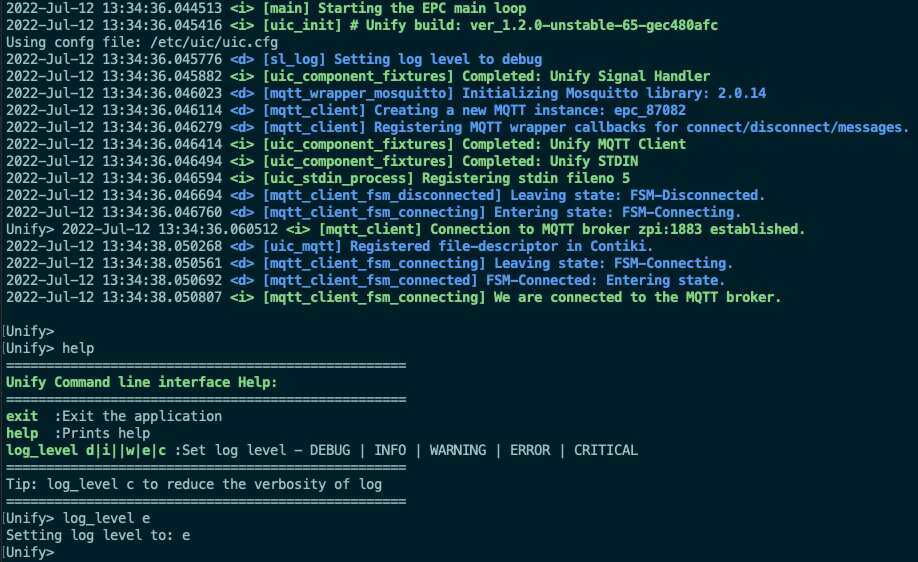
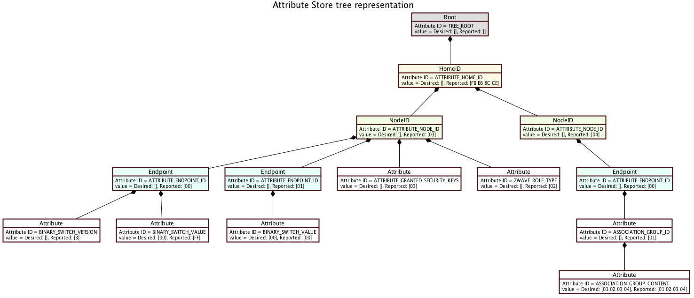

# How to develop a Protocol Controller

This page provides a guide on how to develop a Protocol Controller. A Protocol
Controller can be a complicated application, but can be developed easily
using the [Unify Library](unify_library_overview.md).

## What is a Protocol Controller?

Protocol Controllers can be quite different by design. As a minimum, an
application is considered to be a Protocol Controller when it
interacts (send/receive messages) with some nodes/entities using e.g.
networking protocols and allows at least one of the following using
the UCL language:

1. Expose attributes from the nodes it can reach via MQTT.
2. Send commands to the nodes it can reach when instructed via MQTT.

If an application can communicate with a device and proxy
its state and/or functionality using the UCL language, it is considered
a Protocol Controller.

## Before getting started

First and foremost, take a moment to read the
[Unify Framework Specifications](./unify_specifications/index.rst).
They describe how the Protocol Controller will translate and display nodes
using the UCL framework.

If using the Unify repository, make sure to read the
[Developer README](readme_developer.md) before going ahead and creating a new
application. Finally, it is also a good idea to check the
[Coding Standard](standards/coding-standard.md) and adhere to it before creating
a Protocol Controller in the Unify repository.

## Example Protocol Controller

An Example Protocol Controller (**EPC**) is provided as part of the Unify Framework.
This example application intends to show how to set up and develop a Protocol
Controller.

We use code snippets from the Example Protocol Controller in this guide, but
it is a good idea to have a look at the **EPC** and use it for inspiration when
developing a new Protocol Controller.

## Getting started

### Creating a new application

If you are using the Unify repository, start by creating folders and CMake
files that will allow to build a new application. Peek into the other
applications to get quickly started.

### Creating a main loop

Protocol Controllers designed using the
[Unify Library](unify_library_overview.md) should get started by creating a
main loop.

The main loop can be created by providing a list of functions to invoke for
initialization and teardown, and then invoking *uic_main*.

```c
#include "uic_main.h"

// List of init functions.
static uic_fixt_setup_step_t uic_fixt_setup_steps_list[] = {
  {NULL, "Terminator"}};

// List of shutdown functions
static uic_fixt_shutdown_step_t uic_fixt_shutdown_steps_list[] = {
  {NULL, "Terminator"}};

int main(int argc, char **argv)
{
  return uic_main(uic_fixt_setup_steps_list,
                  uic_fixt_shutdown_steps_list,
                  argc,
                  argv,
                  CMAKE_PROJECT_VERSION);
}
```

Running the main loop without any additional components active will provide a
simple console with a few default functions available. An MQTT broker must be
available and its addresss must be given as argument.

Using the **Example Protocol Controller** application with an empty list of
setup and teardown fixtures will look like this.

```bash
ninja && ./applications/examples/applications/epc/epc --log.level d --mqtt.host zpi
```



The order of initialization must be carefully set, so the components that
depend on another can rely on their dependencies to be initialized. For instance,
it is important to initialize the **Datastore** component before
the **Attribute store**. Components will in most cases log warnings or errors
if they cannot initialize as intended.

It is recommended to initialize:

1. All configuration first
2. Unify Components that The protocol Controller needs
3. Protocol Controller specific components

The teardown order should be the reverse of the initialization order.

Fixture functions are expected to return status codes that will indicate
if the start sequence should continue. For example:

* SL_STATUS_OK: Initialization went well
* SL_STATUS_NOT_AVAILABLE: Initialialization failed, but it was not a critical error and the system should continue running
* Any other value: Initialization failed and the program will shutdown immediately.

### Additional configuration

The Unify configuration module allows to define configuration keys and values
that will be used by the application. The
[Unify Library](unify_library_overview.md) itself sets up a few of these keys
such as the MQTT broker, port, etc.

To see the current configuration setup for an application, run the application
with `--help`. For example using the EPC:


Protocol Controllers should add a component that will initialize all the
additional configuration keys and values that they need. Using the EPC, a
dedicated component holding the list of configuration (`epc_config`) is used
to add more value/keys in the main function.

Protocol Controllers have to initialize all configuration keys and default
values before running the main loop.

```c
int main(int argc, char **argv)
{
  // Initialize the EPC Configuration, add new keys/default values as needed.
  if (epc_config_init()) {
    return EXIT_FAILURE;
  }

  sl_log_info(LOG_TAG, "Starting the EPC main loop");

  // Run uic_main and return result
  return uic_main(uic_fixt_setup_steps_list,
                  uic_fixt_shutdown_steps_list,
                  argc,
                  argv,
                  CMAKE_PROJECT_VERSION);
}
```

In the example above, the `epc_config_init()` function will for example
initialize the default path that will be used with the persistent storage
database. Components can then rely from the initialization that the
`CONFIG_KEY_EPC_DATASTORE_FILE` configuration is available and be set to a value
that they can use this value for their operation.

```c
int epc_config_init()
{
  config_status_t status = CONFIG_STATUS_OK;
  status |= config_add_string(CONFIG_KEY_EPC_DATASTORE_FILE,
                              "EPC datastore database file",
                              DEFAULT_EPC_DATASTORE_FILE);

  return status != CONFIG_STATUS_OK;
}
```

Further, it is recommended to have a cached variable made available for all other
components of the Protocol Controller to access configuration values quickly.
For example, after adding a datastore_file configuration, a wrapper could look
like this:

```c
typedef struct {
  /// File name for datastore/persistent storage
  const char *datastore_file;
} epc_config_t;

static epc_config_t config;

sl_status_t epc_config_fixt_setup()
{
  memset(&config, 0, sizeof(config));
  config_status_t status = CONFIG_STATUS_OK;
  // Datastore configuration
  status |= config_get_as_string(CONFIG_KEY_EPC_DATASTORE_FILE,
                                 &config.datastore_file);

  return status == CONFIG_STATUS_OK ? SL_STATUS_OK : SL_STATUS_FAIL;
}

const epc_config_t *epc_get_config()
{
  return &config;
}
```

Finally, make sure to initialize this Protocol Controller specialization of
the configuration as the first initizalized fixture, so that all components
can access the configuration through the cache.

```c
static uic_fixt_setup_step_t uic_fixt_setup_steps_list[]
  = {{&epc_config_fixt_setup, "EPC Config"},
     {NULL, "Terminator"}};
```

From now on, any component in the application will be able to read the
datastore file configuration setting by invoking:
`epc_get_config()->datastore_file`

### Adding Contiki processes

To keep the system reactive (and not blocking for too long when
performing a chain of operations), Unify Applications and components use Contiki
processes. When an event occurs and can be processed non-sequentially,
it is almost always better to use a Contiki Process.

Note that Contiki Process are not the same as threads, and they still
block each other while executing events. Refer to the Contiki documentation
for details.

```c
#include "process.h"

PROCESS(epc_process, "Example Protocol Controller Process");

// Demo process implementation
PROCESS_THREAD(epc_process, ev, data)
{
  PROCESS_BEGIN()
  while (1) {
    switch (ev) {
      case PROCESS_EVENT_INIT:
        // Additional init code here
        break;
      case PROCESS_EVENT_EXIT:
        // Additional teardown code here
        break;
    }
    PROCESS_WAIT_EVENT();
  }
  PROCESS_END()
}
```

Processes will get started as part of the initialization fixtures. There is
no need to shutdown the processes on exit.

```c
// Fixture starting a process
sl_status_t epc_process_fixt_setup()
{
  process_start(&epc_process, NULL);
  return SL_STATUS_OK;
}

static uic_fixt_setup_step_t uic_fixt_setup_steps_list[]
  = {{&epc_config_fixt_setup, "EPC Config"},
     {&epc_process_fixt_setup, "EPC Process"}, // Start the Contiki process in initialization
     {NULL, "Terminator"}};
```

## How to use the attribute system

The Attribute System aims at providing a very generic solution to storing
network information and making decisions based on any data present in the
network.

It makes the assumption that everything can be stored in an acyclic directed
graph structure, representing the state and knowledge that we have a about
nodes that we can communicate with.

Arbitrary values from 0 to 255 bytes long can be stored in for each attribute
(i.e. it can be any type of numbers, byte-array, structs, strings). Each
attribute has 2 values, a reported (current value reported by the node itself)
and a desired (future/wished value).

An example of a Z-Wave Attribute Store is shown below:



### Defining Attribute Types

Attribute types are identified by a unique <i>uint32_t</i> value, and only 0
(invalid type) and 1 (root attribute) are reserved. The rest of the range can
be assigned by an application.

As the list of defined types is application specific, each application is
free to define for example that type = 2 represents a UNID string, type = 3
represents a uint16_t port number, etc.

To fully leverage the Attribute System, attribute types should be registered
to the Attribute Store using the *attribute_store_regisration* API. For example,
below, registering the "NodeID" attribute, indicating that it will be placed
under HomeID attributes and uses a <i>uint16_t</i> format for storage.

```c
status |= attribute_store_register_type(ATTRIBUTE_NODE_ID, // ATTRIBUTE_NODE_ID is a unique uint32_t number, e.g. 3
                                        "NodeID",
                                        ATTRIBUTE_HOME_ID, // ATTRIBUTE_HOME_ID is a unique uint32_t number, e.g. 2
                                        U16_STORAGE_TYPE);
```

This is particularly important if a Protocol Controller needs to use the
**Attribute Mapper**, as it will allow it to interpret the values of each
attribute.

#### Pre-defined attribute types

A shared DotDot attribute store component (**UIC DotDot Attribute Store**)
defines automatically ZCL attribute types for usage in the **Attribute Store**.
It is not mandatory to use it, but intends to provide a very easy solution to
storing the ZCL state of nodes, which serves as a basis for publishing
attributes or receiving commands via MQTT.

Attribute types are <i>uint32_t</i> values, so 4 bytes long.
The DotDot pre-defined attributes use the following range:
`(ZigBee Cluster ID (2 bytes) <<16) | Zigbee attribute ID (2 bytes)`

The value 0 (Basic Cluster ID) has been replaced to value 0xBA5C, so the range
0x00000002 to 0x0000FFFF is guaranteed to be available for Protocol Controllers
to define their proprietary attributes.

Protocol Controllers must then use this reserved range to assign their own
application attribute definitions. Additionally, attributes allowing to
identify networking addresses/PAN nodes must also be defined by the Protocol
Controllers themselves.

#### Attribute Store and addressing

Using the reserved attribute type range, Protocol Controllers must come up
with an addressing/identifying schema for their networking protocol.

These types should be defined in a manner that will make it easy for the
Protocol Controller to retrieve addresses (either networking addresses,
or UNID/Endpoint addresses) of the resources based on their location in the
attribute tree.

An example of the 2 possible strategies is given in the subsections below.

##### Networking addresses approach

The **ZPC** for example uses the networking address strategy, where it stores
Z-Wave addresses under the **Attribute Store** tree root. Application level
attributes are then placed under Endpoints.

```{uml}
!theme plain
title Attribute Store tree networking addressing example

object root
root : Attribute Type = TREE_ROOT
root : value = Desired: [], Reported: []

object "HomeID" as home_id #fffae6
home_id : Attribute Type = ATTRIBUTE_HOME_ID
home_id : value = Desired: [], Reported: [FB E6 8C CE]

object "NodeID" as node_id_1 #f2ffe6
node_id_1 : Attribute Type = ATTRIBUTE_NODE_ID
node_id_1 : value = Desired: [], Reported: [03]

object "NodeID" as node_id_2 #f2ffe6
node_id_2 : Attribute Type = ATTRIBUTE_NODE_ID
node_id_2 : value = Desired: [], Reported: [04]

object "Endpoint" as endpoint_1 #e6fff7
endpoint_1 : Attribute Type = ATTRIBUTE_ENDPOINT_ID
endpoint_1 : value = Desired: [], Reported: [00]

object "Endpoint" as endpoint_2 #e6fff7
endpoint_2 : Attribute Type = ATTRIBUTE_ENDPOINT_ID
endpoint_2 : value = Desired: [], Reported: [01]

object "Endpoint" as endpoint_3 #e6fff7
endpoint_3 : Attribute Type = ATTRIBUTE_ENDPOINT_ID
endpoint_3 : value = Desired: [], Reported: [00]

object "OnOff attribute" as node_1_ep_2_on_off #FFFFFF
node_1_ep_2_on_off : Attribute Type = DOTDOT_ATTRIBUTE_ID_ON_OFF_ON_OFF
node_1_ep_2_on_off : value = Desired: [01], Reported: [00]

root *-- home_id
home_id *-- node_id_1
home_id *-- node_id_2
node_id_1 *-- endpoint_1
node_id_1 *-- endpoint_2
node_id_2 *-- endpoint_3
endpoint_2 *-- node_1_ep_2_on_off

```

Using this methodology, to publish the state of the OnOff attribute when updated,
the **ZPC** navigates up the **Attribute Store**, collects the value of the
Endpoint, NodeID, HomeID and derives the UNID (from the NodeID / HomeID) and
Endpoint. The **ZPC** can subsequently make these 2 publications:

```mqtt
ucl/by-unid/<UNID>/ep<EndpointId>/OnOff/Attributes/OnOff/Desired - { "value": true }
ucl/by-unid/<UNID>/ep<EndpointId>/OnOff/Attributes/OnOff/Reported - { "value": false }
```

If a frame is to be sent using the Protocol Controller networking protocol,
the addressing information (Endpoint, NodeID, HomeID) is also easy to collect
navigating up the **Attribute Store**.

This method is advantageous if there is a need to store more information
alongside netorking entities, like granted keys for a node, or shared
network properties under for example the HomeID.

##### UNID/Endpoint approach

The **AoXPC** uses a more UNID-like strategy, where the UNIDs are directly saved
under the **Attribute Store** tree root.

```{uml}

!theme plain
title Attribute Store tree UNID addressing example

object "Root" as root #DEDEDE
root : Attribute Type = TREE_ROOT
root : value = Desired: [], Reported: []

object "BLE-UNID" as node_1 #fffae6
node_1 : Attribute Type = ATTRIBUTE_BLE_UNID
node_1 : value = Desired: [], Reported: ["ble-pd-588E81A54788"]

object "Endpoint" as endpoint_1 #f2ffe6
endpoint_1 : Attribute Type = ATTRIBUTE_ENDPOINT_ID
endpoint_1 : value = Desired: [], Reported: [00]

object "Endpoint" as endpoint_2 #f2ffe6
endpoint_2 : Attribute Type = ATTRIBUTE_ENDPOINT_ID
endpoint_2 : value = Desired: [], Reported: [01]

object "BLE-UNID" as node_2 #fffae6
node_2 : Attribute Type = ATTRIBUTE_BLE_UNID
node_2 : value = Desired: [], Reported: ["ble-pd-588E81A54788"]

object "Endpoint" as endpoint_3 #f2ffe6
endpoint_3 : Attribute Type = ATTRIBUTE_ENDPOINT_ID
endpoint_3 : value = Desired: [], Reported: [00]

object "OnOff attribute" as node_1_ep_2_on_off #FFFFFF
node_1_ep_2_on_off : Attribute Type = DOTDOT_ATTRIBUTE_ID_ON_OFF_ON_OFF
node_1_ep_2_on_off : value = Desired: [01], Reported: [00]

root *-- node_1
root *-- node_2
node_1 *-- endpoint_1
node_1 *-- endpoint_2
node_2 *-- endpoint_3
endpoint_2 *-- node_1_ep_2_on_off

```

Using this methodology, to publish the state of the OnOff attribute when updated,
the **AoxPC** navigates up the **Attribute Store**, collects the value of the
Endpoint, UNID, and does require any further calculation.
The **AoxPC** can subsequently make these 2 publications:

```mqtt
ucl/by-unid/<UNID>/ep<EndpointId>/OnOff/Attributes/OnOff/Desired - { "value" : true}
ucl/by-unid/<UNID>/ep<EndpointId>/OnOff/Attributes/OnOff/Reported - { "value" : false}
```

However, when using UNIDs, if a frame is to be sent using the Protocol
Controller networking protocol, the reverse logic needs to be applied and
whenever an attribute triggers the **Attribute Resolver** to send a frame to
a destination, the frame sending functions needs to calculate networking
addresses based on the UNID/Endpoint data in the **Attribute Store**.

### Attribute resolution

When a Protocol Controller has defined its own proprietary atttributes
(both addressing and application-level attributes), it
can start using the **Attribute Resolver** to schedule and send frames.

Let's assume a Protocol Controller using UNID addressing strategy in the
**Attribute Store**. To enable the **Attribute Resolver**, a few additional
components will be needed:

* An NCP component, that allows to send and/or receive frames over the networking protocol.
* A frame/message handler, that writes down the state of the node
* A frame/message generator, that generates an hexadecimal payload to send

The mechanics of the **Attribute Resolver** is shown in the diagram below.

```{uml}

legend top
    |Background color | description |
    |<#ff9999>| Unify Component |
    |<#acffa0>| Protocol Controller Component |
endlegend

!theme plain
title Attribute Resolution

Package "Attribute Store" <<Database>> #ff9999 {

  object "Root" as root #DEDEDE
  object "UNID Attribute" as unid #f2ffe6

  unid : Attribute Type = ATTRIBUTE_UNID
  unid : value = Desired: [] - Reported: ["unid-123"]

  object "Endpoint Attribute" as ep #e6fff7
  ep : Attribute Type = ATTRIBUTE_ENDPOINT_ID
  ep : value = Desired: [] - Reported: [01]

  root *-- unid
  unid *-- ep

  Package "DotDot\nAttribute Space" #f3acb1 {
    map "DotDot Attribute" as dotdot_attribute_1 {
      Reported => [03]
      Desired  => [01 02 03]
    }
    ep *-- dotdot_attribute_1
  }

  Package "Protocol Controller\nAttribute Space" #acffa0 {
    map "Proprietary Attribute" as attribute_1 #FFFFFF {
      Reported => [FF]
      Desired  => [00]
    }
    ep *-- attribute_1
  }
}

Package "Attribute Resolver" as attribute_resolver #ff9999 {
  map "Rule book" as rule_book #acffa0 {
    Function 1 => Attribute type A
    Function 2 => Attribute type B
    Function 3 => Attribute type C
  }
}

Package "Addressing resolver" as address_resolver #acffa0 {
  object "Address resolver" as dedicated_address_resolver #FFFFFF
  dedicated_address_resolver : Takes an attribute, navigate up the tree
  dedicated_address_resolver : and find out proprietary addressing
  dedicated_address_resolver : information and forwards payload/frame
  dedicated_address_resolver : to the NCP component
}

Package "Frame/Message handlers" as frame_handlers #acffa0 {
  object "Frame handler" as frame_handler #FFFFFF
  frame_handler : Parses frames, converts to
  frame_handler : attributes and saves values
  frame_handler : in the Attribute Store
}

Package "Frame/Message generator" as frame_generator #acffa0 {
  object "Attribute Rule" as rule_1 #FFFFFF
  rule_1 : Takes an attribute of a certain
  rule_1 : type and generates a payload/frame
  rule_1 : to send to a node
}

Package "NCP" as ncp_component #acffa0 {
  object "Tx/Rx Module" as tx_rx_module #FFFFFF
  tx_rx_module : send and/or receive
  tx_rx_module : network messages
}

package "PAN" <<Cloud>> {
  package "Node / Endpoint" as pan_node <<Node>> #FFFFFF {
  }
}

rule_1 -l-> rule_book : Registers itself\nfor Attribute Type X

attribute_1 -> attribute_resolver : Notify on value update

attribute_resolver -u-> dedicated_address_resolver : Send Frame / Attribute
dedicated_address_resolver -u-> tx_rx_module : Send Frame with address
pan_node -d-> tx_rx_module : Receive Frame
tx_rx_module -u-> pan_node : Send Frame

ncp_component --> frame_handler : Incoming frames
frame_handler --> attribute_1 : Update value

```

The **Frame/Message Generator** is a set of functions that allow the resolver
to generate a payload (i.e. byte stream). that will sent to the PAN node,
which in turn should Write or Read an attribute.

**Frame/Message Generator functions** can return static frames at times,
or frames that depend on the attribute store values.
For example, in ZCL, to find out the reported value of an *OnOff* attribute should
always be the same payload (ZCL Read Attribute Command with the OnOff attribute ID).
To set the value of an OnOff attribute, the frame generator function would have
to read the value and return either an *On Command* or an *Off Command*.

The payload returned by the **Frame/Message Generator** is an application payload.
Other encapsulations layers (e.g. segmentation, encryption, addressing etc.)
are supposed to be added by the **Addressing resolver** and **NCP** components.

The **Addressing resolver** function is to take the paylaod generated by the
**Frame/Message Generator**, and navigate up the attribute store to find out
the full addressing information. For example, in Z-Wave, it would find out
what is the Endpoint, NodeID, Security Keys to use with the destination, before
it sends it forward to the **NCP**.

### Attribute Mapping

Ultimately, the Protocol Controller needs to set the state of attributes
for the DotDot model, so that they can be published using the UCL language.

The **Attribute Mapper** is able to create attribute rules,
which allow to manipulate attributes. It can be configured using *.uam* files,
which describes relations between attributes.

For example, it is possible to as the **Attribute Mapper** to create an OnOff
attribute and set it to a certain value whenever a corresponding
Protocol Controller Specific attribute is updated.

```{uml}

legend top
    |Background color | description |
    |<#ff9999>| Unify Component |
    |<#acffa0>| Protocol Controller Component |
endlegend

!theme plain
allowmixing
title Attribute Mapper

Package "Attribute Store" <<Database>> #ff9999 {

  object "Root" as root #DEDEDE
  object "UNID Attribute" as unid #f2ffe6

  unid : Attribute Type = ATTRIBUTE_UNID
  unid : value = Desired: [] - Reported: ["unid-123"]

  object "Endpoint Attribute" as ep #e6fff7
  ep : Attribute Type = ATTRIBUTE_ENDPOINT_ID
  ep : value = Desired: [] - Reported: [01]

  root *- unid
  unid *- ep

  Package "DotDot\nAttribute Space" #f3acb1 {
    map "DotDot Attribute 1" as dotdot_attribute_1 {
      Reported => [03]
      Desired  => [01 02 03]
    }
    map "DotDot Attribute 2" as dotdot_attribute_2 {
      Reported => ["Device Name"]
      Desired  => []
    }
    ep *-- dotdot_attribute_1
    ep *-- dotdot_attribute_2
  }

  Package "Protocol Controller\nAttribute Space" #acffa0 {
    map "Proprietary Attribute 1" as attribute_1 #FFFFFF {
      Reported => [FF]
      Desired  => [00]
    }
    map "Proprietary Attribute 2" as attribute_2 #FFFFFF {
      Reported => [3C]
      Desired  => []
    }
    ep *-- attribute_1
    ep *-- attribute_2
  }
}

Package "Attribute Mapper" as attribute_mapper #ff9999 {
  () "Maps Callbacks" as maps_callbacks
  () "Maps Eval" as maps_evaluations
  map "Mappings" as maps #acffa0 {
    Rule 1 => r'1 =  2 * r'2
    Rule 2 => d'2 =  d'1 / 2
    Rule 3 => r'3 =  r'4 + r'2
  }
  maps_callbacks --> maps
  maps_evaluations <-- maps
}

skinparam {
 ArrowColor #FF6655
 ArrowFontColor #FF6655
}

attribute_1 -d-> maps_callbacks : Read
attribute_2 -d-> maps_callbacks
dotdot_attribute_1 -d-> maps_callbacks
dotdot_attribute_2 -d-> maps_callbacks

skinparam {
 ArrowColor #5566FF
 ArrowFontColor #5566FF
}

maps_evaluations -u-> attribute_1
maps_evaluations -u-> attribute_2
maps_evaluations -u-> dotdot_attribute_1
maps_evaluations -u-> dotdot_attribute_2 : Write

```

The **Attribute Mapper** is a very versatile tool allowing to perform attribute
operations. It is used for mapping, but can also be used as information
database in some cases.

[//]: # (FIXME: I think we want to make a generic mapper documentation)
A tutorial and examples on how to create *.uam* files are given in the
[ZPC User Guide](../applications/zpc/how_to_write_uam_files_for_the_zpc.md).

## Connecting the Attribute Store and MQTT

When the attributes are set in the Attribute Store, it is time to advertise
them using MQTT.

There are a few things to set in place to get the Protocol Controller to follow the
[Unify Framework Specifications](./unify_specifications/index.rst)

### Listening to incoming MQTT commands

A large set of auto-generated files in the **UIC DotDot MQTT** components
provide a uniform way to subscribe and listen to incoming commands.
The component will take a callback function for each Cluster/Command combination,
and in turn will take care of publishing the list of SupportedCommands.

```mqtt
ucl/by-unid/<UNID>/ep<EndpointId>/Level/SupportedCommands - { "value" : ["Move","MoveToLevel"] }
```

When such a publication to a command is received, e.g. :

```mqtt
ucl/by-unid/<UNID>/ep<EndpointId>/Level/Commands/MoveToLevel -
{
  "Level": 50,
  "TransitionTime": 0,
  "OptionsMask": {
    "ExecuteIfOff": false,
    "CoupleColorTempToLevel": false
  },
  "OptionsOverride": {
    "ExecuteIfOff": false,
    "CoupleColorTempToLevel": false
  }
}
```

It would parse the UNID, Endpoint, JSON payload, and dispatch it to to the
registered callback. An illustration of how the component works is shown below.

```{uml}

legend top
    |Background color | description |
    |<#ff9999>| Unify Component |
    |<#acffa0>| Protocol Controller Component |
endlegend

!theme plain
title Dispatching incoming UCL commands

Package "DotDot\nCommand Dispatch" as dotdot_command_dispatch #acffa0 {
  map "Command callbacks" as dotdot_command_callbacks #FFFFFF {
    OnOff_On => function1
    OnOff_Off => function2
    OnOff_toggle => function3
    Level_move => function4
  }
}

Package "UIC DotDot MQTT" as uic_dotdot_mqtt #ff9999 {
  object "DotDot MQTT handler" as uic_dotdot_mqtt_component #FFFFFF
  uic_dotdot_mqtt_component : Saves callbacks for commands from user
  uic_dotdot_mqtt_component : components, makes the corresponding
  uic_dotdot_mqtt_component : MQTT subscriptions and dispatches
  uic_dotdot_mqtt_component : incoming messages
}


Package "Attribute Store" <<Database>> #ff9999 {

  object "Root" as root #DEDEDE
  object "UNID Attribute" as unid #f2ffe6

  unid : Attribute Type = ATTRIBUTE_UNID
  unid : value = Desired: [] - Reported: ["unid-123"]

  object "Endpoint Attribute" as ep #e6fff7
  ep : Attribute Type = ATTRIBUTE_ENDPOINT_ID
  ep : value = Desired: [] - Reported: [01]

  root *- unid
  unid *- ep

  Package "DotDot\nAttribute Space" #f3acb1 {
    map "DotDot Attribute 1" as dotdot_attribute_1 {
      Reported => [00]
      Desired  => [01]
    }
    map "DotDot Attribute 2" as dotdot_attribute_2 {
      Reported => [00 01]
      Desired  => []
    }
    ep *-- dotdot_attribute_1
    ep *-- dotdot_attribute_2
  }

  Package "Protocol Controller\nAttribute Space" #acffa0 {
    map "Proprietary Attribute 1" as attribute_1 #FFFFFF {
      Reported => [FF]
      Desired  => [00]
    }
    map "Proprietary Attribute 2" as attribute_2 #FFFFFF {
      Reported => [3C]
      Desired  => []
    }
    ep *-- attribute_1
    ep *-- attribute_2
  }
}

Package "MQTT Client" as mqtt_client #ff9999 {
  map "Subscriptions callbacks" as mqtt_client_subscriptions #FFFFFF {
    topic_filter_1 => function1
    topic_filter_2 => function2
    topic_filter_3 => function3
  }
}


skinparam {
 ArrowColor #5566FF
 ArrowFontColor #5566FF
}

mqtt_client_subscriptions::topic_filter_2 -> uic_dotdot_mqtt_component
uic_dotdot_mqtt_component -> dotdot_command_callbacks::OnOff_toggle

dotdot_command_callbacks -u-> dotdot_attribute_1 : Write the desired value\nin the DotDot space

() "MQTT DotDot\nCommand Publication" as command_publication #5566FF
command_publication --> mqtt_client_subscriptions

skinparam {
 ArrowColor #FF6655
 ArrowFontColor #FF6655
}

dotdot_command_callbacks -> uic_dotdot_mqtt_component : Register command handlers
uic_dotdot_mqtt_component -> mqtt_client_subscriptions : Subscribe to relevant topics to\nreceving incoming publications

```

The Protocol Controller has to provide a component that registers callbacks
for a given DotDot Command. When this command is received, the callback
is expected to locate the UNID/Endpoint in the Attribute Store and perform
the attribute updates that the command effect have on the device.

For example, if the Protocol Controller wants to receive the commands
from the OnOff cluster:

```c
#include "dotdot_mqtt.h"

bool dotdot_command_dispatch_init()
{
  // We listen to OnOff cluster On, Off and Toggle command
  uic_mqtt_dotdot_on_off_on_callback_set(on_on_off_cluster_on_command_received);
  uic_mqtt_dotdot_on_off_off_callback_set(on_on_off_cluster_off_command_received);
  uic_mqtt_dotdot_on_off_toggle_callback_set(on_on_off_cluster_toggle_command_received);

  return true;
}
```

Subsequently, the Protocol controller is expected to find out the corresponding
attributes in the attribute store based on the UNID/Endpoint combination, and
update the value of the DotDot Attribute.

```c
sl_status_t
  on_on_off_cluster_on_command_received(const dotdot_unid_t unid,
                                        const dotdot_endpoint_id_t endpoint,
                                        uic_mqtt_dotdot_callback_call_type_t callback_type)
{
  // Take the UNID/Endpoint and locate the node in the attribute store.
  attribute_store_node_t endpoint_node = get_endpoint_node_from_unid_endpoint(unid, endpoint);

  // On Command will affect the OnOff attribute and set it to true
  attribute_store_node_t on_off_attribute_node =
    attribute_store_get_first_child_by_type(endpoint_node,
                                            DOTDOT_ATTRIBUTE_ID_ON_OFF_ON_OFF);

  // This is used by DotDot MQTT to publish SupportedCommands
  if (callback_type == UIC_MQTT_DOTDOT_CALLBACK_TYPE_SUPPORT_CHECK) {
    return (on_off_attribute_node == ATTRIBUTE_STORE_INVALID_NODE) ? SL_STATUS_OK
                                                                   : SL_STATUS_FAIL;
  }

  // Else set the value to true.
  bool new_value = true;
  return attribute_store_set_desired(on_off_attribute_node,&new_value,sizeof(new_value));
}
```

At this point, if an IoT Service publishes a command such as

```mqtt
ucl/by-unid/<UNID>/ep<EndpointId>/OnOff/Commands/On - {}
```

The command will be received, passed forward to the right command handler, and
the corresponding OnOff attribute in the **Attribute Store** will be updated to match
the wish of the IoT Service

Using the **Attribute Mapper**, the update of the desired value OnOff attribute
should trigger an update of the desired value of the corresponding mapped
proprietary attribute.

Subsequently, the **Attribute Resolver**, will be notified that an update occured
and should determine if a frame is to be sent to the PAN node.

Finally, if the node reports that the corresponding proprietary attribute
reported value is updated back, an attribute map should ensure that the reported
value of the DotDot OnOff attribute gets in turn updated.

### Publishing the DotDot Attribute state of nodes

Using the **Attribute Store** and the **UIC DotDot MQTT** components, a Protocol
Controller can easily publish the state of the DotDot attributes.

```c
sl_status_t dotdot_attribute_publisher_init()
{
  // For Each Cluster/Attribute that needs to be published
  attribute_store_register_callback_by_type_and_state(
    on_off_cluster_on_attribute_desired_state_publisher_callback,
      DOTDOT_ATTRIBUTE_ID_ON_OFF_ON_OFF,
      DESIRED_ATTRIBUTE);
  attribute_store_register_callback_by_type_and_state(
    on_off_cluster_on_attribute_reported_state_publisher_callback,
      DOTDOT_ATTRIBUTE_ID_ON_OFF_ON_OFF,
      REPORTED_ATTRIBUTE);
  return SL_STATUS_OK;
}
```

With these callbacks set, the **Attribute Store** will invoke these function
when the values get updated. Subsequently, the functions can use **UIC DotDot MQTT**
to publish the updated state.

```cpp
void on_off_cluster_on_attribute_desired_state_publisher_callback(
  attribute_store_node_t updated_node, attribute_store_change_t change)

  // Ignore creation and deletion events
  if (change == ATTRIBUTE_DELETED || change == ATTRIBUTE_CREATED){
    return;
  }

  // Take the attribute store node and determine the UNID/Endpoint from the attribute store.
  dotdot_unid_t unid;
  dotdot_endpoint_id_t endpoint_id;
  get_unid_endpoint_from_attribute_store_node(updated_node, unid, endpoint);

  // Prepare the basic topic
  std::stringstream base_topic;
  base_topic << "ucl/by-unid/" << std::string(unid);
  base_topic << "/ep"<< std::to_string(endpoint_id);

  // Get the value of the attribute
  bool value = false;
  attribute_store_get_desired(updated_node,&value,sizeof(value));

  // Call the corresponding DotDot MQTT helper to make the publication
  uic_mqtt_dotdot_on_off_on_off_publish(
    base_topic.str().c_str(),
    value,
    UCL_MQTT_PUBLISH_TYPE_DESIRED);
```

## UCL node state

### UCL node state overview

When the Protocol Controller is setup to publish attributes, process incoming
commands, map in between attribute spaces, resolve and/or send frames when
needed, there is one final step to set up: The UCL node state.

The node state topic is a special topic, which does not fully follow
the standard cluster attributes publications.
Refer to the
[Unify Framework Specifications](./unify_specifications/index.rst)
for details.

Protocol Controllers must publish the node state for each node they can
access, so that IoT services can build up a list of entities.
If possible, the state should be published after publishing the list of
attributes/cluster functionalities, so that IoT Services have a full picture
of the node's capabilities when it is announced to be *"Online Functional"*.

The Protocol Controller UCL node state component should listen
to its proprietary attributes and/or components to determine
when nodes are ready to be operated by IoT Services.

Additionally, the node state has to be republished every time one of the properties
change:

* NetworkStatus
* Security
* MaximumCommandDelay

At the end, the component must be able to publish for all reachable nodes the
following topic:

```mqtt
ucl/by-unid/<UNID>/State -
{
  "NetworkStatus": "Online functional",
  "Security": "Z-Wave S2 Authenticated",
  "MaximumCommandDelay": 1
}
```

```{uml}

legend top
    |Background color | description |
    |<#ff9999>| Unify Component |
    |<#acffa0>| Protocol Controller Component |
endlegend

!theme plain
title Publishing the UCL node state

Package "Attribute Store" <<Database>> #ff9999 {

  object "Root" as root #DEDEDE
  object "UNID Attribute" as unid #f2ffe6

  unid : Attribute Type = ATTRIBUTE_UNID
  unid : value = Desired: [] - Reported: ["unid-123"]

  object "Endpoint Attribute" as ep #e6fff7
  ep : Attribute Type = ATTRIBUTE_ENDPOINT_ID
  ep : value = Desired: [] - Reported: [01]

  root *- unid
  unid *- ep

  Package "DotDot\nAttribute Space" #f3acb1 {
    map "DotDot Attribute 1" as dotdot_attribute_1 {
      Reported => [00]
      Desired  => [01]
    }
    map "DotDot Attribute 2" as dotdot_attribute_2 {
      Reported => [00 01]
      Desired  => []
    }
    ep *-- dotdot_attribute_1
    ep *-- dotdot_attribute_2
  }

  Package "Protocol Controller\nAttribute Space" #acffa0 {
    map "Proprietary Attribute 1" as attribute_1 #FFFFFF {
      Reported => [FF]
      Desired  => [00]
    }
    map "Proprietary Attribute 2" as attribute_2 #FFFFFF {
      Reported => [3C]
      Desired  => []
    }
    ep *-- attribute_1
    ep *-- attribute_2
  }
}

Package "Other\nComponent" as other_component #acffa0 {
  object "Other component" as other_component #FFFFFF
  other_component : May generate relevant events to the
  other_component : node states, like when the Protocol
  other_component : Controller shuts down
}

Package "UCL\nNode State" as ucl_node_state #acffa0 {
  object "Node State publisher" as ucl_node_state_publisher #FFFFFF
  ucl_node_state_publisher : Listens to events from the Attribute
  ucl_node_state_publisher : store or from other components
  ucl_node_state_publisher : to publish node states.
}

Package "MQTT Client" as mqtt_client #ff9999 {
  map "Publication queue" as mqtt_client_publications #FFFFFF {
    topic1 => payload1
    topic2 => payload2
    topic3 => payload2
  }
}

skinparam {
 ArrowColor #5566FF
 ArrowFontColor #5566FF
}

ucl_node_state_publisher -> mqtt_client_publications : Publish node state

skinparam {
 ArrowColor #FF6655
 ArrowFontColor #FF6655
}

attribute_1 --> ucl_node_state_publisher : Read
attribute_2 --> ucl_node_state_publisher
dotdot_attribute_1 --> ucl_node_state_publisher
dotdot_attribute_2 --> ucl_node_state_publisher
other_component -> ucl_node_state_publisher : Relevant events

```

Some attributes may be located directly under the UNID for the network
status, but Endpoint 0 is also a good place to store such data.

A couple of helpers are available in the **UIC DotDot MQTT** component
to publish State related information, such as the state SupportedCommands.

### Start-up and shutdown

A Protocol Controller is expected to unretain (almost) all topics that it
published during runtime when it is being shutdown. The node state topic
will be the only one that will stay after the Protocol Controller is shut down.

For example, the **ZPC** on shutdown iterates through its entire list of PAN nodes
and publish that they will be unavailable, right before removing all other
topics that have published for the PAN nodes.

```c
void ucl_node_state_teardown()
{
  // get node list and publish the node state unavailable
  attribute_store_node_t home_id_node = get_zpc_network_node();
  attribute_store_node_t node_id_node = ATTRIBUTE_STORE_INVALID_NODE;
  size_t num_child = attribute_store_get_node_child_count(home_id_node);
  for (size_t i = 0; i < num_child; i++) {
    node_id_node = attribute_store_get_node_child_by_type(home_id_node,
                                                          ATTRIBUTE_NODE_ID,
                                                          i);
    publish_node_state(node_id_node, false);
  }

  //Remove all retained topics except ucl/by-unid/<xxxxx>/State
  uic_mqtt_unretain_by_regex("^(?!ucl\\/by-unid\\/.*\\/State$).*");
}
```

This will have the effect of publishing an unavailable state for all nodes:

```mqtt
ucl/by-unid/zw-D4BFAE7D-0001/State - {"NetworkStatus": "Unavailable", "Security": "Z-Wave S2 Access Control", "MaximumCommandDelay": 0}
ucl/by-unid/zw-D4BFAE7D-000C/State - {"NetworkStatus": "Unavailable", "Security": "None", "MaximumCommandDelay": 4200}
ucl/by-unid/zw-D4BFAE7D-000D/State - {"NetworkStatus": "Unavailable", "Security": "Z-Wave S2 Authenticated", "MaximumCommandDelay": 1}
```

Whenever the Protocol Controller starts again, it needs to iterate over the
list of nodes and publish their state, as well as the Dotdot attributes and commands.

An initialization function can use the **Attribute Store**
*attribute_store_refresh_node_and_children_callbacks* function, that will simulate
that all attributes just got updated in the Attribute Store and will trigger a
publication.

## General recommendations

### MQTT publications vs Attribute Store resolution and mapping

Whenever a component wants to publish the state of an attribute, it can
(and in certain cases should) verify if the **Attribute Mapper** and/or
**Attribute Resolver** are still working on the **Attribute Store** tree.

The **Attribute Resolver** can give notifications when a node and all
its children have been resolved. This can be used to move the UCL node
state from "Online interviewing" to "Online functional".

The **Attribute Mapper** can indicate if it still is modifying the
**Attribute Store** due to pending evaluations.

Re-invoking the same function can be done with the **Attribute Timeouts**
component. Here is an example.

```c
void on_zcl_attribute_update(attribute_store_node_t updated_node)
{
  // If the Mapper is still working, wait with the publication:
  if (attribute_mapper_has_pending_evaluations()) {
    // Wait that the mapper has reached a final state.
    // Try again in 200 ms
    sl_log_debug(LOG_TAG,
                 "Mapper is still working. "
                 "Postponing DotDot attribute publications by 200ms.");
    attribute_timeout_set_callback(updated_node,
                                   200,
                                   &on_zcl_attribute_update);
    return;
  }

  // Else publish the ZCL attribute
  // [...]
```

## Network Management

Network management is an optional feature of Protocol Controllers, and should
be implemented only if their networking protocol allows them to
perform such operations.

### Manual Network Management operations

If a Protocol Controller is able to join/leave a network or add/remove nodes
to a network, they are expected to implement the
`ucl/by-unid/&lt;UNID&gt;/ProtocolController/NetworkManagement` topic.

Protocol Controllers ables to perform network management functionalities
should implement a component publishing and subscribing to NetworkManagement
commands.

There is no shared component helping for this function at the moment.

### Using SmartStart for network inclusions

A dedicated Unify component named **UIC SmartStart Management** is available
for Protocol Controller that would like to use SmartStart. It will enable
them to receive the SmartStart information automatically.

## Additional shared components

In general, it is recommended to use components that are provided as part of the
[Unify Library](unify_library_overview.md). Not all are designed for Protocol
Controllers in general, but most will provide some useful functionalities.

For example, the **UIC OTA** provides a simple interface to advertise, receive
and apply firmware updates to end nodes. **Unify Attribute poll** will manage
a list of attributes types that must be read periodically.
