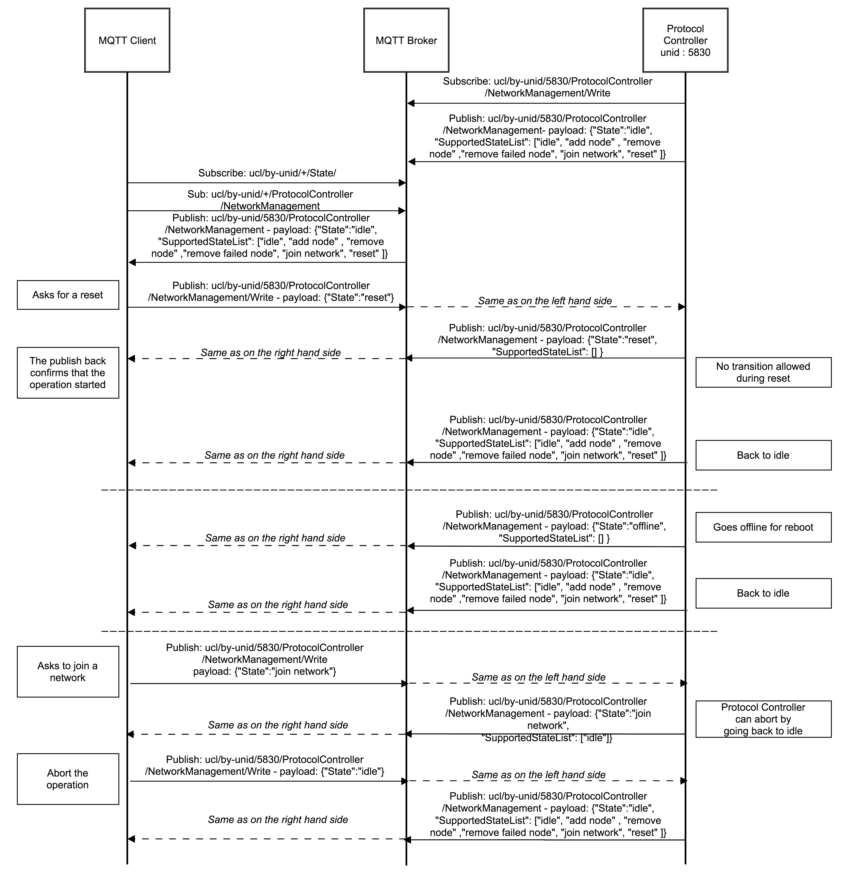
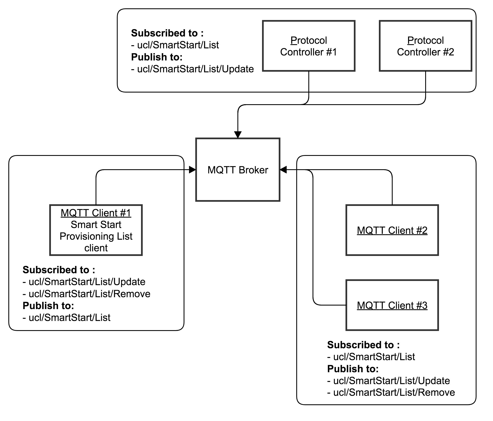

.. meta::
  :description: Unify Network Management
  :keywords: Network, Management

.. |ZCL2019| replace:: `ZCL 2019 <https://zigbeealliance.org/wp-content/uploads/2019/12/07-5123-06-zigbee-cluster-library-specification.pdf>`__

.. raw:: latex

 \newpage

.. _unify_specifications_chapter_network_management:

Network Management Commands
===========================

Introduction
------------

Depending on which PHY/protocol is used, various types of API that can operate the network
are needed, which makes up *network management* and includes
functions such as the following:

* Add/remove nodes to/from a network
* Security functions (OOB authentication, key exchange selections, and so on)
* Set up/interview the nodes so that they can be used (for example in Z-Wave,
  it includes setting an association/binding and Wake Up functionalities (poll control))

The network management API must allow any PHY or protocol to set up their
network properly, so that an application can run without taking the
PHY into consideration.

All automatic setup steps that a Protocol Controller does, should actually be
done without asking IoT Services about how to configure the device.
If needed or possible, an API for IoT Services can still be used to change
some of the settings subsequently. For example, a Protocol Controller should
set up all required bindings in a "default" fashion when including a
new node in a network. It does not prevent the existence of an API for
IoT Services to subsequently change bindings, but it would allow clients to
be PHY agnostic and still be able to leverage the application possibilities.

Generic APIs for Network Management
-----------------------------------

Two distinct network management categories can be used by IoT Services:

* Network Management
* SmartStart List Management

Additionally, the following functionality may be made available by Protocol
Controllers:

* Telemetry data

From an MQTT broker/client perspective, these functionalities categories are mapped
into topics, as shown in
:numref:`table_unify_specifications_network_management_mqtt_topic_space_overview`.

.. list-table:: Network Management MQTT Topic space overview
  :name: table_unify_specifications_network_management_mqtt_topic_space_overview
  :widths: 60 30 10
  :width: 50%
  :header-rows: 1

  * - MQTT Topic
    - Description
    - ZCL Cluster
  * - ucl/by-unid/+/ProtocolController/NetworkManagement/#
    - Generic network management functionalities such as

      network creation or security setup.
    - None
  * - ucl/by-unid/+/ProtocolController/RFTelemetry/#
    - RF telemetry
    - ProtocolController/RFTelemetry (0xFC01)
  * - ucl/SmartStart/+
    - SmartStart functionality
    - None

Network Management
------------------

This functionality enables creating and managing a PAN.
The API should be usable for any PHY. This is a list of typical
Network Management operations:

* Add a new node in the network
* Remove a node from the network
* Join another network
* Leave the current network
* Reset and leave network. (set default)

Some network functionalities may be uninterruptible, meaning that the
Protocol Controller is basically busy and clients need to wait before they can
initiate new network management operations. On the other hand, some operations
can be aborted or transitioned to a new operation on the fly.

The network management functionality must support additional APIs for security
and commissioning, shortly after network inclusion:

* Security functions: decide which keys to grant /
  perform out-of-band authentication (input the DSK/PIN digits)
* Tell the clients when a node interview/commissioning is over and
  can be controlled. (issue a node/endpoint state topic
  (``ucl/by-unid/+/State``) message (refer to the
  :ref:`unify_specifications_chapter_service_discovery`).

Not all functionalities might be available at all times, based on
individual protocol constraints. For example, the Z-Wave Network Role
will affect the network management capabilities. Those capabilities may
change at runtime, so it is important that the API/commands must allow to
make clients aware what functionalities are currently supported.

The Network Management State Concept
''''''''''''''''''''''''''''''''''''

Typically, network management operations are carried out by a state machine,
which gets restricted with what it can do based on its current state.
Therefore, the Network Management API is primarily concerned with
reading and changing the state of the network management state machine.

The state machine will at times need additional state parameters to carry
out operations, which will indicate how to behave in certain scenarios.
The proposed model is to have a State variable that will take any value
among an pre-defined enumeration.

A Protocol Controller will also advertise a *SupportedStateList*, that will
advertise the list of values that the State can be changed to or transitioned
to at the current time.

When changing to a new State value, if the Protocol Controller needs
additional parameters to continue the operation, it will publish a
list of *RequestedStateParameters*, which is an enumeration of the variables
needed. For example, if the Protocol Controller is moved to the
"Remove node" state, it may publish back
``{"RequestedStateParameters" = ["Unid"]}`` to indicate that it needs the
unid of the node to be removed from the network to be added
in the *StateParameters* array before it can continue.

A Client can push additional state parameters variables
in an array named *StateParameters*. Examples are given in
:numref:`table_unify_specifications_network_management_state_and_other_parameters`.

.. table:: Network Management State and other parameters
  :name: table_unify_specifications_network_management_state_and_other_parameters
  :widths: 60 30 10
  :width: 50%
  :align: left

  +------------------+-------------------+--------------+-----------------------------------------------------------------------+
  |  **Parameter**                       |  **Type**    |  **Description**                                                      |
  +==================+===================+==============+=======================================================================+
  |    State                             |  String      | Current state of the Network Management state machine                 |
  +------------------+-------------------+--------------+-----------------------------------------------------------------------+
  | SupportedStateList                   | array        | List of values to which the current network state                     |
  |                                      |              |                                                                       |
  |                                      |              | (State) can move to from the current state                            |
  +------------------+-------------------+--------------+-----------------------------------------------------------------------+
  | RequestedStateParameters             | array        | List of names of parameters that the ProtocolController needs         |
  |                                      |              |                                                                       |
  |                                      |              | a Client to provide in the StateParameters array. If a network        |
  |                                      |              |                                                                       |
  |                                      |              | management function is started with too little or missing mandatory   |
  |                                      |              |                                                                       |
  |                                      |              | StateParameters, this array of strings will indicate back to the      |
  |                                      |              |                                                                       |
  |                                      |              | client that it needs to provide the missing parameter and its value.  |
  +------------------+-------------------+--------------+-----------------------------------------------------------------------+
  | RequestedStateParameters             | JSON object  | JSON object containing key/value parameters, that are provided or     |
  |                                      |              |                                                                       |
  |                                      |              | advertised by the ProtocolController relating to the                  |
  |                                      |              |                                                                       |
  |                                      |              | ongoing operation.                                                    |
  +------------------+-------------------+--------------+-----------------------------------------------------------------------+
  | StateParameters  | ProvisioningMode  | string       | Indicates the type of connection/security that is established         |
  |                  |                   |              |                                                                       |
  |                  |                   |              | at the protocol level. It will help a client to know how to           |
  |                  |                   |              |                                                                       |
  |                  |                   |              | guide an end-user to fill the security code, preventing formatting    |
  |                  |                   |              |                                                                       |
  |                  |                   |              | mistakes from the beginning.                                          |
  +------------------+-------------------+--------------+-----------------------------------------------------------------------+
  | StateParameters  | UserAccept        | boolean      | Posted by the client to indicate if it got a end user to accept       |
  |                  |                   |              |                                                                       |
  |                  |                   |              | the connection establishment (e.g. BLE "just work" connection). Set   |
  |                  |                   |              |                                                                       |
  |                  |                   |              | to true when the end user accepts the connection. Set to false when   |
  |                  |                   |              |                                                                       |
  |                  |                   |              | the end user refuses the connection.                                  |
  +------------------+-------------------+--------------+-----------------------------------------------------------------------+
  | StateParameters  | SecurityCode      | string       | This represents the pin code or out of band authentication input      |
  |                  |                   |              |                                                                       |
  |                  |                   |              | by the end user. A client needs to provide this information to the    |
  |                  |                   |              |                                                                       |
  |                  |                   |              | Protocol Controller to proceed with the security setup. Clients can   |
  |                  |                   |              |                                                                       |
  |                  |                   |              | help end users with the format of the SecurityCode by looking at the  |
  |                  |                   |              |                                                                       |
  |                  |                   |              | ProvisioningMode. If no provisioning mode is provided or if it is     |
  |                  |                   |              |                                                                       |
  |                  |                   |              | unknown, a client would typically show a free text field to users for |
  |                  |                   |              |                                                                       |
  |                  |                   |              | input of the Security Code.                                           |
  +------------------+-------------------+--------------+-----------------------------------------------------------------------+
  | StateParameters  | Unid              | string       | Unid of the node for which the network management                     |
  |                  |                   |              |                                                                       |
  |                  |                   |              | operation will apply.                                                 |
  +------------------+-------------------+--------------+-----------------------------------------------------------------------+
  | ClusterRevision                      | number       | Version of the cluster/payload that the Protocol Controller is        |
  |                                      |              |                                                                       |
  |                                      |              | supporting. This field MUST be set to 1 at the moment. Future         |
  |                                      |              |                                                                       |
  |                                      |              | revisions of the Unify specification may add new functionalities and  |
  |                                      |              |                                                                       |
  |                                      |              | increment this value.                                                 |
  +------------------+-------------------+--------------+-----------------------------------------------------------------------+

MQTT Topics and Parameters
''''''''''''''''''''''''''

.. list-table:: Network Management MQTT Topics
  :name: table_unify_specifications_network_management_mqtt_topics
  :widths: 60 40
  :width: 80%
  :header-rows: 1

  * - MQTT Topic
    - Description
  * - ucl/by-unid/+/ProtocolController/NetworkManagement
    - Read/report the current network management state and its associated parameters
  * - ucl/by-unid/+/ProtocolController/NetworkManagement/Write
    - Attempt to change the the network management state with additional/optional state parameters

The State value and additional parameters are part of the MQTT publish
message payload. The state parameter indicates if the actual Protocol
Controller is carrying out an operation.  This is an overview of the identified
State values and example of additional parameters in the MQTT payload.
This list can be expanded to fit all protocols.

State value examples
~~~~~~~~~~~~~~~~~~~~

idle
****

The network management state machine is idle and ready to carry operations

.. code-block:: json

  {
   "State": "idle",
   "SupportedStateList": ["idle", "add node" , "remove node" , "join network",  "leave network", "reset" ]
  }

add node
********

Include a new node into the network.

.. code-block:: json

  {
    "State": "add node",
    "StateParameters": {
      "ProvisioningMode": "ZWaveDSK",
      "UserAccept": true,
      "SecurityCode": "26277-50093-58391-05165-27397-27368-37969-16601"
    },
    "SupportedStateList": [
      "idle"
    ],
    "RequestedStateParameters": [
      "UserAccept",
      "AllowMultipleInclusions"
    ]
  }

Note: AllowMultipleInclusions - set to true if add node mode should remain
active after the first node is added. State must be explicitly set to
idle when no more node additions are desired.

remove node
***********

Remove any node from the network.
Removing a particular node can be triggered from the node State topic using
"Remove" command as described in the "Network management for individual nodes"
section. In this case, the "StateParameters" JSON object will indicate which
particular node is attempted to be removed.

.. code-block:: json

  {
    "State": "remove node",
    "StateParameters": {
      "Unid": ""
    },
    "SupportedStateList": [ "idle" ]
  }

join network
**********************

Join a new network.

.. code-block:: json

  {
    "State": "join network",
    "StateParameters": {
      "ProvisioningMode": "ZWaveDSK",
      "SecurityCode": "26277-50093-58391-05165-27397-27368-37969-16601"
    },
    "SupportedStateList": [ "idle" ]
  }

leave network
*************

Leave the current network

.. code-block:: json

  {
    "State": "leave network",
    "SupportedStateList": []
  }

network repair
**************

The Protocol Controller is carrying out some network repair functions,
such as providing routes for nodes or remove bindings towards nodes
that have left the network

.. code-block:: json

  {
    "State": "network repair",
    "SupportedStateList": []
  }

network update
**************

The Protocol Controller performs a network update,
which consists in ensuring that it knows which nodes are present in the network,
and protocol specific information like routing/network topology.
it can also be distributing the network topology or state to other nodes in the
network.

.. code-block:: json

  {
    "State": "network update",
    "SupportedStateList": [ "idle" ]
  }

reset
*****

The Protocol Controller is resetting to default (and leaving the network).
It may get offline for a little while.

.. code-block:: json

  {
    "State": "reset",
    "SupportedStateList": []
  }

scan mode
*********

The Protocol Controller is looking for nodes to join the network,
and will provide a list of candidates. No nodes are added yet.

.. code-block:: json

  {
    "State": "scan mode",
    "SupportedStateList": [ "idle" ]
  }

JSON Schema for NetworkManagement Topic
~~~~~~~~~~~~~~~~~~~~~~~~~~~~~~~~~~~~~~~

The NetworkManagement topic MUST follow the following JSON schema:

.. code-block:: json

  {
    "$schema": "http://json-schema.org/draft-07/schema#",
    "definitions": {
      "NetworkManagementState": {
        "type": "string",
        "enum": [
          "idle",
          "add node",
          "remove node",
          "join network",
          "leave network",
          "network repair",
          "network update",
          "reset",
          "scan mode"
        ]
      },
      "NetworkManagementRequestedStateParameter": {
        "type": "string",
        "enum": [
          "ProvisioningMode",
          "UserAccept",
          "SecurityCode",
          "Unid",
          "AllowMultipleInclusions"
        ]
      },
      "NetworkManagementStateParameters": {
        "type": "object",
        "properties": {
          "ProvisioningMode": {
            "type": "string"
          },
          "UserAccept": {
            "type": "boolean"
          },
          "SecurityCode": {
              "type": "string"
          },
          "Unid": {
            "type": "string"
          },
          "AllowMultipleInclusions": {
            "type": "boolean"
          }
        }
      }
    },
    "title": "Protocol Controller Network Management Properties",
    "description": "Current state of the Protocol Controller Network management",
    "type": "object",
    "properties": {
      "State": {
        "$ref": "#/definitions/NetworkManagementState"
      },
      "SupportedStateList": {
        "type": "array",
        "items": {
          "$ref": "#/definitions/NetworkManagementState"
        }
      },
      "RequestedStateParameters": {
        "type": "array",
        "items": {
          "$ref": "#/definitions/NetworkManagementRequestedStateParameter"
        }
      },
      "StateParameters": {
        "$ref": "#/definitions/NetworkManagementStateParameters"
      },
      "Version": {
        "type": "string",
        "pattern": "^0x[0-9a-fA-F]+"
      }
    },
    "required": [
      "State",
      "SupportedStateList"
    ]
  }

Example: Including a New Node
~~~~~~~~~~~~~~~~~~~~~~~~~~~~~

The diagram below shows an example of an MQTT Client and Protocol
Controller going through a Network Inclusion, initiated by somebody else
than the MQTT Client. The "SupportedStateList" parameter that is used for
allowed state transitions is not shown in the example below.

The JSON payload of the MQTT publish message is sometimes simplified for
readability, for example it does not contain the *SupportedStateList*
parameter, showing allowed *State* transitions.

.. uml::

  'Style matching the other figures in chapter.
  !theme plain
  skinparam LegendBackgroundColor #F0F0F0
  !pragma teoz true

  title Advanced Joining of a Z-Wave S2 node

  legend top
  MQTT Subscription
  Retained MQTT Publication
  Unretained MQTT Publication
  endlegend

  participant "IoT Service" as client
  participant "MQTT Broker" as broker
  participant "Protocol Controller\nunid : 5830" as pc
  participant "PAN Node" as pan_node

  pc -> broker: ucl/by-unid/5830/ProtocolController/NetworkManagement/Write
  client -> broker: ucl/by-unid/+/State/
  client -> broker: ucl/by-unid/+/ProtocolController/NetworkManagement

  pc -> broker: ucl/by-unid/5830/ProtocolController/NetworkManagement\n<b>{"State":"idle"}
  & broker -> client

  rnote left of client: Initiates \ninclusion
  client -> broker: ucl/by-unid/5830/ProtocolController/NetworkManagement/Write \n<b>{"State":"add node"}
  & broker -> pc

  pc -> broker: ucl/by-unid/5830/ProtocolController/NetworkManagement\n<b>{"State":"add node"}
  & broker -> client

  rnote over pc, pan_node: Adds the node\ninto the network
  pc -> broker: ucl/by-unid/46813/State\n<b>{"NetworkStatus": "Online interviewing",\n<b>"Security": "None", \n<b>"MaximumCommandDelay": 0}
  & broker -> client

  rnote left of client: The publication on\nthe new node UNID\n confirms that a new\n node is joining

  rnote over pc, pan_node: Security bootstrapping\nstarts

  pc -> client: ucl/by-unid/5830/ProtocolController/NetworkManagement \n<b>{"State": "add node",\n<b>"StateParameters": {"ProvisioningMode": "ZWaveDSK",\n<b>"SecurityCode": "xxxxx-00388-61481-49494-17761-06413-32760-21616"},\n<b>"RequestedStateParameters": ["SecurityCode","UserAccept","AllowMultipleInclusions"]}

  client -> pc: ucl/by-unid/5830/ProtocolController/NetworkManagement/Write\n<b>{"State":"add node",\n<b>"StateParameters":{"UserAccept":true,\n<b>"SecurityCode":"11111-00388-61481-49494-17761-06413-32760-21616",\n<b>"AllowMultipleInclusions":false}}

  rnote left of client: Client provides\nSecurity authentication
  rnote over pc, pan_node: Security bootstrapping\ncompletes

  pc -> broker: ucl/by-unid/5830/ProtocolController/NetworkManagement\n<b>{"State":"idle"}
  & broker -> client

  pc -> broker: ucl/by-unid/46813/State\n<b>{"NetworkStatus": "Online interviewing",\n<b>"Security": "Z-Wave S2 Authenticated", \n<b>"MaximumCommandDelay": 0}
  & broker -> client

  rnote left of client: Client knows that\nthe node operates securely

  rnote over pc, pan_node: Application level\ninterview

  pc -> broker: ucl/by-unid/46813/State\n<b>{"NetworkStatus": "Online functional",\n<b>"Security": "Z-Wave S2 Authenticated", \n<b>"MaximumCommandDelay": 0}
  & broker -> client

  rnote left of client: Client knows that\nthe node can be controlled

  == Node is now ready to be operated ==
  == Protocol Controller can publish ZCL Cluster servers ==

Example: Using the SupportedStateList for State Transitions
~~~~~~~~~~~~~~~~~~~~~~~~~~~~~~~~~~~~~~~~~~~~~~~~~~~~~~~~~~~

:numref:`figure_network_management_using_supported_state_list_for_transitions`
shows an example of an MQTT Client changing the network management state of
a Protocol Controller.

  Network Management: State transitions

Network Management for Individual Nodes
~~~~~~~~~~~~~~~~~~~~~~~~~~~~~~~~~~~~~~~

Protocol Controllers may have network management functionalities that will
affect a given node in the PAN. It is not always possible for an IoT Service
to be sure about which Protocol Controller services which PAN node.

Therefore, some of the network management functionalities will be located under
the state of the node themselves.

> Topic: ``ucl/by-unid/<UNID>/State/SupportedCommands``

> Topic: ``ucl/by-unid/<UNID>/State/Commands/<CommandName>``

.. note::
  The State is located directly under the UNID and not under endpoints.

As for most other clusters, the SupportedCommands will be an array of
supported commands, which can be issued by IoT Services under the Commands
topic namespace.

When an IoT service issues a State Command using
``ucl/by-unid/<UNID>/State/Commands/<CommandName>``, the effect
of the command may be published in either:

* The servicing ProtocolController network management state: ``ucl/by-unid/<UNID>/ProtocolController/NetworkManagement``
* The node state itself: ``ucl/by-unid/<UNID>/State``

Protocol Controllers SHOULD NOT update the list of SupportedCommands under a
node state topic (``ucl/by-unid/<UNID>/State/SupportedCommands``)
based on their current NetworkManagement State.
An IoT service publishing a command under the state of a particular node
MAY observe no publication back, in case the corresponding Protocol Controller
is busy carrying another action. IoT services SHOULD abstain from issuing node
state commands if any Protocol Controller is carrying some network management
operations.

.. list-table:: Network management commands for individual nodes
  :name: table_unify_specifications_network_management_commands_for_individual_nodes
  :widths: 20 80
  :width: 50%
  :header-rows: 1

  * - Command
    - Description
  * - Remove
    - This command is used to trigger a removal of a specific node from the

      network. The Protocol Controller MUST NOT perform removal of the node

      without the node's consent.
  * - RemoveOffline
    - This command is used to trigger a removal of a node which is in "Offline"

      state from a given network. The Protocol Controller MUST perform removal

      of the node without the offline node's consent.
  * - DiscoverNeighbors
    - This command is used to request a node to perform a new neighbor discovery.

      The information or end-result associated to this operation may not be

      visible to IoT Services.
  * - Interview
    - This command is used to instruct a Protocol Controller to interview a

      node, i.e. discover its capabilities and state.

The protocol controllers MUST advertise the list of SupportedCommands under a
node state topic if they support the functionalities.

For operations that are blocking other NetworkManagement operations for a
Protocol Controller, the effect of the command MUST be reflected on the
ProtocolController/NetworkManagement state.

Remove Command
~~~~~~~~~~~~~~

The Protocol Controller MUST change its Network Management state to *remove node*
when it is trying to remove a node. If it tries to remove a single node,
The Protocol Controller MAY advertise the UNID of this particular node in the
*StateParameters* object.

For example, if a Protocol Controller supports removing a particular node,
the MQTT publications could look like this:

.. uml::

  ' Allows to do simultaneous transmissions
  !pragma teoz true

  ' Style for the diagram
  !theme plain
  skinparam LegendBackgroundColor #F0F0F0

  title Initiating a Network Management command (Remove) on a node itself (1)

  legend top
  MQTT Subscription
  Retained MQTT Publication
  Unretained MQTT Publication
  endlegend

  ' List of participants
  participant "IoT Service" as iot_service
  participant "MQTT Broker" as mqtt_broker
  participant "Protocol Controller\nunid: zw-0001" as protocol_controller

  protocol_controller -> mqtt_broker: ucl/by-unid/+/+/+/Commands/+
  protocol_controller -> mqtt_broker: ucl/by-unid/+/State/Commands/+
  protocol_controller -> mqtt_broker: ucl/by-unid/zw-0001/ProtocolController\n/NetworkManagement/Write

  iot_service -> mqtt_broker: ucl/unid/+/State
  iot_service -> mqtt_broker: ucl/unid/+/State/SupportedCommands
  iot_service -> mqtt_broker: ucl/unid/+/ProtocolController/NetworkManagement

  protocol_controller -> mqtt_broker : ucl/by-unid/zw-1234/State \n<b>{ "NetworkStatus": "Online functional", \n<b>"Security": "Z-Wave S2 Access Control", \n<b>"MaximumCommandDelay": 5 }</b>
  & mqtt_broker -> iot_service

  protocol_controller -> mqtt_broker : ucl/by-unid/zw-1234/State/SupportedCommands \n<b>{ "value": ["Remove","RemoveOffline","Interview","DiscoverNeighbors"]}</b>

  == IoT Service wishes to initiate node removal ==

  iot_service -> mqtt_broker
  & mqtt_broker -> protocol_controller : ucl/by-unid/zw-1234/State/Commands/Remove

  protocol_controller -> mqtt_broker : ucl/by-unid/zw-0001/ProtocolController/NetworkManagement \n<b>{"State": "remove node", "StateParameters": \n<b>{ "Unid": "zw-1234" },"SupportedStateList": [ "idle" ]} </b>
  & mqtt_broker -> iot_service

  == IoT Service wishes to interrupt node removal ==

  iot_service -> mqtt_broker
  & mqtt_broker -> protocol_controller : ucl/by-unid/zw-0001/ProtocolController/NetworkManagement/Write \n  <b>{"State": "idle"}

  protocol_controller -> mqtt_broker : ucl/by-unid/zw-0001/ProtocolController/NetworkManagement \n<b>{"State": "idle", "SupportedStateList":  ["idle", "add node" ,\n<b> "remove node", "join network", "leave network", "reset" ]} </b>
  & mqtt_broker -> iot_service

RemoveOffline Command
~~~~~~~~~~~~~~~~~~~~~

The Protocol Controller MUST change its Network Management state to *remove node*
when it is trying to remove a node that is offline. The Protocol Controller MAY
advertise the UNID of this particular node in the *StateParameters* object.

If a Protocol Controller supports removing an offline node,
the MQTT publications could look like this:

.. uml::

  ' Allows to do simultaneous transmissions
  !pragma teoz true

  ' Style for the diagram
  !theme plain
  skinparam LegendBackgroundColor #F0F0F0

  title Initiating a Network Management command (RemoveOffline) on a node itself (2)

  legend top
  MQTT Subscription
  Retained MQTT Publication
  Unretained MQTT Publication
  endlegend

  ' List of participants
  participant "IoT Service" as iot_service
  participant "MQTT Broker" as mqtt_broker
  participant "Protocol Controller\nunid: zw-0001" as protocol_controller

  protocol_controller -> mqtt_broker: ucl/by-unid/+/+/+/Commands/+
  protocol_controller -> mqtt_broker: ucl/by-unid/+/State/Commands/+
  protocol_controller -> mqtt_broker: ucl/by-unid/zw-0001/ProtocolController\n/NetworkManagement/Write

  iot_service -> mqtt_broker: ucl/unid/+/State
  iot_service -> mqtt_broker: ucl/unid/+/State/SupportedCommands
  iot_service -> mqtt_broker: ucl/unid/+/ProtocolController/NetworkManagement

  protocol_controller -> mqtt_broker : ucl/by-unid/zw-1234/State \n<b>{ "NetworkStatus": "Offline", \n<b>"Security": "Z-Wave S2 Access Control", \n<b>"MaximumCommandDelay": 5 }</b>
  & mqtt_broker -> iot_service

  protocol_controller -> mqtt_broker : ucl/by-unid/zw-1234/State/SupportedCommands \n<b>{ "value":["Remove","RemoveOffline","Interview","DiscoverNeighbors"]}</b>
  & mqtt_broker -> iot_service

  == IoT Service wishes to initiate offline node removal ==

  iot_service -> mqtt_broker
  & mqtt_broker -> protocol_controller : ucl/by-unid/zw-1234/State/Commands/RemoveOffline

  protocol_controller -> mqtt_broker : ucl/by-unid/zw-0001/ProtocolController/NetworkManagement \n<b>{"State": "remove node", "StateParameters": \n<b>{ "Unid": "zw-1234" },"SupportedStateList": [ "idle" ]} </b>
  & mqtt_broker -> iot_service

  == IoT Service wishes to interrupt offline node removal ==

  iot_service -> mqtt_broker
  & mqtt_broker -> protocol_controller : ucl/by-unid/zw-0001/ProtocolController/NetworkManagement/Write \n  <b>{"State": "idle"}

  protocol_controller -> mqtt_broker : ucl/by-unid/zw-0001/ProtocolController/NetworkManagement \n<b>{"State": "idle", "SupportedStateList":  ["idle", "add node" ,\n<b> "remove node", "join network", "leave network", "reset" ]} </b>
  & mqtt_broker -> iot_service

DiscoverNeighbors Command
~~~~~~~~~~~~~~~~~~~~~~~~~

The effect of the command will not be reflected anywhere as the process is
non blocking for Protocol Controller and transparent for both IOT Service
and MQTT broker. Multiple requests of this command will be handled
intelligently (queued or discarded) in the Protocol Controller to not
flood the node. In the case of the DiscoverNeighbor command, the
Protocol Controller servicing the PAN node will continue its State topic
to show "Online", while the new neighbor discovery is in progress on the node.

.. uml::

  ' Allows to do simultaneous transmissions
  !pragma teoz true

  ' Style for the diagram
  !theme plain
  skinparam LegendBackgroundColor #F0F0F0

  title Initiating a Network Management command (DiscoverNeighbors) on a node itself (3)

  legend top
  MQTT Subscription
  Retained MQTT Publication
  Unretained MQTT Publication
  endlegend

  ' List of participants
  participant "IoT Service" as iot_service
  participant "MQTT Broker" as mqtt_broker
  participant "Protocol Controller" as protocol_controller

  protocol_controller -> mqtt_broker: ucl/by-unid/+/+/+/Commands/+
  protocol_controller -> mqtt_broker: ucl/by-unid/+/State/Commands/+

  iot_service -> mqtt_broker: ucl/unid/+/State
  iot_service -> mqtt_broker: ucl/unid/+/State/SupportedCommands

  protocol_controller -> mqtt_broker : ucl/by-unid/zw-1234/State \n<b>{ "NetworkStatus": "Online functional", \n<b>"Security": "Z-Wave S2 Access Control", \n<b>"MaximumCommandDelay": 5 }</b>
  & mqtt_broker -> iot_service

  protocol_controller -> mqtt_broker : ucl/by-unid/zw-1234/State/SupportedCommands \n<b>{ "value": ["Remove", "Remove offline node", "Interview", "DiscoverNeighbors"]}</b>
  & mqtt_broker -> iot_service

  == IoT Service wishes to initiate Discover Neighbors==

  iot_service -> mqtt_broker
  & mqtt_broker -> protocol_controller : ucl/by-unid/zw-1234/State/Commands/DiscoverNeighbors

Interview Command
~~~~~~~~~~~~~~~~~

For operations that are not blocking and can be run in the background,
the effect of the command will be reflected on the PAN node state topic
NetworkStatus.
It can for example change to "Unavailable" or "Online Interviewing", until the
node is ready to be operational again.
For the Interview command, the ProtocolController servicing the
PAN node will change its State topic to show "Online Interviewing", until the
interview is completed:

.. uml::

  ' Allows to do simultaneous transmissions
  !pragma teoz true

  ' Style for the diagram
  !theme plain
  skinparam LegendBackgroundColor #F0F0F0

  title Initiating a Network Management command (Interview) on a node itself (3)

  legend top
  MQTT Subscription
  Retained MQTT Publication
  Unretained MQTT Publication
  endlegend

  ' List of participants
  participant "IoT Service" as iot_service
  participant "MQTT Broker" as mqtt_broker
  participant "Protocol Controller" as protocol_controller

  protocol_controller -> mqtt_broker: ucl/by-unid/+/+/+/Commands/+
  protocol_controller -> mqtt_broker: ucl/by-unid/+/State/Commands/+

  iot_service -> mqtt_broker: ucl/unid/+/State
  iot_service -> mqtt_broker: ucl/unid/+/State/SupportedCommands

  protocol_controller -> mqtt_broker : ucl/by-unid/zw-1234/State \n<b>{ "NetworkStatus": "Online functional", \n<b>"Security": "Z-Wave S2 Access Control", \n<b>"MaximumCommandDelay": 5 }</b>
  & mqtt_broker -> iot_service

  protocol_controller -> mqtt_broker : ucl/by-unid/zw-1234/State/SupportedCommands \n<b>{ "value":["Remove","RemoveOffline","Interview","DiscoverNeighbors"]}</b>
  & mqtt_broker -> iot_service

  iot_service -> mqtt_broker
  & mqtt_broker -> protocol_controller : ucl/by-unid/zw-1234/State/Commands/Interview

  protocol_controller -> mqtt_broker : ucl/by-unid/zw-1234/State \n<b>{ "NetworkStatus": "Online interviewing", \n<b>"Security": "Z-Wave S2 Access Control", \n<b>"MaximumCommandDelay": 5 }</b>
  & mqtt_broker -> iot_service

  == When the operation is completed ==

  protocol_controller -> mqtt_broker : ucl/by-unid/zw-1234/State \n<b>{ "NetworkStatus": "Online functional", \n<b>"Security": "Z-Wave S2 Access Control", \n<b>"MaximumCommandDelay": 5 }</b>
  & mqtt_broker -> iot_service

SmartStart Management
---------------------

This functionality is about keeping a list of pre-provisioned devices that
should be added to a (specific) PAN automatically when they are detected.
Once again, this functionality should be applicable to any Protocol
Controller, regardless of the future PHY. For this reason, it is considered
to have a single consolidated list that is shared among all Protocol Controllers.

This functionality is not necessary to get networks created, but it is a
huge help in unifying the network setup process and should be added to
the system as soon as possible.

SmartStart Parameters
'''''''''''''''''''''

The SmartStart list is a list of entries with associated information that
will enable a Protocol Controller to uniquely identify a device and include it securely.

.. table:: SmartStart list parameters
  :name: table_unify_specifications_smartstart_list_parameters
  :widths: 60 30 10
  :width: 95%
  :align: left

  +------------------------------------------------+-----------------------------------------------------------------------+
  |  **Parameter**                                 |  **Description**                                                      |
  +================================================+=======================================================================+
  | SmartStart                                     | This parameter will be a JSON Array of SmartStart entries,            |
  |                                                |                                                                       |
  | list                                           | representing each a unique device that will join the network.         |
  +------------------------------------------------+-----------------------------------------------------------------------+
  | SmartStart entry                               | Each SmartStart entry will be represented as a JSON object            |
  +------------------------------------------------+-----------------------------------------------------------------------+
  | SmartStart entry::DSK                          | This is the Device Specific Key, which is used both for unique        |
  |                                                |                                                                       |
  |                                                | identification of the device and secure key exchange or out-of-band   |
  |                                                |                                                                       |
  |                                                | authentication. Its format can be one of the following:               |
  |                                                |                                                                       |
  |                                                |* 8 groups of 5 decimal characters separated by hyphens                |
  |                                                |* 16/18/22/26 groups of 2 hexadecimal characters separated by hyphens  |
  |                                                |                                                                       |
  |                                                | For example "11-22-33-44-55-66-77-88-99-00-AA-BB-CC-DD-EE-FF" for a   |
  |                                                |                                                                       |
  |                                                | 16-group hexadecimal DSK. This type is often used in Zigbee nodes.    |
  +------------------------------------------------+-----------------------------------------------------------------------+
  | SmartStart entry::Include                      | This parameter is used to indicate if the device identified by the    |
  |                                                |                                                                       |
  |                                                | DSK in the SmartStart entry must be included into the network.        |
  |                                                |                                                                       |
  |                                                | MQTT Clients may want to keep a device in the SmartStart list         |
  |                                                |                                                                       |
  |                                                | even if it should not be included immediately. In this case, they     |
  |                                                |                                                                       |
  |                                                | can set this parameter to false and Protocol Controllers will not     |
  |                                                |                                                                       |
  |                                                | include the device when they detect its presence.                     |
  +------------------------------------------------+-----------------------------------------------------------------------+
  | SmartStart entry::ProtocolControllerUnid       | This parameter is used to indicate which protocol controller is to    |
  |                                                |                                                                       |
  |                                                | include the device identified by the DSK in this SmartStart entry.    |
  |                                                |                                                                       |
  |                                                | This can be important if several Protocol Controllers sharing the     |
  |                                                |                                                                       |
  |                                                | same PHY are subscribed to the list, so that they do not both attempt |
  |                                                |                                                                       |
  |                                                | to include the same node at the same time. This variable is optional  |
  |                                                |                                                                       |
  |                                                | to add in a SmartStart entry. An empty value                          |
  |                                                |                                                                       |
  |                                                | (ProtocolControllerUnid="") must indicate that any protocol           |
  |                                                |                                                                       |
  |                                                | controller must try to include the device.                            |
  +------------------------------------------------+-----------------------------------------------------------------------+
  | SmartStart entry::Unid                         | This parameter is used to advertise which unid has been assigned to   |
  |                                                |                                                                       |
  |                                                | the SmartStart entry. It must be set to an empty string or omitted    |
  |                                                |                                                                       |
  |                                                | when an MQTT client creates/add an entry to the SmartStart list.      |
  |                                                |                                                                       |
  |                                                | Once the device or node has joined the network, the Protocol          |
  |                                                |                                                                       |
  |                                                | Controller that performed the inclusion publishes back the actual     |
  |                                                |                                                                       |
  |                                                | assigned UNID of the node.                                            |
  +------------------------------------------------+-----------------------------------------------------------------------+
  | SmartStart entry::PreferredProtocols           | This parameter is a prioritized list and is used to indicate the      |
  |                                                |                                                                       |
  |                                                | preferred protocols for inclusion, the first element being the        |
  |                                                |                                                                       |
  |                                                | highest priority. During a SmartStart inclusion, the protocol         |
  |                                                |                                                                       |
  |                                                | controller will then initiate the inclusion with the protocol of      |
  |                                                |                                                                       |
  |                                                | highest priority that is supported by the node. This parameter can be |
  |                                                |                                                                       |
  |                                                | useful in case multiple protocols are supported by the node. This     |
  |                                                |                                                                       |
  |                                                | parameter can be omitted in a JSON payload when an MQTT client        |
  |                                                |                                                                       |
  |                                                | creates/adds an entry to the SmartStart list so there will be no      |
  |                                                |                                                                       |
  |                                                | preferences on the protocols for inclusion. An empty list is          |
  |                                                |                                                                       |
  |                                                | considered as omitted.                                                |
  +------------------------------------------------+-----------------------------------------------------------------------+
  | SmartStart entry::ManualInterventionRequired   | This parameter is used to indicate if the device identified by the    |
  |                                                |                                                                       |
  |                                                | DSK requires a manual intervention to be included in the network.     |
  |                                                |                                                                       |
  |                                                | Protocol Controllers MUST set this to true when the node needs manual |
  |                                                |                                                                       |
  |                                                | intervention to be included. If there are multiple Protocol           |
  |                                                |                                                                       |
  |                                                | Controllers for the same PHY connected to same Unify GW then a        |
  |                                                |                                                                       |
  |                                                | special case can arise: The end node may be included to first         |
  |                                                |                                                                       |
  |                                                | Protocol Controller while from the viewpoint of second Protocol       |
  |                                                |                                                                       |
  |                                                | Controller manual intervention is required to exclude from first      |
  |                                                |                                                                       |
  |                                                | Protocol Controller and add it to second Protocol Controller instead. |
  |                                                |                                                                       |
  |                                                | To deal with this, a Protocol Controller MUST NOT request manual      |
  |                                                |                                                                       |
  |                                                | intervention for a node already included by another Protocol          |
  |                                                |                                                                       |
  |                                                | Controller on the same Unify GW (connected to same broker). A         |
  |                                                |                                                                       |
  |                                                | Protocol Controller MUST NOT set ManualInterventionRequired to true   |
  |                                                |                                                                       |
  |                                                | if the UNID field is non-empty (indicating that the other PC has      |
  |                                                |                                                                       |
  |                                                | included the node). A Protocol Controller MUST NOT set                |
  |                                                |                                                                       |
  |                                                | ManualInterventionRequired to true if a ProtocolControllerUnid        |
  |                                                |                                                                       |
  |                                                | different from its own is specified for the SmartStart entry. When    |
  |                                                |                                                                       |
  |                                                | the node is added to the Protocol Controllers own network, Protocol   |
  |                                                |                                                                       |
  |                                                | Controller SHOULD NOT publish this parameter. If this parameter is    |
  |                                                |                                                                       |
  |                                                | not present, the IoT Service can assume that its default value is     |
  |                                                |                                                                       |
  |                                                | false. IoT Services MUST NOT publish this parameter. IoT Services     |
  |                                                |                                                                       |
  |                                                | SHOULD use this parameter to guide the user for manual intervention   |
  |                                                |                                                                       |
  |                                                | of the device and allow it to join the network. Protocol Controllers  |
  |                                                |                                                                       |
  |                                                | MUST set it to FALSE when it could include the node successfully      |
  |                                                |                                                                       |
  |                                                | after Manual intervention.                                            |
  +------------------------------------------------+-----------------------------------------------------------------------+

MQTT Topics
'''''''''''

The MQTT topics for the SmartStart list are as follows. The list of
parameters for each entry is an example and can be subsequently refined
to be use case-specific.

JSON Schema for the SmartStart provisioning list
~~~~~~~~~~~~~~~~~~~~~~~~~~~~~~~~~~~~~~~~~~~~~~~~

.. code-block:: json

  {
    "$schema": "http://json-schema.org/draft-07/schema#",
    "definitions": {
      "SmartStart Entry": {
        "type": "object",
        "properties": {
          "DSK": {
            "type": "string"
          },
          "Include": {
            "type": "boolean"
          },
          "ProtocolControllerUnid": {
            "type": "string"
          },
          "Unid": {
            "type": "string"
          },
          "PreferredProtocols": {
            "type": "array",
            "items": {
              "type": "string",
              "enum": [
                "Z-Wave Long Range",
                "Z-Wave"
              ]
            }
          },
          "ManualInterventionRequired": {
            "type": "boolean"
          }
        },
        "required": [
          "DSK",
          "Include",
          "ProtocolControllerUnid",
          "Unid"
        ]
      }
    },
    "title": "SmartStart List",
    "description": "List of SmartStart entries",
    "type": "object",
    "properties": {
      "value": {
        "type": "array",
        "items": {
          "$ref": "#/definitions/SmartStart Entry"
        }
      }
    },
    "required": [
      "value"
    ]
  }

An overview of the topics used for the SmartStart functionality is shown in
:numref:`table_unify_specifications_network_management_mqtt_topic_space_overview`.

.. list-table:: SmartStart MQTT Topics space overview
  :name: table_unify_specifications_smart_start_mqtt_topic_space_overview
  :widths: 30 10 60
  :width: 90%
  :header-rows: 1

  * - MQTT Topic
    - Description
    - Parameters/payload example
  * - ucl/SmartStart/List
    - Used to publish

      the current SmartStart

      list (read-only)
    - .. code-block:: json

        {
          "value": [
            {
              "DSK": "24859-64107-46202-12845-60475-62452-54892-59867",
              "Include": true,
              "ProtocolControllerUnid": "zw-3849520",
              "Unid": "",
              "PreferredProtocols": [
                "Z-Wave Long Range",
                "Z-Wave"
              ]
            },
            {
              "DSK": "29304-00703-03201-39471-03987-12013-63902-39874",
              "Include": false,
              "ProtocolControllerUnid": "",
              "Unid": ""
            }
          ]
        }
  * - ucl/SmartStart/List/Update
    - Adds or modifies

      a SmartStart entry
    - .. code-block:: json

        {
          "DSK": "24859-64107-46202-12845-60475-62452-54892-59867",
          "Include": true,
          "ProtocolControllerUnid": "zw-3849520",
          "Unid": "5896549",
          "PreferredProtocols": ["Z-Wave", "Z-Wave Long Range"]
        }

      If an entry is updated, all omitted variables from

      the SmartStart entry object stay unchanged in the list.

  * - ucl/SmartStart/List/Remove
    - Removes a SmartStart

      entry from the list
    - .. code-block:: json

        {
          "DSK": "24859-64107-46202-12845-60475-62452-54892-59867"
        }

To avoid duplicating the list many times and publishing it to all, a
dedicated MQTT Client has to do the house keeping for the SmartStart
list, keep all inputs from other MQTT Clients and Protocol Controllers,
and merge them into a single list that gets redistributed to all subscribers.
The MQTT broker has to make sure that a single client has the right to
publish to the ``ucl/SmartStart/List`` topic.

Both ProtocolControllers and MQTT clients may change things in the
SmartStart list, using the *Update* and *Remove* topics. Accepting the
*Update* and *Remove* commands is up to the MQTT Client in charge of the
SmartStart list.

The interactions are shown in
:numref:`figure_smart_start_list_manager_mqtt_client`.

  SmartStart list manager MQTT client

Example: Adding a Node Using SmartStart
~~~~~~~~~~~~~~~~~~~~~~~~~~~~~~~~~~~~~~~

The figure below shows an example of a SmartStart based node inclusion
into a PAN.

.. uml::

  ' Allows to do simultaneous transmissions
  !pragma teoz true

  'Style matching the other figures in chapter.
  !theme plain
  skinparam LegendBackgroundColor #F0F0F0

  legend top
  MQTT Subscription
  Retained MQTT Publication
  Unretained MQTT Publication
  endlegend

  participant "SmartStart Provisioning List \nMQTT Client" as upvl
  participant "IoT Service" as dev_ui
  participant "Protocol Controller\nunid: zw-0001" as protocol_controller
  participant "PAN Node" as pan_node

  rnote over dev_ui: Add a new node in \nthe Provisioning List
  dev_ui -> upvl: ucl/SmartStart/List/Update\n {"DSK": "24859-64107-46202",\n"Unid":"",\n"ProtocolControllerUnid":"",\n"Include": true}
  rnote over upvl: Accepts the \nupdate and \npublishes it back
  upvl -> dev_ui: ucl/SmartStart/List\n {"value":[{\n\t"DSK": "24859-64107-46202",\n\t"Unid": "",\n\t"ProtocolControllerUnid":"",\n\t"Include": true}]}
  & upvl -> protocol_controller

  rnote over protocol_controller, pan_node: Node is included
  rnote over protocol_controller: Update the SmartStart \nlist entry with new info
  protocol_controller -> upvl: ucl/SmartStart/List/Update\n {"DSK": "24859-64107-46202",\n"Unid": "123456"}
  rnote over upvl: Accepts the \nupdate and \npublishes it back
  upvl-> dev_ui:  ucl/SmartStart/List\n {"value":[{\n\t"DSK": "24859-64107-46202",\n\t"Unid":"123456",\n\t"ProtocolControllerUnid":"",\n\t"Include": true}]}
  & upvl-> protocol_controller:

  rnote over dev_ui: Remove the node \nfrom Provisioning list
  dev_ui -> upvl:   ucl/SmartStart/List/Remove \n {"DSK": "24859-64107-46202"}
  rnote over upvl: Accepts the \nupdate and \npublishes it back
  upvl -> dev_ui:  ucl/SmartStart/List\n { "value": [] }
  & upvl -> protocol_controller
  rnote over protocol_controller: The node stays in the \nnetwork but will not \nbe reincluded automatically

Example: Adding a Node Using SmartStart, while the Node Requires Manual Intervention to Enable to be Included
~~~~~~~~~~~~~~~~~~~~~~~~~~~~~~~~~~~~~~~~~~~~~~~~~~~~~~~~~~~~~~~~~~~~~~~~~~~~~~~~~~~~~~~~~~~~~~~~~~~~~~~~~~~~~

For example, in a Z-Wave network, manual intervention needed indicates that
the end node needs to be excluded from another network before it can be
included in a new network.

.. uml::

  'Style matching the other figures in chapter.
  !theme plain
  skinparam LegendBackgroundColor #F0F0F0

  ' Allows to do simultaneous transmissions
  !pragma teoz true

  legend top
  MQTT Subscription
  Retained MQTT Publication
  Unretained MQTT Publication
  endlegend

  participant "SmartStart Provisioning List \nMQTT Client" as upvl
  participant "IoT Service" as dev_ui
  participant "Protocol Controller\nunid: zw-0001" as protocol_controller
  participant "PAN Node" as pan_node

  rnote over dev_ui: Add a new node in \nthe Provisioning List
  dev_ui -> upvl: ucl/SmartStart/List/Update \n{\n"DSK": "24859-64107-46202",\n"Unid":"",\n"ProtocolControllerUnid":"", \n"Include": true}
  rnote over upvl: Accepts the \nupdate and \npublishes it back
  upvl -> dev_ui: ucl/SmartStart/List \n{"value":[{\n\t"DSK": "24859-64107-46202", \n\t"Unid": "",\n\t"ProtocolControllerUnid":"", \n\t"Include": true}]}
  & upvl -> protocol_controller

  rnote over protocol_controller, pan_node: Protocol Controller detects \nthat the node can not \njoin the network as \nit needs manual intervention
  rnote over protocol_controller: Protocol Controller also sees that \n the UNID and ProtocolControllerUnid \nare both empty
  rnote over protocol_controller: Protocol Controller sets\nManualInterventionRequired\nto true
  protocol_controller -> upvl: ucl/SmartStart/List/Update \n {"DSK":"24859-64107-46202",\n"ManualInterventionRequired":true}
  upvl -> dev_ui: ucl/SmartStart/List \n {"value":[{\n\t"DSK": "24859-64107-46202",\n\t"Unid": "",\n\t"ProtocolControllerUnid":"",\n\t"Include": true, \n\t"ManualInterventionRequired":true}]}
  & upvl-> protocol_controller
  rnote over dev_ui: User is notified\n For manual intervention
  rnote over dev_ui: User is done\n with manual step\n to allow the node\n to join new network
  rnote over protocol_controller, pan_node: Node is included
  rnote over protocol_controller: Set ManualInterventionRequired \nfalse after successful inclusion
  protocol_controller -> upvl:  ucl/SmartStart/List/Update \n {"DSK":"24859-64107-46202",\n"Unid":"2485911",\n"ManualInterventionRequired": false}
  upvl -> dev_ui: ucl/SmartStart/List \n {"value":[{\n\t"DSK": "24859-64107-46202",\n\t"Unid": "2485911",\n\t"ProtocolControllerUnid":"",\n\t"Include": true,\n\t"ManualInterventionRequired":false}]}

Example: Adding a Node Using SmartStart, while the Node is Included in Other Protocol Controller's Network in Unify
~~~~~~~~~~~~~~~~~~~~~~~~~~~~~~~~~~~~~~~~~~~~~~~~~~~~~~~~~~~~~~~~~~~~~~~~~~~~~~~~~~~~~~~~~~~~~~~~~~~~~~~~~~~~~~~~~~~

.. uml::

  'Style matching the other figures in chapter.
  !theme plain
  skinparam LegendBackgroundColor #F0F0F0

  ' Allows to do simultaneous transmissions
  !pragma teoz true

  legend top
  MQTT Subscription
  Retained MQTT Publication
  Unretained MQTT Publication
  endlegend

  participant "SmartStart Provisioning List \nMQTT Client" as upvl
  participant "IoT Service" as dev_ui
  participant "Protocol Controller (PC1)\nunid: zw-0001" as protocol_controller
  participant "PAN Node" as pan_node
  participant "Protocol Controller (PC2) \nunid: zw-0002" as protocol_controller2

  rnote over dev_ui: Add a new node in \nthe Provisioning List
  dev_ui -> upvl: ucl/SmartStart/List/Update \n {"DSK": "24859-64107-46202",\n"Unid":"",\n"ProtocolControllerUnid":"",\n"Include": true}
  rnote over upvl: Accepts the \nupdate and \npublishes it back
  upvl -> dev_ui: ucl/SmartStart/List \n {"value":[{\n\t"DSK": "24859-64107-46202",\n\t"Unid": "",\n\t"ProtocolControllerUnid":"",\n\t"Include": true}]}
  & upvl -> protocol_controller
  & upvl -> protocol_controller2

  rnote over protocol_controller, pan_node: Node is included
  rnote over protocol_controller: Update the SmartStart \nlist entry with new info
  protocol_controller -> upvl: ucl/SmartStart/List/Update \n {"DSK":"24859-64107-46202",\n"Unid":"123456"}
  rnote over upvl: Accepts the \nupdate and \npublishes it back
  upvl -> dev_ui: ucl/SmartStart/List \n{"value":[{\n\t"DSK": "24859-64107-46202",\n\t"Unid": "123456",\n"ProtocolControllerUnid":"",\n\t"Include": true}]}
  & upvl-> protocol_controller:
  & upvl-> protocol_controller2:

  rnote over protocol_controller2: PC2 detects node cannot be\nincluded without manual intervention\n(already included to PC1)
  rnote over protocol_controller2: PC2 sees that \nthe unid is non-empty\nso PC2 DOES NOT set \nManualInterventionRequired to true

Diagnostics
-----------

This functionality enables retrieving statistics to assess the network health
and other properties. It is based on the existing Diagnostics (Cluster ID 0x0B05).

Refer to the XML file for the list of attributes available in this Cluster.

MQTT Topics and Parameters
''''''''''''''''''''''''''

.. list-table:: Diagnostics MQTT Topics
  :name: table_unify_specifications_diagnotics_mqtt_topic_space_overview
  :widths: 50 50
  :width: 90%
  :header-rows: 1

  * - MQTT Topic
    - Description
  * - ucl/by-unid/+/+/Diagnostics/Commands/<CommandName>
    - Command topic space. IoT services can publish under this topic.

      See the XML file for command definitions.
  * - ucl/by-unid/+/+/Diagnostics/Attributes/<AttributeName>/Reported
    - Used to publish the standard and additionnal attributes of the cluster.

      See the XML file for standard attributes definitions
  * - ucl/by-unid/+/+/Diagnostics/Attributes/<AttributeName>/Desired
    - Used to publish the standard and additionnal attributes of the cluster.

      See the XML file for standard attributes definitions

      See the XML file for attributes definitions
  * - ucl/by-unid/+/+/Diagnostics/SupportedCommands
    - Used to publish the supported commands
  * - ucl/by-unid/+/+/Diagnostics/SupportedGeneratedCommands
    - Used to publish the generated commands
  * - ucl/by-unid/+/+/Diagnostics/GeneratedCommands/<CommandName>
    - Topic used to publish generated commands.

Requesting Diagnostics
~~~~~~~~~~~~~~~~~~~~~~

Protocol Controllers SHOULD request Diagnostics from nodes regularly, but
the polling interval may be large to minimize traffic. Protocol Controllers
SHOULD allow IoT Service to request fresh diagnostics data for a
UNID/Endpoint by advertising the **ForceReadAttributes** command as supported
for this cluster.

An IoT Service can ask a Protocol Controller to request updated diagnostics
data by using the special ForceReadAttributes command.

.. code-block:: mqtt

  ucl/by-unid/<Unid>/Ep<EndPointID>/Diagnostics/Commands/ForceReadAttributes -
  {
    "value" :[]
  }

ProtocolController/RFTelemetry
------------------------------

RFTelemetry is a telemetry cluster functionality, using a custom XML
file definition. It uses a Manufacturer specific ZigBee Cluster ID.

Measurement data about the last RF transmissions will be published under this
cluster. A TxReport Command will be generated for this cluster at every
transmission attempt, if the command can be generated and the *ReportingEnabled*
attribute is set to true.

No aggregation is provided for this cluster.

See the ``Unify_ProtocolController_RFTelemetry.xml`` cluster in the dotdot-xml
folder provided as part of the Unify SDK.

MQTT Topics and Parameters
''''''''''''''''''''''''''

.. list-table:: RF Telemetry MQTT Topics
  :name: table_unify_specifications_rf_telemetry_mqtt_topic_space_overview
  :widths: 50 50
  :width: 90%
  :header-rows: 1

  * - MQTT Topic
    - Description
  * - ucl/by-unid/+/ProtocolController/RFTelemetry/Commands/<CommandName>
    - Command topic space. IoT services can publish under this topic.

      See the XML file for command definitions.
  * - ucl/by-unid/+/ProtocolController/RFTelemetry/Attributes/<AttributeName>/Reported
    - Used to publish the standard attributes of the cluster.

      See the XML file for attributes definitions
  * - ucl/by-unid/+/ProtocolController/RFTelemetry/Attributes/<AttributeName>/Desired
    - Used to publish the standard attributes of the cluster.

      See the XML file for attributes definitions
  * - ucl/by-unid/+/ProtocolController/RFTelemetry/SupportedCommands
    - Used to publish the supported commands
  * - ucl/by-unid/+/ProtocolController/RFTelemetry/SupportedGeneratedCommands
    - Used to publish the generated commands
  * - ucl/by-unid/+/ProtocolController/RFTelemetry/GeneratedCommands/TxReport
    - Topic used to publish the transmission data.

For example, the publications for the ProtocolController/RFTelemetry
could be as follow:

.. code-block:: mqtt

  ucl/by-unid/zw-DCE2F035-0001/ProtocolController/RFTelemetry/SupportedCommands - {"value": ["WriteAttributes"]}
  ucl/by-unid/zw-DCE2F035-0001/ProtocolController/RFTelemetry/SupportedGeneratedCommands - {"value": ["TxReport"]}
  ucl/by-unid/zw-DCE2F035-0001/ProtocolController/RFTelemetry/Attributes/TxReportEnabled/Reported - {"value": true}
  ucl/by-unid/zw-DCE2F035-0001/ProtocolController/RFTelemetry/Attributes/TxReportEnabled/Desired - {"value": true}
  ucl/by-unid/zw-DCE2F035-0001/ProtocolController/RFTelemetry/Attributes/ClusterRevision/Reported - {"value": 1}
  ucl/by-unid/zw-DCE2F035-0001/ProtocolController/RFTelemetry/Attributes/ClusterRevision/Desired - {"value": 1}

If the *TxReportEnabled* is set to true, the ProtocolController will generate
an incoming command at every transmission attempt.

Not all fields may be available for all RF Protocols. A protocol Controller
MUST use the following values to indicate unknown data for the following
data types:

* **string**: Use the value *""*
* **uint8**: Use the value *0*
* **int8**: Use the value *127*

For example it could publish:

.. code-block:: mqtt

  ucl/by-unid/zw-DCE2F035-0001/ProtocolController/RFTelemetry/GeneratedCommands/TxReport
  {
    "SourceUNID": "zw-DCE2F035-0001",
    "DestinationUNID": "zw-DCE2F035-0003",
    "TransmissionSuccessful": true,
    "TransmissionTimeMs": 299,
    "TxPowerdBm": 10,
    "TxChannel": 1,
    "RoutingAttempts": 0,
    "RouteChanged": false,
    "TransmissionSpeed": "Z-WaveLongRange-100-kbits-per-second",
    "MeasuredNoiseFloordBm": -120,
    "LastRouteRepeaters": [
      "zw-DCE2F035-0003",
      "zw-DCE2F035-00A5"
    ],
    "IncomingRSSIRepeaters": [
      -85,
      -90
    ],
    "AckRSSI": -85,
    "DestinationAckTxPowerdBm": 10,
    "DestinationAckMeasuredRSSI": -95,
    "DestinationAckMeasuredNoiseFloor": -110
  }

An example with a transmission failure could be:

.. code-block:: mqtt

  ucl/by-unid/zw-DCE2F035-0001/ProtocolController/RFTelemetry/GeneratedCommands/TxReport
  {
    "SourceUNID": "zw-DCE2F035-0001",
    "DestinationUNID": "zw-DCE2F035-0005",
    "TransmissionSuccessful": false,
    "TransmissionTimeMs": 862,
    "TxPowerdBm": 10,
    "TxChannel": 1,
    "RoutingAttempts": 3,
    "RouteChanged": true,
    "TransmissionSpeed": "Other",
    "MeasuredNoiseFloordBm": 127,
    "LastRouteRepeaters": [
      "zw-DCE2F035-0003",
      "zw-DCE2F035-00A5"
    ],
    "IncomingRSSIRepeaters": [
      127,
      127
    ],
    "LastRouteFailedLinkFunctionalUNID" : "zw-DCE2F035-00A5"
    "LastRouteFailedLinkNonFunctionalUNID" : "zw-DCE2F035-0005"
    "AckRSSI": 127,
    "DestinationAckTxPowerdBm": 127,
    "DestinationAckMeasuredRSSI": 127,
    "DestinationAckMeasuredNoiseFloor": 127
  }