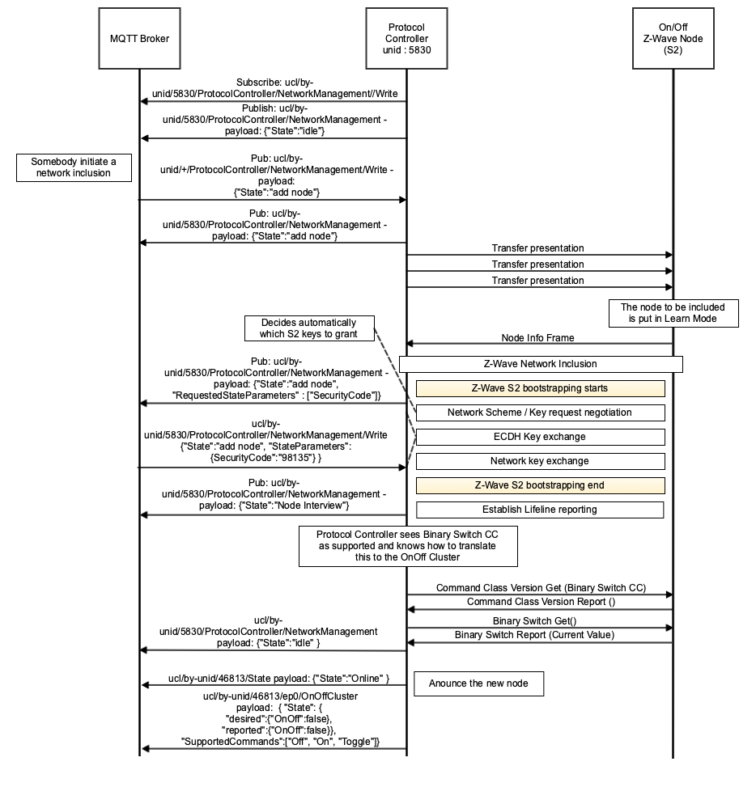

.. meta::
  :description: Unify Scenario Mappings
  :keywords: Mappings, PHY, Examples

.. raw:: latex

 \newpage

.. _unify_specifications_chapter_scenario_mapping:

Scenario Mapping to Specific PHYs: Z-Wave
=========================================================

This chapter describes use-cases or scenarios using the same Unify commands but showing the Protocol Controller translation details for several PHYs.

Adding a Node to a Network
--------------------------

This use case explains how to include a new node into a network. It is assumed that the
implementations follow the lines described in Network Management Commands and
Service discovery.

Z-Wave PAN
''''''''''

  Adding a node with a Z-Wave PAN
